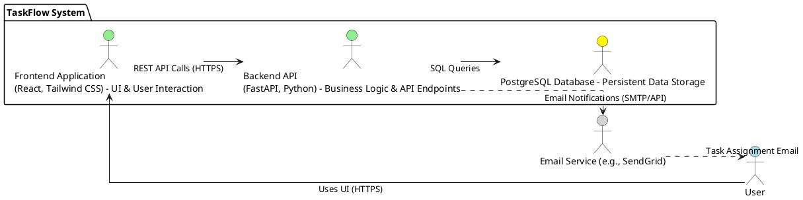

# Architecture Design

## Project Overview
TaskFlow is a lightweight web application designed to centralize task management for small teams (under 50 members). It addresses inefficiencies from fragmented task tracking by providing core functionalities: secure user management, comprehensive task creation and modification, a centralized dashboard with filtering, and a simple notification system. The goal is to enhance team collaboration, accountability, and productivity through an intuitive and easy-to-use interface.

## Architecture Goals
- **AG-1 (Improved Team Productivity):** Provide a unified platform for task organization to eliminate fragmented communication and enhance overall team efficiency.
- **AG-2 (Enabled Managerial Oversight):** Empower managers with visibility into task progress to identify bottlenecks and facilitate effective resource allocation.
- **AG-3 (Ensured Clear Accountability):** Facilitate explicit task assignments to promote individual responsibility and task ownership.
- **AG-4 (Reduced Tool Proliferation):** Establish TaskFlow as the primary tool for task tracking, minimizing reliance on less efficient alternative methods.
- **AG-5 (Achieve User Task Management Proficiency):** Enable 90% of active users to proficiently manage tasks within 2 weeks of onboarding.
- **AG-6 (Improve Task Completion Rates):** Increase task completion rates by at least 15% for teams using TaskFlow for 3+ months.
- **AG-7 (Achieve High System Adoption):** Reach an 80% adoption rate among target users within 6 months post-launch.

## Non-Functional Requirements
- NFR-PERF-001: System MUST support a minimum of 500 concurrent active users without degradation in response time.
  - **Measurable Criteria:** During load testing simulations with 500 concurrent users performing common actions (login, view dashboard, create task, update status), the average API response time for critical operations (e.g., task creation, task view) SHALL remain below 2 seconds. The CPU utilization of application servers SHALL not exceed 70% and database CPU utilization SHALL not exceed 60% under this load.
- NFR-PERF-002: The system's API response time for all defined endpoints SHALL be under 2 seconds for 95% of requests.
  - **Measurable Criteria:** End-to-end API response time, measured from client request to server response, averages less than 2 seconds over a 24-hour period for 95% of requests, under normal load conditions (up to 200 concurrent users). The remaining 5% of requests SHALL not exceed 5 seconds.
- NFR-AVAIL-001: The system SHALL maintain an uptime of at least 99.5% per month, excluding scheduled maintenance.
  - **Measurable Criteria:** Monthly monitoring reports SHALL demonstrate an average system availability of 99.5% or higher, calculated based on total operational hours minus unscheduled downtime. Scheduled maintenance windows, clearly communicated to users at least 24 hours in advance, will not be factored into uptime calculations.
- NFR-SEC-001: All user passwords MUST be stored using a strong, industry-standard cryptographic hashing algorithm with a salt.
  - **Measurable Criteria:** Database inspection confirms that user passwords are not stored in plaintext. The chosen hashing algorithm (e.g., bcrypt, Argon2) MUST be configurable with a sufficient work factor (e.g., cost factor for bcrypt >= 12). Each password hash SHALL include a unique, randomly generated salt.
- NFR-SEC-002: All network communication between client and server MUST be secured using HTTPS.
  - **Measurable Criteria:** Network traffic analysis confirms that all data transmissions occur over HTTPS. The application SHALL only serve content via HTTPS, redirecting any HTTP requests to HTTPS. SSL/TLS certificates MUST be valid and up-to-date.
- NFR-USABILITY-001: The user interface MUST be fully responsive and optimized for usability across desktop and tablet screen sizes (768px and above).
  - **Measurable Criteria:** Manual and automated browser testing confirms that the UI adapts gracefully and remains fully functional on screen widths ranging from 768px (tablet landscape) to 1920px (standard desktop), without horizontal scrolling being required. Key interactive elements are appropriately sized and positioned for touch and mouse interaction on both device types. Text and images scale correctly and remain legible across specified screen sizes.

## Data Requirements
- DR-001: System MUST use a relational database to store user, task, and assignment data, ensuring data normalization and integrity.
- DR-002: System MUST enforce data integrity through foreign key constraints for `created_by` (User-Task) and `task_id`/`user_id` (Assignment-Task/User), and validate mandatory fields before persistence.
- DR-003: System MUST retain all user and task data indefinitely unless explicitly deleted by an authorized user, in accordance with user functional requirements (FR-TASK-005).
- DR-004: System MUST implement daily automated backups of the entire database, with a Recovery Point Objective (RPO) of 24 hours and a Recovery Time Objective (RTO) of 4 hours.
- DR-005: System MUST facilitate data migration and schema evolution with minimal downtime, supporting backward compatibility where feasible for future database changes.

## AI Consideration

**Status:** Not applicable
**Rationale:** No `[AI-CANDIDATE]` or `[HYBRID]` tags present in spec.md. Project follows deterministic architecture.

## Technology Stack
| Layer | Technology | Version | Justification (NFR/DR/AIR) |
|-------|---------------------|---------|----------------------------------------------------------|
| Frontend | React, Tailwind CSS | Latest stable | NFR-USABILITY-001 (responsive UI), AG-7 (adoption), AG-5 (proficiency) |
| Backend | FastAPI (Python) | Latest stable | NFR-PERF-001/002 (high-performance async API), AG-1 (productivity), AG-3 (accountability), Constraints (Time to Market, Open Source) |
| Database | PostgreSQL | Latest stable | DR-001/002 (relational data integrity), NFR-PERF-001/002 (scalability for concurrency), Constraints (Open Source) |
| AI/ML | N/A | N/A | N/A |
| Testing | Jest, React Testing Library (Frontend), Pytest (Backend) | Latest stable | AG-5 (proficiency), NFR-PERF-001/002 (performance validation), NFR-SEC-001 (security validation) |

### Alternative Technology Options
-   **Backend:** Node.js with Express.js: Considered for its large ecosystem and JavaScript ubiquity across frontend/backend. Not selected due to FastAPI's stronger performance characteristics for I/O-bound tasks, built-in data validation (Pydantic), and superior tooling for API development, which aligns better with NFR-PERF-001/002 and the 3-month time-to-market constraint.
-   **Database:** MongoDB: Considered for its flexibility with schema-less documents. Not selected because TaskFlow's data model (Users, Tasks, Assignments) is inherently relational and benefits significantly from strong schema enforcement and transactional integrity provided by PostgreSQL, directly supporting DR-001/002.
-   **Frontend:** Vue.js: Considered as a lightweight alternative to React. Not selected as React has a larger developer community and a wealth of existing components and libraries, which could slightly accelerate development given the time-to-market constraint and support NFR-USABILITY-001 more readily.

### Technology Stack Validation
-   **FastAPI & PostgreSQL:** Directly address NFR-PERF-001/002 by offering high-performance, asynchronous capabilities for the backend and robust, scalable data management for the database, capable of handling 500 concurrent users with sub-2-second response times. PostgreSQL's relational model inherently supports DR-001/002 for data integrity.
-   **React & Tailwind CSS:** Fulfill NFR-USABILITY-001 by providing a modern framework for building responsive UIs and a utility-first CSS framework for efficient styling, ensuring a consistent and optimized experience across desktop and tablet.
-   **JWT-based Authentication:** Integrates with FastAPI for secure user logins, supporting NFR-SEC-001/002 for authentication and secure communication.
-   **Docker & Cloud (AWS/Azure):** Provide a robust platform for deployment, enabling NFR-AVAIL-001 through containerization, managed services, and auto-scaling capabilities.

### Technology Decision
| Metric (from NFR/DR/AIR) | FastAPI (Candidate 1) | Node.js/Express (Candidate 2) | Rationale |
|--------------------------|-----------------------|-------------------------------|-----------|
| NFR-PERF-002 (API Response < 2s) | High (Async, Pydantic) | Medium (Event Loop, middleware) | FastAPI's native async support and Pydantic for validation often lead to leaner, faster APIs by default, which is critical for meeting performance targets for 95% of requests. |
| NFR-SEC-001 (Password Hashing) | High (bcrypt/Argon2 libs) | High (bcrypt/Argon2 libs) | Both stacks offer robust libraries for cryptographic hashing. |
| Constraint (Time to Market) | High (Built-in validation, auto-docs) | High (Large ecosystem, JS ubiquity) | FastAPI's automatic documentation (Swagger UI), validation, and clear structure significantly reduce API development time, offsetting Node.js's ecosystem advantage for this specific project's scale. |
| Constraint (Open Source) | Yes | Yes | Both are excellent open-source choices. |

**Rationale:** FastAPI was chosen as the primary backend technology due to its superior performance for I/O-bound operations and built-in features like Pydantic for data validation and auto-generated API documentation. These features directly contribute to meeting the stringent performance requirements (NFR-PERF-001/002) and accelerate development, aligning with the "3-month time to market" constraint. While Node.js/Express.js is also a strong candidate, FastAPI's Pythonic simplicity and async capabilities provide a slight edge for this specific application's needs.

## Technical Requirements
- TR-001: System MUST implement the backend using FastAPI with Python to leverage its asynchronous capabilities and data validation features for high-performance API endpoints (justified by NFR-PERF-001, NFR-PERF-002, and Time to Market constraint).
- TR-002: System MUST utilize a layered architecture pattern for the application (Presentation, Application/Service, Data Access) to ensure modularity, maintainability, and clear separation of concerns, supporting a lean MVP development within the 3-month timeline.
- TR-003: System MUST be containerized using Docker and deployed to a cloud platform (AWS or Azure) leveraging managed services for compute and database to ensure scalability, high availability, and minimize operational overhead (justified by NFR-AVAIL-001 and Operational Costs constraint).
- TR-004: System MUST use JWT for authentication between the frontend client and the backend API, with tokens stored securely (HttpOnly, Secure, SameSite=Strict cookies) to meet security standards (justified by NFR-SEC-001, NFR-SEC-002).
- TR-005: System MUST expose a RESTful API for all client-server communication, ensuring consistent, stateless interactions and supporting the responsive frontend (justified by NFR-USABILITY-001 and AG-5).
- TR-006: System MUST integrate with an email service or provide an equivalent in-app notification mechanism to notify users of new task assignments (justified by FR-NOTIF-001).

## Domain Entities
- **User:** Represents an individual account within TaskFlow.
    -   `user_id` (Primary Key, UUID)
    -   `name` (String, mandatory)
    -   `email` (String, unique, mandatory, validated format)
    -   `password_hash` (String, mandatory, bcrypt/Argon2 hashed)
    -   `created_at` (Timestamp, mandatory)
- **Task:** Represents a single task managed in the system.
    -   `task_id` (Primary Key, UUID)
    -   `title` (String, mandatory, max 255 chars)
    -   `description` (Text, optional)
    -   `status` (Enum: 'Open', 'In Progress', 'Completed', 'On Hold', default 'Open')
    -   `priority` (Enum: 'Low', 'Medium', 'High', default 'Medium')
    -   `created_by` (Foreign Key to User.user_id, mandatory)
    -   `created_at` (Timestamp, mandatory)
- **Assignment:** A junction table linking tasks to the users they are assigned to, enabling many-to-many relationships.
    -   `assignment_id` (Primary Key, UUID)
    -   `task_id` (Foreign Key to Task.task_id, mandatory)
    -   `user_id` (Foreign Key to User.user_id, mandatory)
    -   `assigned_at` (Timestamp, mandatory)

## Technical Constraints & Assumptions
-   **Constraints:**
    -   **Time to Market:** Initial release within 3 months from project kick-off.
    -   **Operational Costs:** System design must minimize ongoing operational costs.
    -   **Technology Choice:** Prioritize open-source technologies wherever feasible.
-   **Assumptions:**
    -   **User Familiarity:** Users have basic familiarity with web applications and common UI patterns.
    -   **Team Size:** Teams utilizing TaskFlow consist of fewer than 50 members.
    -   **Internet Connectivity:** Users have a stable internet connection.

## Development Workflow

1.  **Requirements Analysis & Design:** Translate product specifications into detailed architectural design, data models, and API contracts.
2.  **Infrastructure Setup (IaC):** Provision cloud resources (DB, compute, networking) using Infrastructure-as-Code (e.g., Terraform/CloudFormation).
3.  **Core Backend Development:** Implement User and Task management APIs, including authentication, data validation, and database interactions.
4.  **Frontend Development:** Build the React UI, integrating with the backend APIs for user authentication, task dashboard, creation, and modification.
5.  **Testing & Quality Assurance:** Conduct unit, integration, and performance testing (load testing for NFR-PERF-001/002). Implement security audits.
6.  **Deployment & Monitoring:** Deploy containerized application (Docker) to cloud environment (AWS/Azure). Set up comprehensive logging and monitoring.

---

## Architecture Overview and Patterns

### Architectural Style
The TaskFlow system will adopt a **Layered Architecture** (often referred to as a "Monolith" in contrast to microservices). This pattern structures the application into distinct, horizontally stacked layers, with each layer having a specific responsibility and communicating only with the layers immediately above and below it.

**Layers:**
1.  **Presentation Layer (Frontend):** Handles user interface and user interaction logic (React, Tailwind CSS).
2.  **Application/Service Layer (Backend):** Contains the core business logic, orchestrates tasks, and serves as an API endpoint (FastAPI).
3.  **Data Access Layer (Backend):** Manages communication with the database, handling CRUD operations and data persistence (FastAPI with ORM).
4.  **Database Layer:** Persists application data (PostgreSQL).

### Justification for Layered Architecture
-   **Context:** TaskFlow is an MVP for small teams with a strict 3-month time-to-market constraint and a focus on minimizing operational costs. The domain is relatively simple CRUD operations.
-   **Decision:** Implement a well-structured Layered Architecture with a Python FastAPI backend and a React frontend.
-   **Benefit 1 (Rapid Development):** A monolithic layered approach reduces initial complexity, dependency management overhead, and cross-service communication concerns, enabling faster iteration and meeting the 3-month timeline (Constraint: Time to Market).
-   **Benefit 2 (Ease of Deployment & Operations):** A single deployable unit simplifies CI/CD pipelines, scaling (vertical or horizontal for the entire application), and monitoring, directly addressing the "minimize operational costs" constraint.
-   **Benefit 3 (Maintainability & Testability):** Clear separation of concerns between layers promotes maintainable code, making it easier to understand, debug, and test specific components in isolation (TR-002).

## Component Architecture

The TaskFlow system is composed of three primary logical components: the Frontend Application, the Backend API, and the PostgreSQL Database.



### Component Descriptions:
-   **Frontend Application (React, Tailwind CSS):** This is the client-side single-page application responsible for rendering the user interface, handling user input, and making API calls to the Backend API. It ensures responsiveness across various devices (NFR-USABILITY-001).
-   **Backend API (FastAPI, Python):** This is the core application server. It exposes RESTful API endpoints, implements business logic (task creation, assignment, updates), handles user authentication and authorization, performs data validation, and interacts with the PostgreSQL Database. It is designed for high performance and scalability (NFR-PERF-001, NFR-PERF-002, TR-001).
-   **PostgreSQL Database:** This relational database stores all persistent application data, including user accounts, task details, and assignment records. It ensures data integrity and supports efficient querying (DR-001, DR-002).
-   **Email Service (e.g., SendGrid):** An external service integrated by the Backend API to send email notifications to users upon task assignment (FR-NOTIF-001, TR-006).

## Integration Architecture

### Client-Server Communication
-   All communication between the **Frontend Application** and the **Backend API** will be via HTTPS/REST (NFR-SEC-002, TR-005).
-   The Frontend will send JSON payloads to the Backend API and receive JSON responses.

### Authentication
-   User authentication will be **JWT-based** (TR-004).
    1.  Upon successful login, the Backend API issues a JWT token.
    2.  This token is securely stored by the Frontend (e.g., in HttpOnly, Secure, SameSite=Strict cookies).
    3.  For subsequent authenticated requests, the Frontend includes the JWT in the `Authorization` header (`Bearer <token>`).
    4.  The Backend API validates the JWT for each request to ensure authenticity and authorization.

### Notifications
-   For MVP, the notification system (FR-NOTIF-001) will likely use an external **Email Service** (e.g., SendGrid, Mailgun) integrated by the Backend API (TR-006).
-   When a task is assigned (FR-TASK-002), the Backend API will trigger an email to the assigned user(s) containing relevant task details.
-   Future iterations could introduce in-app real-time notifications via WebSockets.

## Security Architecture

TaskFlow's security architecture is designed to protect user data and ensure system integrity, adhering to OWASP guidelines and NFR-SEC-001/002.

### 1. Authentication (OWASP A07: Authentication Failures)
-   **Password Hashing:** User passwords will be hashed using a strong, adaptive cryptographic algorithm (e.g., Argon2 or bcrypt) with a unique, randomly generated salt for each user (NFR-SEC-001). This prevents rainbow table attacks and makes brute-forcing computationally expensive.
-   **JWT Security:** JWTs will be issued with short expiry times and handled securely. They will be stored in `HttpOnly`, `Secure`, and `SameSite=Strict` cookies to prevent XSS attacks and CSRF (TR-004).
-   **Rate Limiting:** Login endpoints will have rate limiting implemented to mitigate brute-force password guessing attacks.
-   **Session Management:** A new session ID (JWT) will be issued upon successful login to prevent session fixation attacks.

### 2. Access Control (OWASP A01: Broken Access Control)
-   **Principle of Least Privilege:** Backend API endpoints will implement fine-grained access checks based on user roles and task ownership.
    -   Users can only edit/delete tasks they created or are assigned to, or if they hold a 'manager' role (implicit for MVP from FR-TASK-003, FR-TASK-005).
    -   API routes will be protected by middleware verifying JWT validity and authorization claims.
-   **Deny by Default:** All resources and operations will be denied by default, requiring explicit permission.

### 3. Data Protection (OWASP A02: Cryptographic Failures)
-   **Encryption in Transit:** All network communication between the client and server MUST use HTTPS (NFR-SEC-002). This ensures confidentiality and integrity of data in transit.
-   **Encryption at Rest:** The PostgreSQL database deployed on a cloud provider (AWS RDS/Azure Database for PostgreSQL) will leverage platform-managed encryption at rest features to protect sensitive data on disk.
-   **Secret Management:** API keys, database credentials, and other sensitive configurations will be stored in environment variables or a cloud-native secret management service (e.g., AWS Secrets Manager, Azure Key Vault), never hardcoded.

### 4. Input Validation & Output Encoding (OWASP A03: Injection)
-   **Server-side Input Validation:** All user inputs (e.g., task titles, descriptions, email addresses) will be rigorously validated on the backend (FastAPI/Pydantic) to prevent various injection attacks (SQL Injection, XSS) (FR-USER-001, FR-TASK-001).
-   **Parameterized Queries:** All database interactions will use parameterized queries (ORM in FastAPI) to explicitly separate code from data, preventing SQL injection.
-   **Output Encoding:** Frontend will render user-provided data using safe methods (e.g., React's automatic escaping for text content) to prevent XSS. If rich text is allowed in future, a sanitization library (e.g., DOMPurify) will be used.

### 5. Security Misconfiguration & Vulnerable Components (OWASP A05, A06)
-   **Secure Defaults:** Production environments will disable verbose error messages and debug modes.
-   **Security Headers:** The web server/API Gateway will configure security headers like Content Security Policy (CSP), HSTS, X-Content-Type-Options, X-Frame-Options to mitigate common web vulnerabilities.
-   **Dependency Management:** Regular scanning of third-party libraries and dependencies for known vulnerabilities (e.g., using `pip-audit`, `npm audit`, Snyk).
-   **Principle of Simplicity:** The lean, focused MVP architecture inherently reduces the attack surface compared to more complex systems.

## Deployment Architecture

The TaskFlow system will be deployed to a cloud environment (AWS or Azure) using containerization for consistency and scalability, aligning with NFR-AVAIL-001 and operational cost minimization.

```plantuml
@startuml
!define CLOUD #LightSkyBlue
!define VPC #LightBlue
!define SERVER #LightGreen
!define DB #Yellow
!define LOAD_BALANCER #LightGray
!define CDN #PowderBlue
!define MONITORING #Orange
!define DNS #Gainsboro

left to right direction
skinparam linetype ortho

CLOUD "Cloud Provider (AWS / Azure)" {
    DNS "Route 53 / Azure DNS" as dns
    LOAD_BALANCER "Application Load Balancer / Azure Front Door" as alb
    CDN "CloudFront / Azure CDN" as cdn

    VPC "Virtual Private Cloud / Virtual Network" {
        SERVER "Frontend Container (React)" as frontend_c {
            FE_SERVER "Nginx/Static Host"
        }
        SERVER "Backend API Container (FastAPI)" as backend_c {
            BE_SERVER "Uvicorn/Gunicorn"
        }
        DB "Managed PostgreSQL Database" as postgres_db
    }
    MONITORING "Cloud Monitoring / Logging" as monitoring
}

actor "End User" as user
actor "Administrator" as admin

user --> dns : TaskFlow URL
dns --> cdn : Resolve Static Assets
cdn --> frontend_c : Serve Frontend Assets (HTTPS)
dns --> alb : Resolve Backend API
user --> alb : API Requests (HTTPS)

alb --> backend_c : Forward API Requests
backend_c --> postgres_db : Database Access
backend_c --> monitoring : Logs & Metrics
frontend_c --> monitoring : Logs & Metrics

admin --> monitoring : View Dashboards & Alerts

@enduml
```

### Deployment Strategy
1.  **Containerization:** Both the Frontend (React) and Backend (FastAPI) applications will be containerized using Docker. This ensures consistent environments from development to production.
2.  **Cloud Platform:** Either AWS or Azure will be utilized.
3.  **Frontend Deployment:**
    *   Static React assets will be stored in an object storage service (e.g., AWS S3 or Azure Blob Storage).
    *   A Content Delivery Network (CDN) (e.g., AWS CloudFront or Azure CDN) will be used to serve these assets globally, improving latency and offloading traffic from the origin, supporting NFR-USABILITY-001 and NFR-PERF-002.
4.  **Backend Deployment:**
    *   Backend FastAPI containers will be deployed to a managed container service (e.g., AWS ECS/EKS or Azure Kubernetes Service/App Service Containers).
    *   Auto-scaling groups will be configured to automatically adjust the number of backend instances based on load, ensuring NFR-PERF-001 and NFR-AVAIL-001.
    *   An Application Load Balancer (ALB / Azure Front Door) will distribute incoming traffic across the backend instances and handle SSL termination (NFR-SEC-002).
5.  **Database Deployment:**
    *   A managed PostgreSQL database service (e.g., AWS RDS for PostgreSQL or Azure Database for PostgreSQL) will be used. This provides automated backups (DR-004), patching, high availability, and easy scaling.
6.  **Networking:** All components will reside within a Virtual Private Cloud (VPC / VNet) with appropriate network security groups and subnets to control traffic flow and enhance security.
7.  **DNS:** A managed DNS service (e.g., AWS Route 53 or Azure DNS) will be used to manage domain records.

## Cross-Cutting Concerns

### 1. Logging
-   **Structured Logging:** Both frontend and backend applications will emit structured logs (e.g., JSON format) for easier parsing and analysis.
-   **Centralized Logging:** Logs will be streamed to a centralized logging service (e.g., AWS CloudWatch Logs or Azure Monitor Logs) for aggregation, retention, and searching.
-   **Levels:** Logs will use appropriate severity levels (DEBUG, INFO, WARN, ERROR, CRITICAL) to distinguish operational messages from critical failures.
-   **Audit Logs:** Critical security events (e.g., login attempts, access denied) will be logged for auditing purposes.

### 2. Monitoring
-   **Application Performance Monitoring (APM):** Tools (e.g., Prometheus/Grafana, Datadog, New Relic, or cloud-native APM solutions) will be integrated to monitor API response times, throughput, error rates, and resource utilization (CPU, memory) of the backend. This is critical for NFR-PERF-001/002.
-   **Infrastructure Monitoring:** Cloud provider monitoring tools (e.g., AWS CloudWatch, Azure Monitor) will track the health and performance of underlying infrastructure (VMs, containers, database).
-   **Uptime Monitoring:** External synthetic monitoring will regularly check application availability (NFR-AVAIL-001).
-   **Alerting:** Automated alerts will be configured for critical thresholds (e.g., high error rates, elevated response times, low availability) to ensure proactive incident response.

### 3. Error Handling
-   **Centralized Backend Error Handling:** The FastAPI backend will implement a global exception handler to catch unhandled exceptions, log them, and return standardized, user-friendly error responses (e.g., HTTP 4xx for client errors, HTTP 5xx for server errors) without exposing sensitive internal details.
-   **Frontend Error Display:** The React frontend will display clear and concise error messages to users for API failures or client-side issues, providing guidance where possible.
-   **Retry Mechanisms:** External API calls (e.g., to Email Service) will incorporate retry logic with exponential backoff to handle transient failures.

### 4. Configuration Management
-   **Environment Variables:** All application configurations (database connection strings, API keys, JWT secrets, email service credentials) will be managed via environment variables. This ensures that sensitive information is not hardcoded and can be easily changed across different deployment environments.
-   **External Configuration:** For more complex configurations, external configuration files (e.g., `config.toml` for FastAPI, or cloud-managed configurations) could be used, but environment variables are preferred for sensitive data.

### 5. Code Quality & Standards
-   **Linting & Formatting:** Automated linters (e.g., Black, ESLint, Prettier) will enforce consistent code style.
-   **Code Reviews:** All code changes will undergo peer code reviews to ensure quality, adherence to best practices, and detection of potential issues.
-   **Unit & Integration Tests:** Comprehensive test suites (Jest/React Testing Library for frontend, Pytest for backend) will ensure functionality and prevent regressions.

---
**Note:** The provided specification did not include an `ai_note` or `summary` for front matter, as the template implicitly suggests this is a document *structure* rather than a markdown `post` requiring such metadata. Therefore, no YAML front matter has been generated.