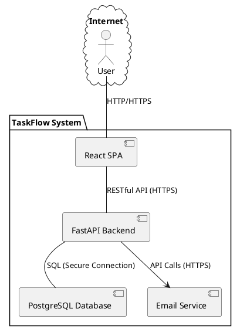
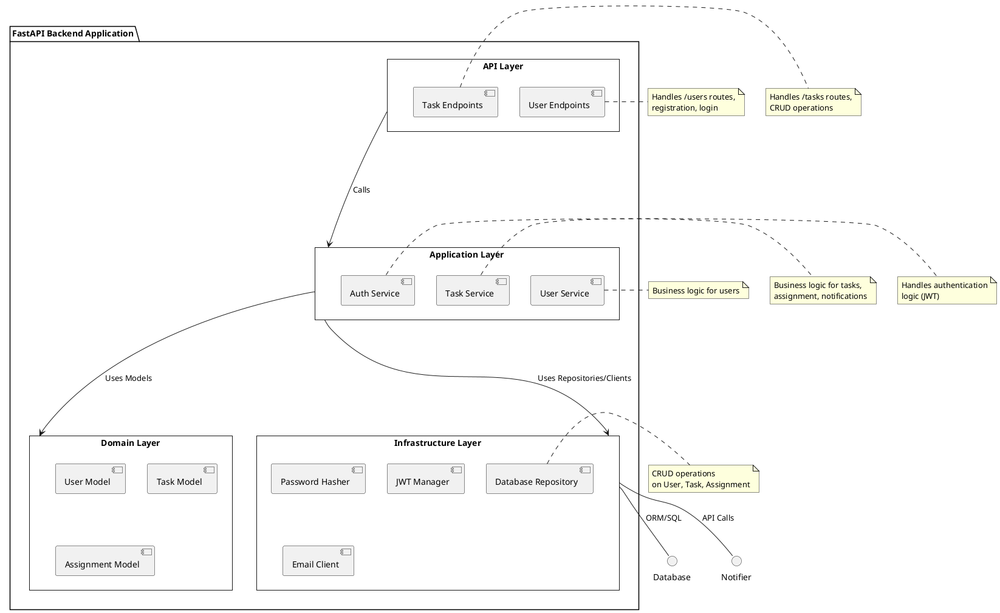

# System Architecture Document: TaskFlow

## 1. Architecture Overview and Patterns

### 1.1 Executive Summary
TaskFlow is a lightweight, intuitive web application for small team task management. The architecture is designed for rapid development within a 3-month timeline, emphasizing simplicity, scalability for up to 500 concurrent users, and low operational costs. We adopt a **Monolithic Architecture** for the initial MVP, structured internally with a **Layered Architecture** to ensure clear separation of concerns, maintainability, and future scalability. Communication between the frontend and backend will be via a **RESTful API**.

### 1.2 Architectural Goals
The primary architectural goals for TaskFlow are:
*   **Rapid Time-to-Market:** Deliver the MVP within 3 months, prioritizing developer velocity and simplicity.
*   **Scalability:** Support up to 500 concurrent users with consistent performance.
*   **Maintainability:** Ensure the codebase is easy to understand, modify, and extend by adhering to established patterns and clean code principles.
*   **Cost Efficiency:** Minimize ongoing operational costs through judicious technology choices and cloud resource utilization.
*   **Security:** Implement robust security measures to protect user data and ensure application integrity.
*   **User Experience:** Support a responsive and intuitive user interface across specified devices.

### 1.3 Architecture Patterns
*   **Monolithic Architecture:** Chosen for the MVP due to the strict 3-month deadline. It simplifies development, testing, and deployment processes by packaging all components (UI, API, business logic, data access) into a single deployable unit. This approach minimizes overhead associated with distributed systems in the early stages.
*   **Layered Architecture (N-Tier):** Within the monolithic application, a clear separation into presentation, application, domain, and infrastructure layers will be enforced. This pattern enhances modularity, maintainability, and testability.
    *   **Presentation Layer:** Handles user interface and interactions (Frontend).
    *   **API Layer:** Exposes RESTful endpoints, handles request/response serialization/deserialization, and authentication/authorization.
    *   **Application Layer:** Orchestrates business logic, validates data, and manages transactions.
    *   **Domain Layer:** Contains core business entities and rules.
    *   **Infrastructure Layer:** Manages persistence (database), external services (email), and other technical concerns.
*   **RESTful API:** For communication between the client-side application (frontend) and the server-side backend. This provides a standardized, stateless, and cacheable interface.

## 2. Technology Stack with Justification

The technology stack is chosen to align with the product goals of rapid development, scalability, cost-efficiency, and leveraging open-source solutions.

*   **Frontend:**
    *   **Framework:** **React**
        *   **Justification:** Modern, component-based library known for building interactive user interfaces. High developer productivity, large community support, and strong ecosystem. Excellent for creating Single Page Applications (SPAs) which provide a fluid user experience. Aligns with the "intuitive" and "simple" UI goal.
    *   **Styling:** **Tailwind CSS**
        *   **Justification:** A utility-first CSS framework that enables rapid UI development directly in markup. This significantly speeds up styling, reduces CSS boilerplate, and promotes consistent design, crucial for the 3-month timeline.
*   **Backend:**
    *   **Framework:** **FastAPI (Python)**
        *   **Justification:** A modern, high-performance web framework for building APIs with Python 3.7+. It offers built-in data validation and serialization with Pydantic, automatic interactive API documentation (Swagger UI), and leverages Python's async capabilities for excellent performance. Python's readability and developer-friendliness contribute to rapid development, and FastAPI's performance characteristics support 500 concurrent users.
*   **Database:**
    *   **System:** **PostgreSQL**
        *   **Justification:** A powerful, open-source, object-relational database system known for its robustness, reliability, feature richness, and performance. It's an industry standard, supports complex queries, and is highly scalable. Its open-source nature aligns with the cost-efficiency and open-source preference constraints. It's well-supported by cloud providers as a managed service, simplifying operations.
*   **Authentication:**
    *   **Method:** **JSON Web Tokens (JWT)**
        *   **Justification:** A compact, URL-safe means of representing claims to be transferred between two parties. JWTs are stateless, which is ideal for scalable web APIs as it avoids server-side session management, reducing memory overhead and simplifying horizontal scaling. This directly supports the NFR for 500 concurrent users.
*   **Deployment & Containerization:**
    *   **Containerization:** **Docker**
        *   **Justification:** Provides a consistent and isolated environment for the application, bundling all dependencies. This ensures that the application runs reliably across different environments (development, staging, production) and simplifies deployment and scaling.
    *   **Cloud Platform:** **AWS/Azure Cloud** (as specified in Product Spec)
        *   **Justification:** Offers robust, scalable, and highly available infrastructure services. Managed database services, auto-scaling groups, and load balancers are critical for meeting performance and availability NFRs while minimizing operational overhead. Allows for flexible resource allocation and cost optimization.
*   **Communication:**
    *   **Protocol:** **HTTPS**
        *   **Justification:** Essential for securing all network communication between clients and the server, protecting sensitive data (passwords, task details) from eavesdropping and tampering. Directly addresses `NFR-SEC-002`.

## 3. Non-Functional Requirements (NFR-XXX) with Measurable Criteria

These NFRs are extracted directly from the Product Specification and serve as critical benchmarks for the system's quality attributes.

*   **NFR-PERF-001 (Performance):** The system MUST support a minimum of 500 concurrent active users without degradation in response time.
    *   **Measurable Criteria:**
        1.  During load testing simulations with 500 concurrent users performing common actions (login, view dashboard, create task, update status), the average API response time for critical operations (e.g., task creation, task view) SHALL remain below 2 seconds.
        2.  The CPU utilization of application servers SHALL not exceed 70% and database CPU utilization SHALL not exceed 60% under this load.
*   **NFR-PERF-002 (Performance):** The system's API response time for all defined endpoints SHALL be under 2 seconds for 95% of requests.
    *   **Measurable Criteria:**
        1.  End-to-end API response time, measured from client request to server response, averages less than 2 seconds over a 24-hour period for 95% of requests, under normal load conditions (up to 200 concurrent users).
        2.  The remaining 5% of requests SHALL not exceed 5 seconds.
*   **NFR-AVAIL-001 (Availability):** The system SHALL maintain an uptime of at least 99.5% per month, excluding scheduled maintenance.
    *   **Measurable Criteria:**
        1.  Monthly monitoring reports SHALL demonstrate an average system availability of 99.5% or higher, calculated based on total operational hours minus unscheduled downtime.
        2.  Scheduled maintenance windows, clearly communicated to users at least 24 hours in advance, will not be factored into uptime calculations.
*   **NFR-SEC-001 (Security):** All user passwords MUST be stored using a strong, industry-standard cryptographic hashing algorithm with a salt.
    *   **Measurable Criteria:**
        1.  Database inspection confirms that user passwords are not stored in plaintext.
        2.  The chosen hashing algorithm (e.g., bcrypt, Argon2) MUST be configurable with a sufficient work factor (e.g., cost factor for bcrypt >= 12).
        3.  Each password hash SHALL include a unique, randomly generated salt.
*   **NFR-SEC-002 (Security):** All network communication between client and server MUST be secured using HTTPS.
    *   **Measurable Criteria:**
        1.  Network traffic analysis (e.g., using browser developer tools or Wireshark) confirms that all data transmissions occur over HTTPS.
        2.  The application SHALL only serve content via HTTPS, redirecting any HTTP requests to HTTPS.
        3.  SSL/TLS certificates MUST be valid and up-to-date.
*   **NFR-USABILITY-001 (Usability/Responsiveness):** The user interface MUST be fully responsive and optimized for usability across desktop and tablet screen sizes (768px and above).
    *   **Measurable Criteria:**
        1.  Manual and automated browser testing confirms that the UI adapts gracefully and remains fully functional on screen widths ranging from 768px (tablet landscape) to 1920px (standard desktop), without horizontal scrolling being required.
        2.  Key interactive elements (buttons, forms, navigation) are appropriately sized and positioned for touch and mouse interaction on both desktop and tablet devices.
        3.  Text and images scale correctly and remain legible across specified screen sizes.

## 4. Technical Requirements (TR-XXX)

These requirements outline the technical implementation aspects necessary to fulfill the functional and non-functional requirements.

*   **TR-AUTH-001:** The backend system SHALL implement JWT-based authentication for securing API endpoints.
    *   **Details:** JWT tokens will be issued upon successful login and must be included in the `Authorization` header for protected routes. Tokens shall have a short expiry time (e.g., 15-30 minutes) and refresh token mechanism (if scope allows, otherwise re-login).
*   **TR-API-001:** The backend system SHALL expose a RESTful API with endpoints for all user and task management operations (CRUD).
    *   **Details:** Endpoints will follow REST best practices (e.g., `/users`, `/tasks/{id}`, `/tasks/{id}/assign`). Request and response bodies will be JSON.
*   **TR-DB-001:** The system SHALL utilize PostgreSQL as its primary database, with a schema designed for the `User`, `Task`, and `Assignment` entities.
    *   **Details:** Database schema will define tables with appropriate data types, primary keys, foreign keys, and indexes to support efficient querying and data integrity.
*   **TR-FRONT-001:** The frontend application SHALL be developed as a Single Page Application (SPA) using React.
    *   **Details:** The SPA will handle client-side routing, state management, and interaction with the backend API.
*   **TR-VALID-001:** The backend API SHALL perform server-side input validation for all incoming requests to prevent malformed data and security vulnerabilities.
    *   **Details:** Validation rules will enforce data types, constraints (e.g., title not empty, email format), and business logic.
*   **TR-PERM-001:** The backend system SHALL enforce authorization checks based on user roles and task ownership for sensitive operations (edit, delete, assign tasks).
    *   **Details:** A user can only modify/delete tasks they created or are assigned to. Managers have broader permissions (MVP implies a single 'team' and broader visibility/edit for all, so this simplifies initial implementation but needs to be extensible).
*   **TR-NOTIF-001:** The backend system SHALL integrate with an external email service provider (e.g., SendGrid, Mailgun) for sending task assignment notifications.
    *   **Details:** When `FR-TASK-002` is triggered, the system will send an email containing task details to the assignee(s).
*   **TR-RESP-001:** The frontend UI SHALL implement responsive design principles using Tailwind CSS to adapt to varying screen sizes as per `NFR-USABILITY-001`.
    *   **Details:** Utilize Tailwind's utility classes and breakpoints to ensure optimal layout and readability on desktop and tablet devices.

## 5. Data Requirements (DR-XXX)

The data model for TaskFlow is based on a relational database structure, as specified in the Product Specification.

*   **DR-USER-001: User Entity**
    *   **Description:** Stores account information for individuals accessing TaskFlow.
    *   **Fields:**
        *   `user_id` (UUID or Integer, Primary Key, Auto-generated)
        *   `name` (VARCHAR, NOT NULL)
        *   `email` (VARCHAR, NOT NULL, UNIQUE) - used for login
        *   `password_hash` (VARCHAR, NOT NULL) - stores securely hashed password
        *   `created_at` (TIMESTAMP WITH TIME ZONE, NOT NULL, Default: CURRENT_TIMESTAMP)
*   **DR-TASK-001: Task Entity**
    *   **Description:** Stores the details of each task managed within the system.
    *   **Fields:**
        *   `task_id` (UUID or Integer, Primary Key, Auto-generated)
        *   `title` (VARCHAR, NOT NULL)
        *   `description` (TEXT, NULLABLE)
        *   `status` (ENUM / VARCHAR, NOT NULL, Allowed values: 'Open', 'In Progress', 'Completed', 'On Hold', Default: 'Open')
        *   `priority` (ENUM / VARCHAR, NOT NULL, Allowed values: 'Low', 'Medium', 'High', Default: 'Medium')
        *   `created_by` (UUID or Integer, Foreign Key to `User.user_id`, NOT NULL) - the user who created the task
        *   `created_at` (TIMESTAMP WITH TIME ZONE, NOT NULL, Default: CURRENT_TIMESTAMP)
        *   `updated_at` (TIMESTAMP WITH TIME ZONE, NULLABLE, Default: CURRENT_TIMESTAMP ON UPDATE)
*   **DR-ASSIGNMENT-001: Assignment Entity (Junction Table)**
    *   **Description:** Links tasks to the users they are assigned to, supporting many-to-many relationships.
    *   **Fields:**
        *   `assignment_id` (UUID or Integer, Primary Key, Auto-generated)
        *   `task_id` (UUID or Integer, Foreign Key to `Task.task_id`, NOT NULL)
        *   `user_id` (UUID or Integer, Foreign Key to `User.user_id`, NOT NULL)
        *   `assigned_at` (TIMESTAMP WITH TIME ZONE, NOT NULL, Default: CURRENT_TIMESTAMP)
    *   **Constraints:** `(task_id, user_id)` MUST be unique to prevent duplicate assignments.

## 6. Component Architecture

The component architecture illustrates the logical breakdown of the TaskFlow system into interacting components.

### 6.1 High-Level Component Diagram



### 6.2 Backend (FastAPI) Internal Layered Architecture

The FastAPI Backend will implement a layered architecture for separation of concerns.



## 7. Integration Architecture

TaskFlow will primarily integrate components through standard web protocols and dedicated APIs.

*   **Frontend-Backend Integration:**
    *   **Protocol:** HTTPS
    *   **Method:** RESTful API calls. The React SPA will make AJAX requests to the FastAPI backend.
    *   **Data Format:** JSON for request and response bodies.
    *   **Authentication:** JWT tokens will be passed in the `Authorization` header for protected API routes.
*   **Backend-Database Integration:**
    *   **Protocol:** Secure database connection (e.g., TCP/IP over TLS/SSL).
    *   **Method:** FastAPI will interact with PostgreSQL using an Object-Relational Mapper (ORM) (e.g., SQLAlchemy) or direct SQL queries. This abstracts database interactions and provides type safety.
*   **Backend-Email Service Integration:**
    *   **Protocol:** HTTPS
    *   **Method:** The FastAPI backend will make API calls to a third-party email service provider (e.g., SendGrid, Mailgun) for sending task assignment notifications. Credentials for the email service will be securely stored and accessed as environment variables.

## 8. Security Architecture

Security is a paramount concern, especially when handling user data and authentication.

*   **Secure Communication (`NFR-SEC-002`):**
    *   All client-server communication will be enforced over HTTPS using TLS/SSL certificates to encrypt data in transit, preventing eavesdropping and man-in-the-middle attacks.
    *   HTTP Strict Transport Security (HSTS) will be configured to ensure browsers always connect via HTTPS.
*   **Authentication and Authorization:**
    *   **Password Hashing (`NFR-SEC-001`):** User passwords will never be stored in plaintext. Industry-standard cryptographic hashing algorithms (e.g., bcrypt, Argon2) with unique salts will be used to hash passwords before storage. A sufficient work factor will be applied.
    *   **JWT for Stateless Authentication (`TR-AUTH-001`):** JWTs will be used for session management. Tokens will be signed with a strong secret key. Best practices for JWT handling (e.g., short expiry for access tokens, refresh token mechanism if within scope) will be followed.
    *   **Access Control (`TR-PERM-001`):** Role-based access control (RBAC) will be implemented to ensure users only perform actions they are authorized for (e.g., a user can only edit/delete tasks they created or are assigned to, or if they are a manager).
*   **Input Validation (`TR-VALID-001`):**
    *   Comprehensive server-side input validation will be performed on all data received from the client to prevent common web vulnerabilities like SQL injection, Cross-Site Scripting (XSS), and buffer overflows.
*   **Sensitive Data Protection:**
    *   All sensitive configuration data (database credentials, API keys, JWT secrets) will be stored securely (e.g., environment variables, secret management services) and not hardcoded in the codebase.
*   **API Security:**
    *   Rate limiting (future consideration but good for preventing brute-force attacks and abuse) might be implemented to restrict the number of requests a user can make to the API within a given timeframe.
*   **Logging and Monitoring:**
    *   Security-relevant events (failed logins, critical data changes) will be logged and monitored.

## 9. Deployment Architecture

The deployment architecture focuses on leveraging cloud services for scalability, high availability, and simplified operations, aligning with the 500 concurrent user requirement and low operational cost goal.

```plantuml
@startuml
skinparam style strictuml

cloud "Internet" {
  component "User (Browser/Tablet)" as UserDevice
}

UserDevice -- (DNS)
(DNS) -- "Cloud Load Balancer (ELB/Azure LB)" as LoadBalancer

rectangle "Cloud Provider (AWS/Azure)" {

  rectangle "Virtual Private Cloud (VPC)" {

    rectangle "Public Subnet" {
      LoadBalancer --> "Auto Scaling Group" as ASG
      ASG --> "FastAPI Containers (Docker)" as BackendApp : HTTP/HTTPS
    }

    rectangle "Private Subnet" {
      BackendApp --> "Managed PostgreSQL Database (RDS/Azure SQL)" as Database : Secure SQL
      BackendApp --> "Caching Layer (Redis - Optional for MVP)" as Cache : Read/Write
    }

    rectangle "Managed Services" {
        node "Email Service (SendGrid/Mailgun)" as EmailService
        node "Logging & Monitoring (CloudWatch/Azure Monitor)" as Monitoring
    }

  }
}

BackendApp -- EmailService : API Calls (HTTPS)
BackendApp ..> Monitoring : Logs & Metrics

note right of LoadBalancer
  Distributes traffic to
  application instances
end note

note right of ASG
  Scales application instances
  based on load (CPU, requests)
end note

note right of BackendApp
  Nginx (reverse proxy) +
  Uvicorn (ASGI server)
end note

note right of Database
  High availability, backups,
  managed by cloud provider
end note

@enduml
```

### 9.1 Key Components
*   **User Device:** Any web browser or tablet accessing the application.
*   **DNS:** Resolves the application's domain name to the load balancer's IP address.
*   **Cloud Load Balancer (e.g., AWS Elastic Load Balancer, Azure Load Balancer):** Distributes incoming web traffic across multiple instances of the backend application, ensuring high availability and fault tolerance. It also terminates SSL/TLS, offloading encryption work from application servers.
*   **Auto Scaling Group (ASG):** Manages the FastAPI backend instances. It automatically scales the number of instances up or down based on predefined metrics (e.g., CPU utilization, request queue length), dynamically adjusting to demand and ensuring `NFR-PERF-001` and `NFR-PERF-002` are met during peak loads.
*   **FastAPI Containers (Docker):** The core backend application, containerized using Docker. Each container runs FastAPI with an ASGI server (e.g., Uvicorn) behind a reverse proxy (e.g., Nginx) for optimal performance and connection management.
*   **Managed PostgreSQL Database (e.g., AWS RDS PostgreSQL, Azure Database for PostgreSQL):** A fully managed relational database service. Provides automated backups, patching, scaling, and high availability features, reducing operational overhead and ensuring `NFR-AVAIL-001`.
*   **Caching Layer (e.g., Redis - Optional for MVP):** While not explicitly required for the MVP, a caching layer (e.g., for user lists or frequently accessed task data) can significantly improve performance and reduce database load under `NFR-PERF-001` conditions. It can be introduced in later iterations.
*   **Email Service (e.g., SendGrid, Mailgun):** A third-party service integrated for sending transactional emails (like task assignment notifications).
*   **Logging & Monitoring (e.g., AWS CloudWatch, Azure Monitor):** Centralized services for collecting application logs, system metrics (CPU, memory, network I/O), and health checks.

### 9.2 Deployment Strategy
*   **Containerization:** All application components (frontend assets, backend API) will be containerized using Docker.
*   **Infrastructure as Code (IaC):** Terraform or CloudFormation/ARM templates will be used to define and provision the cloud infrastructure, ensuring consistency, repeatability, and version control.
*   **CI/CD Pipeline:** A Continuous Integration/Continuous Deployment pipeline will automate building Docker images, running tests, and deploying updates to the cloud environment.
*   **Blue/Green or Rolling Deployments:** To minimize downtime during updates and ensure `NFR-AVAIL-001`, deployment strategies like rolling updates or blue/green deployments will be employed.

## 10. Cross-Cutting Concerns

These are aspects of the system that affect multiple components and require a consistent approach.

### 10.1 Logging
*   **Centralized Logging:** All application logs (frontend errors, backend API requests/responses, database queries, security events) will be collected and streamed to a centralized logging system (e.g., AWS CloudWatch Logs, Azure Monitor Logs, or an ELK stack).
*   **Log Levels:** Implement standard log levels (DEBUG, INFO, WARNING, ERROR, CRITICAL) to allow for filtering and severity-based alerting.
*   **Structured Logging:** Logs will be structured (e.g., JSON format) to facilitate easier parsing, searching, and analysis.
*   **Contextual Logging:** Logs will include relevant context (e.g., request ID, user ID, timestamp) to trace requests across different components.

### 10.2 Monitoring & Alerting
*   **Application Performance Monitoring (APM):** Tools will be used to monitor API response times (`NFR-PERF-002`), error rates, and resource utilization (CPU, memory) of backend instances (`NFR-PERF-001`).
*   **Infrastructure Monitoring:** Monitor the health and performance of underlying cloud resources (load balancers, databases, auto-scaling groups).
*   **Uptime Monitoring:** External uptime monitoring services will verify `NFR-AVAIL-001` by checking public endpoints.
*   **Alerting:** Define alerts based on critical thresholds (e.g., high error rates, low availability, elevated CPU usage, failed logins) and configure notifications to relevant teams (e.g., email, Slack).
*   **Dashboarding:** Create dashboards to visualize key metrics and system health at a glance.

### 10.3 Error Handling
*   **Consistent API Error Responses:** The backend API will return consistent, standardized JSON error responses including an error code, a descriptive message, and potentially specific details (e.g., validation errors).
*   **Graceful Frontend Error Display:** The React frontend will gracefully handle API errors, display user-friendly messages, and provide options for recovery or retry where appropriate.
*   **Centralized Exception Handling:** Implement global exception handlers in the backend to catch unhandled exceptions, log them, and return appropriate error responses without exposing sensitive internal details.
*   **Retry Mechanisms:** Implement robust retry mechanisms for transient failures when interacting with external services (e.g., email service, database connections).

### 10.4 Configuration Management
*   **Environment Variables:** All environment-specific configurations (database connection strings, API keys, JWT secrets, email service credentials) will be managed via environment variables.
*   **Separation of Configuration:** Keep configuration separate from code for different environments (development, staging, production).
*   **Secret Management:** Sensitive credentials will be stored and accessed using secure secret management services provided by the cloud provider (e.g., AWS Secrets Manager, Azure Key Vault).

### 10.5 Backup and Restore
*   **Automated Database Backups:** The managed PostgreSQL service will be configured for automated daily backups with a defined retention period.
*   **Point-in-Time Recovery (PITR):** Enable PITR capabilities for the database to allow recovery to any specific point in time within the retention window.
*   **Backup Testing:** Regularly test the backup and restore procedures to ensure data recoverability.