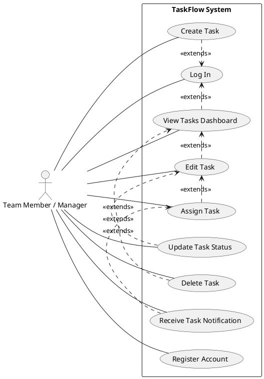

# Product Specification: TaskFlow – Simple Team Task Management System

---

## 1. Executive Summary

TaskFlow is a lightweight web application designed to empower small teams with efficient task management capabilities. The primary problem TaskFlow addresses is the widespread inefficiency caused by disparate tools (email, chat, spreadsheets) for task tracking, which leads to fragmented communication, unclear accountability, and limited visibility into project progress.

This product specification details the requirements for TaskFlow, outlining its core functionalities including user registration and authentication, comprehensive task creation and management, a centralized task dashboard with filtering capabilities, and a simple notification system. By centralizing task organization and fostering clear assignments, TaskFlow aims to significantly improve team collaboration, accountability, and overall productivity. The emphasis is on providing a simple, intuitive, and easy-to-use interface to ensure high user adoption and immediate value for small teams.

## 2. Goals and Objectives

### 2.1 Product Vision Statement

TaskFlow will be the indispensable, intuitive, and efficient web application that enables small teams to effortlessly organize, assign, and track tasks, fostering seamless collaboration and clear accountability to drive project success.

### 2.2 Business Objectives

1.  **Improve Team Productivity:** TaskFlow MUST provide a unified platform for task organization, eliminating the need for fragmented communication across multiple tools and thereby improving overall team efficiency.
2.  **Enable Managerial Oversight:** TaskFlow SHALL empower managers to easily track the progress of tasks, providing necessary visibility to identify bottlenecks and allocate resources effectively.
3.  **Ensure Clear Accountability:** TaskFlow MUST facilitate clear task assignments to team members, ensuring every task has an owner and promoting a culture of responsibility.
4.  **Reduce Tool Proliferation:** TaskFlow SHALL serve as the primary tool for task tracking, significantly reducing reliance on less efficient methods like email, chat, or spreadsheets.

### 2.3 Product Goals (Success Criteria)

1.  **User Task Management Proficiency:** Within 2 weeks of onboarding, 90% of active users SHALL be able to successfully create, assign, update, and complete tasks using TaskFlow without requiring external assistance.
2.  **Improved Task Completion Rates:** Teams actively using TaskFlow for at least 3 months SHALL demonstrate a measurable increase in task completion rates by at least 15% compared to their previous methods.
3.  **High System Adoption:** TaskFlow SHALL achieve an adoption rate of at least 80% among its target user base (team members and managers in small teams) within the first 6 months post-launch.

## 3. Target Users

The primary users of TaskFlow are individuals and managers within small teams (typically fewer than 50 members) who need a straightforward and efficient way to manage their daily tasks and collaborative projects.

*   **Team Members (End Users):** Individuals responsible for executing tasks, collaborating with peers, and updating their task progress. They value simplicity, clear assignments, and easy access to their task list.
*   **Team Managers (End Users):** Individuals responsible for assigning tasks, tracking team progress, ensuring accountability, and identifying potential blockers. They value visibility, ease of tracking, and reporting (even if basic for this MVP).

## 4. Functional Requirements (FR-XXX)

### 4.1 User Management

| ID         | Requirement                                                                                             | Acceptance Criteria                                                                                                                                                                                                                               | Tag            |
| :--------- | :------------------------------------------------------------------------------------------------------ | :------------------------------------------------------------------------------------------------------------------------------------------------------------------------------------------------------------------------------------------------ | :------------- |
| **FR-USER-001** | The system SHALL allow new users to register for an account using a unique email address and a password.  | 1.  User navigates to `/register` and provides a unique email, name, and password (min 8 chars, 1 uppercase, 1 lowercase, 1 number, 1 symbol).   2.  Upon successful submission, the system creates a new user record and redirects the user to the login page.   3.  Attempting to register with an already existing email address MUST result in an error message indicating the email is taken. | [DETERMINISTIC] |
| **FR-USER-002** | The system SHALL allow registered users to log in securely using their registered email and password. | 1.  User navigates to `/login` and provides their registered email and password.   2.  Upon successful validation, the system issues a JWT token and redirects the user to the main task dashboard.   3.  Providing incorrect credentials (email or password) MUST result in an "Invalid credentials" error message without distinguishing between incorrect email or password. | [DETERMINISTIC] |

### 4.2 Task Management

| ID         | Requirement                                                                                                                                                                                                           | Acceptance Criteria                                                                                                                                                                                                                                                                                                                                                                                                                                                                                                                                                                                                                                                               | Tag            |
| :--------- | :-------------------------------------------------------------------------------------------------------------------------------------------------------------------------------------------------------------------- | :------------------------------------------------------------------------------------------------------------------------------------------------------------------------------------------------------------------------------------------------------------------------------------------------------------------------------------------------------------------------------------------------------------------------------------------------------------------------------------------------------------------------------------------------------------------------------------------------------------------------------------------------------------------------ | :------------- |
| **FR-TASK-001** | A logged-in user MUST be able to create a new task with a title, description (optional), status (defaulting to 'Open'), and priority (defaulting to 'Medium').                                                      | 1.  User navigates to the 'Create Task' page or clicks a 'New Task' button.   2.  The task creation form is displayed, including fields for 'Title' (text, mandatory), 'Description' (textarea, optional), 'Status' (dropdown: 'Open', 'In Progress', 'Completed', 'On Hold', default 'Open'), and 'Priority' (dropdown: 'Low', 'Medium', 'High', default 'Medium').   3.  Upon submitting valid input, the system creates a new task record in the database, assigns the creating user as `created_by`, and sets `created_at`.   4.  The newly created task is immediately visible on the user's task dashboard.   5.  Attempting to create a task without a title MUST result in an error message. | [DETERMINISTIC] |
| **FR-TASK-002** | A logged-in user MUST be able to assign an existing task to one or more registered team members.                                                                                                                   | 1.  User selects an existing task from the dashboard or task detail view.   2.  An "Assign To" option is available, displaying a searchable list of registered users within the system.   3.  User selects one or more users from the list and confirms the assignment.   4.  The system updates the `Assignment` table to link the task to the selected user(s).   5.  The assigned task(s) appear on the assignee's dashboard.   6.  The assignee(s) receive a notification (see FR-NOTIF-001).                                                                                                                                                                    | [DETERMINISTIC] |
| **FR-TASK-003** | A logged-in user MUST be able to modify the title, description, status, and priority of any existing task they have permission to edit (e.g., created by them or assigned to them, or if they are a manager). | 1.  User accesses an existing task's detail or edit view.   2.  The task's current title, description, status, and priority are pre-filled in editable fields.   3.  User modifies one or more fields and clicks "Save Changes".   4.  The system validates the input and updates the corresponding `Task` record in the database.   5.  The updated task details are immediately reflected on the task dashboard and detail view.   6.  Attempting to save changes with an empty title MUST result in an error.                                                                                                                                                                   | [DETERMINISTIC] |
| **FR-TASK-004** | A logged-in user MUST be able to update an existing task's status to 'Completed'.                                                                                                                                 | 1.  User selects an existing task.   2.  An option to quickly mark the task as 'Completed' (e.g., a checkbox or a dedicated button/dropdown option) is available.   3.  Upon activating this option, the task's status is immediately updated to 'Completed' in the database.   4.  The dashboard reflects the task's new 'Completed' status.                                                                                                                                                                                                                                                                                                                       | [DETERMINISTIC] |
| **FR-TASK-005** | A logged-in user MUST be able to delete any existing task they have permission to delete (e.g., created by them, or if they are a manager).                                                                    | 1.  User selects an existing task from the dashboard or task detail view.   2.  A "Delete Task" option is available.   3.  Upon clicking "Delete Task", the system prompts for confirmation (e.g., "Are you sure you want to delete this task?").   4.  Upon user confirmation, the task record and all associated assignment records are permanently removed from the database.   5.  The deleted task is no longer visible on any dashboard or via direct URL access.                                                                                                                                                                                  | [DETERMINISTIC] |

### 4.3 Dashboard and Visibility

| ID         | Requirement                                                                                                                                                                                                                                                         | Acceptance Criteria                                                                                                                                                                                                                                                                                                                                                                                                                                                                                                                                                                                                                                                                                                                                                            | Tag            |
| :--------- | :------------------------------------------------------------------------------------------------------------------------------------------------------------------------------------------------------------------------------------------------------------------ | :-------------------------------------------------------------------------------------------------------------------------------------------------------------------------------------------------------------------------------------------------------------------------------------------------------------------------------------------------------------------------------------------------------------------------------------------------------------------------------------------------------------------------------------------------------------------------------------------------------------------------------------------------------------------------------------------------------------------------------------------------------------------------- | :------------- |
| **FR-DASH-001** | The system SHALL display a main dashboard to a logged-in user, which lists all tasks relevant to that user (i.e., tasks they created, tasks assigned to them, and tasks created by other members of their team).                                             | 1.  Upon successful login, the system loads the main dashboard view.   2.  The dashboard displays a tabular or card-based list of tasks.   3.  Each task entry MUST clearly show its title, current status, priority, and assignee(s).   4.  The list includes all tasks where the logged-in user is the `created_by` user, or where the user is linked via the `Assignment` table, or tasks created by any user in the same 'team' (assuming team concept derived from shared organization or implicit through small teams). For MVP, assume all registered users are part of the 'team' for task visibility.   5.  The dashboard data is consistently updated to reflect the latest task changes (creation, updates, deletion). | [DETERMINISTIC] |
| **FR-DASH-002** | A logged-in user MUST be able to filter the task dashboard by task status (e.g., 'Open', 'In Progress', 'Completed', 'On Hold').                                                                                                                            | 1.  The dashboard includes filter controls (e.g., checkboxes, dropdown, or tab navigation) for task statuses.   2.  User selects one or more status options from the filter.   3.  The task list on the dashboard immediately updates to display only tasks matching the selected status(es).   4.  Deselecting all filters MUST revert the dashboard to showing all relevant tasks.                                                                                                                                                                                                                                                                                                                                                               | [DETERMINISTIC] |

### 4.4 Notifications

| ID          | Requirement                                                                                             | Acceptance Criteria                                                                                                                                                                                                                                                                                                                                                                                                                                                                                                                                                                                                     | Tag            |
| :---------- | :------------------------------------------------------------------------------------------------------ | :------------------------------------------------------------------------------------------------------------------------------------------------------------------------------------------------------------------------------------------------------------------------------------------------------------------------------------------------------------------------------------------------------------------------------------------------------------------------------------------------------------------------------------------------------------------------------------------------------ | :------------- |
| **FR-NOTIF-001** | The system SHALL notify a user when a task is assigned to them. (For MVP, an in-app notification or simple email alert is sufficient). | 1.  When FR-TASK-002 (Assign Task) is successfully executed, the assigned user(s) receive a notification.   2.  **Option A (In-app):** A visual indicator (e.g., a bell icon badge, a toast message) appears on the assigned user's UI upon their next visit or if they are actively using the application, informing them of the new assignment.   3.  **Option B (Email):** An automated email is sent to the assigned user's registered email address, containing the task title, a link to the task, and the name of the assigner.   4.  The notification clearly indicates the task that was assigned and by whom. | [DETERMINISTIC] |

## 5. Non-Functional Requirements (NFR-XXX)

| ID           | Requirement                                                                                                                            | Acceptance Criteria                                                                                                                                                                                                                                                                                                                                                                                                                                                                                                                                                                                                                                                                                                                                                           | Tag            |
| :----------- | :------------------------------------------------------------------------------------------------------------------------------------- | :---------------------------------------------------------------------------------------------------------------------------------------------------------------------------------------------------------------------------------------------------------------------------------------------------------------------------------------------------------------------------------------------------------------------------------------------------------------------------------------------------------------------------------------------------------------------------------------------------------------------------------------------------------------------------------------------------------------------------------------------------------------------------- | :------------- |
| **NFR-PERF-001** | The system MUST support a minimum of 500 concurrent active users without degradation in response time.                                 | 1.  During load testing simulations with 500 concurrent users performing common actions (login, view dashboard, create task, update status), the average API response time for critical operations (e.g., task creation, task view) SHALL remain below 2 seconds.   2.  The CPU utilization of application servers SHALL not exceed 70% and database CPU utilization SHALL not exceed 60% under this load. | [DETERMINISTIC] |
| **NFR-PERF-002** | The system's API response time for all defined endpoints SHALL be under 2 seconds for 95% of requests.                               | 1.  End-to-end API response time, measured from client request to server response, averages less than 2 seconds over a 24-hour period for 95% of requests, under normal load conditions (up to 200 concurrent users).   2.  The remaining 5% of requests SHALL not exceed 5 seconds.                                                                                                                                                                                                                                                                                                                                                                                                                                                                                 | [DETERMINISTIC] |
| **NFR-AVAIL-001** | The system SHALL maintain an uptime of at least 99.5% per month, excluding scheduled maintenance.                                      | 1.  Monthly monitoring reports SHALL demonstrate an average system availability of 99.5% or higher, calculated based on total operational hours minus unscheduled downtime.   2.  Scheduled maintenance windows, clearly communicated to users at least 24 hours in advance, will not be factored into uptime calculations.                                                                                                                                                                                                                                                                                                                                                                                                                                                | [DETERMINISTIC] |
| **NFR-SEC-001**  | All user passwords MUST be stored using a strong, industry-standard cryptographic hashing algorithm with a salt.                         | 1.  Database inspection confirms that user passwords are not stored in plaintext.   2.  The chosen hashing algorithm (e.g., bcrypt, Argon2) MUST be configurable with a sufficient work factor (e.g., cost factor for bcrypt >= 12).   3.  Each password hash SHALL include a unique, randomly generated salt.                                                                                                                                                                                                                                                                                                                                                                                                                                                   | [DETERMINISTIC] |
| **NFR-SEC-002**  | All network communication between client and server MUST be secured using HTTPS.                                                       | 1.  Network traffic analysis (e.g., using browser developer tools or Wireshark) confirms that all data transmissions occur over HTTPS.   2.  The application SHALL only serve content via HTTPS, redirecting any HTTP requests to HTTPS.   3.  SSL/TLS certificates MUST be valid and up-to-date.                                                                                                                                                                                                                                                                                                                                                                                                                                                               | [DETERMINISTIC] |
| **NFR-USABILITY-001** | The user interface MUST be fully responsive and optimized for usability across desktop and tablet screen sizes (768px and above). | 1.  Manual and automated browser testing confirms that the UI adapts gracefully and remains fully functional on screen widths ranging from 768px (tablet landscape) to 1920px (standard desktop), without horizontal scrolling being required.   2.  Key interactive elements (buttons, forms, navigation) are appropriately sized and positioned for touch and mouse interaction on both desktop and tablet devices.   3. Text and images scale correctly and remain legible across specified screen sizes.                                                                                                                                                                                                                                         | [DETERMINISTIC] |

## 6. Use Case Analysis

### 6.1 Actors

*   **User:** Represents any authenticated individual interacting with the TaskFlow system. This includes both "Team Members" and "Team Managers" as their core interactions with the task management features are similar in the MVP scope.

### 6.2 Use Case Diagram

### 6.3 Detailed Use Cases

#### 6.3.1 Use Case: UC-001 Register Account

*   **Goal:** The User successfully creates a new account to gain access to TaskFlow features.
*   **Actor:** User
*   **Preconditions:**
    *   The User is not currently logged into TaskFlow.
    *   The User has an active internet connection.
*   **Postconditions:**
    *   A new user account record is successfully created and persisted in the system's database.
    *   The User is either automatically logged in (if applicable for MVP) or redirected to the login page.
*   **Main Flow:**
    1.  The User navigates their web browser to the TaskFlow registration page (e.g., `/register`).
    2.  The System displays the user registration form, requesting fields such as Name, Email Address, and Password (with a password confirmation field).
    3.  The User inputs their desired name, a unique email address, and a password meeting the specified criteria (minimum length, character types).
    4.  The User clicks the "Register" or "Sign Up" button.
    5.  The System performs server-side validation on the provided input (e.g., checks for unique email, password strength, matching passwords).
    6.  If validation passes, the System securely hashes the User's password with a unique salt and creates a new `User` record in the database.
    7.  The System displays a success message (e.g., "Account created successfully!") and redirects the User to the login page.
*   **Alternate Flows:**
    *   **AF-1.1: Email Address Already Exists:**
        1.  In step 5, the System detects that the provided email address is already registered.
        2.  The System displays an error message: "This email address is already in use. Please use a different one or log in."
        3.  The User can then correct the email or choose to navigate to the login page.
    *   **AF-1.2: Invalid Input:**
        1.  In step 5, the System detects missing mandatory fields (e.g., empty name, email, or password) or passwords that do not meet complexity requirements or do not match.
        2.  The System displays specific inline error messages next to the invalid fields (e.g., "Email is required," "Password must be at least 8 characters," "Passwords do not match").
        3.  The User corrects the input and attempts to submit the form again.
    *   **AF-1.3: System Error during Registration:**
        1.  In step 6, a database or server error prevents the creation of the user account.
        2.  The System displays a generic error message: "An unexpected error occurred during registration. Please try again later."

#### 6.3.2 Use Case: UC-002 Create Task

*   **Goal:** The User successfully creates a new task that becomes visible within TaskFlow.
*   **Actor:** User
*   **Preconditions:**
    *   The User is logged into TaskFlow.
    *   The User has an active internet connection.
*   **Postconditions:**
    *   A new task record is created and persisted in the system's database.
    *   The newly created task is immediately visible on the User's main task dashboard.
*   **Main Flow:**
    1.  The User, while logged in, navigates to the "Create Task" section (e.g., by clicking a "New Task" button on the dashboard).
    2.  The System displays the task creation form, which includes input fields for "Task Title," "Description," a dropdown for "Status," and a dropdown for "Priority."
    3.  The User inputs the task title (mandatory), optionally inputs a description, selects a status (defaults to 'Open'), and selects a priority (defaults to 'Medium').
    4.  The User clicks the "Save Task" or "Create Task" button.
    5.  The System performs server-side validation on the provided input (e.g., ensures the title is not empty, status and priority are valid selections).
    6.  If validation passes, the System creates a new `Task` record in the database, associating it with the creating User (`created_by`) and setting the `created_at` timestamp.
    7.  The System displays a success message (e.g., "Task created successfully!") and redirects the User back to the main task dashboard, where the new task is now listed.
*   **Alternate Flows:**
    *   **AF-2.1: Missing Mandatory Fields:**
        1.  In step 5, the System detects that the "Task Title" field is empty.
        2.  The System displays an inline error message next to the title field: "Task Title is required."
        3.  The User must provide a title and resubmit the form.
    *   **AF-2.2: System Error during Task Creation:**
        1.  In step 6, a database or server error prevents the creation of the task record.
        2.  The System displays a generic error message: "An unexpected error occurred while creating the task. Please try again."

## 7. Data Model Reference

TaskFlow relies on a relational database structure as defined in the BRD Section 7. The core entities and their relationships are:

*   **User:** Stores all account information for individuals accessing TaskFlow.
    *   `user_id`, `name`, `email`, `password_hash`, `created_at`
*   **Task:** Stores the details of each task managed within the system.
    *   `task_id`, `title`, `description`, `status`, `priority`, `created_by` (foreign key to User), `created_at`
*   **Assignment:** A junction table that links tasks to the users they are assigned to, supporting many-to-many relationships.
    *   `assignment_id`, `task_id` (foreign key to Task), `user_id` (foreign key to User), `assigned_at`

## 8. Technology Stack Reference

The chosen technology stack, as detailed in BRD Section 8, is:

*   **Frontend:** React, Tailwind CSS
*   **Backend:** FastAPI (Python)
*   **Database:** PostgreSQL
*   **Authentication:** JWT-based authentication
*   **Deployment:** Docker, AWS or Azure Cloud

This stack provides a modern, scalable, and efficient foundation for developing TaskFlow, aligning with the "open-source where possible" constraint.

## 9. Constraints, Assumptions, and Risks

### 9.1 Constraints

*   **Time to Market:** The initial release of TaskFlow MUST be completed within **3 months** from the project kick-off date. This dictates a lean MVP approach.
*   **Operational Costs:** The system MUST be designed to minimize ongoing operational costs, favoring cost-efficient cloud services and resource utilization.
*   **Technology Choice:** The system MUST prioritize the use of open-source technologies wherever feasible and appropriate for the product's scope and requirements.

### 9.2 Assumptions

*   **User Familiarity:** Users are assumed to have basic familiarity with web applications and common UI patterns (e.g., forms, buttons, navigation).
*   **Team Size:** Teams utilizing TaskFlow are assumed to consist of fewer than 50 members. This influences performance expectations and feature prioritization (e.g., no complex permission systems for larger organizations).
*   **Internet Connectivity:** Users are assumed to have a stable internet connection to access and interact with the web application.

### 9.3 Risks

*   **R-1: Scope Creep (High):**
    *   **Description:** The "simple and easy to use" goal might lead to requests for more advanced features (e.g., calendar view, recurring tasks, sub-tasks) that are currently out of scope, jeopardizing the 3-month timeline.
    *   **Mitigation:** Maintain strict control over feature additions, clearly communicate "out of scope" items to stakeholders, and establish a backlog for future iterations.
*   **R-2: Performance Bottlenecks with Concurrent Users (Medium):**
    *   **Description:** While NFRs define limits (500 concurrent users, 2s response), achieving this with a new team and stack within 3 months could pose integration and optimization challenges.
    *   **Mitigation:** Implement early and frequent performance testing, monitor database queries, optimize API endpoints, and utilize cloud auto-scaling features where appropriate.
*   **R-3: Security Vulnerabilities (Medium):**
    *   **Description:** JWT implementation, password hashing, and general data handling could have vulnerabilities if not meticulously developed and tested.
    *   **Mitigation:** Follow industry best practices for authentication and authorization (e.g., secure JWT handling, strong hashing algorithms, regular security audits, input sanitization), conduct penetration testing.
*   **R-4: User Adoption Challenges (Medium):**
    *   **Description:** Despite simplicity goals, users might resist migrating from existing informal methods (email, chat) or find the UI less intuitive than expected, impacting the 80% adoption goal.
    *   **Mitigation:** Conduct user testing early and iteratively, provide clear onboarding guides, collect user feedback continuously, and highlight the benefits of centralization.
*   **R-5: Deployment and Infrastructure Issues (Low):**
    *   **Description:** Setting up Docker and cloud infrastructure (AWS/Azure) for a new application can sometimes reveal unexpected complexities.
    *   **Mitigation:** Leverage Infrastructure-as-Code (IaC) principles, use managed services where possible, engage DevOps expertise early, and conduct thorough deployment testing.