# Requirements Specification

## Feature Goal
Build a lightweight, web-based TaskFlow application that enables small teams to create, assign, track, and complete tasks with a simple, discoverable UI and minimal operational cost. The delivered end state SHALL include secure user accounts, a full task lifecycle (create/assign/edit/complete/delete), a team-aware dashboard with filtering and pagination, and an in-app + email notification mechanism for assignments. Advanced analytics, AI features, mobile native apps, and external PM tool integrations SHALL be out of scope for the initial release.

## Business Justification
- Business value and user impact  
  - Centralizes task coordination for small teams replacing ad-hoc email/spreadsheets, increasing visibility and accountability and reducing coordination overhead. Expected outcomes: faster task turnover, fewer missed assignments, and higher manager visibility into progress.
- Integration with existing features  
  - Integrates with standard authentication flows (JWT), email delivery service (managed provider like SES/SendGrid), and a PostgreSQL data store. Frontend SHALL be React + Tailwind; backend SHALL be FastAPI.
- Problems this solves and for whom  
  - Problem: Small teams lack a simple single place to assign and track tasks.  
  - Solves: Enables team members and managers to reliably assign, view, filter, and complete tasks with clear ownership and auditability.

## Feature Scope
User-visible behavior and technical requirements:
- User registration, login, password reset, and secure session (JWT with refresh token).
- Task creation with title, optional description, optional due date, optional priority, and creator metadata.
- Assign tasks to team members (single assignee for MVP); retain assignment history.
- Edit tasks with optimistic concurrency controls.
- Mark tasks as Completed; soft-delete tasks (archival) with undo window.
- Dashboard: list tasks (team-scoped + global if role permits) with pagination, sorting, and filters (status, assignee, priority).
- Notifications: in-app notification center plus optional email for assignments.
- Security: HTTPS mandatory, OWASP mitigations, password hashing with Argon2 or bcrypt.
- Performance: support 500 concurrent users, P95 API response < 2s for dashboard endpoints.
- Observability: structured logs, basic metrics, health checks.
- Deployment: Dockerized services, managed cloud (AWS/Azure), daily DB backups.

### Success Criteria
- [ ] Registered users can sign up, login, and reach the dashboard (end-to-end flow validated in e2e tests).
- [ ] Create → Assign → Notify → Assignee sees in-app notification within 5s in normal operating conditions (95th percentile).
- [ ] Dashboard list endpoints return paginated results with P95 latency < 2s under 500 concurrent users.
- [ ] Passwords stored using Argon2 (or bcrypt) and no plaintext credentials written to logs.
- [ ] Adoption metric: 80% of target users adopt within first 3 months (tracked separately via analytics).

## Functional Requirements
- FR-001: [DETERMINISTIC] System MUST allow new users to register an account with name, email, and password.  
  - Acceptance Criteria:
    - Registration endpoint returns 201 Created on valid input.
    - Email MUST be unique; 409 Conflict returned when duplicate.
    - Password MUST be validated against policy: min 10 chars, at least one letter and one number, no common passwords (use a deny-list).
    - Password MUST be hashed with Argon2 (preferred) or bcrypt before persistence.
    - Registration latency: 95th percentile < 2s under normal load.
- FR-002: [DETERMINISTIC] System MUST authenticate users via email and password and issue JWT access and refresh tokens.  
  - Acceptance Criteria:
    - Successful login returns 200 OK with access token (JWT, 15m expiry) and refresh token (secure HttpOnly cookie or storage, 7d expiry) or equivalent mechanism.
    - On invalid credentials return 401 Unauthorized.
    - Implement rate limiting per IP and per account origin; lock account after configurable failed-attempt threshold (e.g., 10 attempts in 10 minutes).
    - New session token MUST be issued on successful login; previous access tokens remain valid until expiry but refresh tokens may be rotated.
- FR-003: [DETERMINISTIC] System MUST allow authenticated users to create tasks with required title and optional description, due date, and priority.  
  - Acceptance Criteria:
    - Create Task endpoint returns 201 Created with task_id and created_at.
    - Title: required, max length 255 characters. Description: optional, max length 4000 chars.
    - Default status MUST be "New".
    - created_by MUST record the creating user's user_id.
    - Input validation MUST return 400 Bad Request for invalid fields.
- FR-004: [DETERMINISTIC] System MUST allow authenticated users (creator or manager role) to assign a task to a team member (single assignee for MVP) and record assignment history.  
  - Acceptance Criteria:
    - Assign endpoint returns 200 OK and creates an Assignment record with assigned_at timestamp.
    - Assignee MUST be a member of the same team as the task (if team model applies); otherwise return 400 with descriptive error.
    - Assignment history MUST be persisted and queryable via task details API.
    - Assignment action MUST enqueue an in-app notification and optional email to assignee (based on preference).
- FR-005: [DETERMINISTIC] System MUST allow authorized users (creator or assignee per ACL policy) to edit task fields (title, description, due date, priority, status) with optimistic concurrency control.  
  - Acceptance Criteria:
    - Edit endpoint returns 200 OK with updated task and updated_at timestamp.
    - Concurrent edits MUST be detected via ETag / version field; on version mismatch return 409 Conflict.
    - Validation rules from FR-003 apply.
    - Audit trail MUST store who edited and when.
- FR-006: [DETERMINISTIC] System MUST allow authorized users (assignee or privileged role) to mark a task as Completed and record completion metadata.  
  - Acceptance Criteria:
    - Mark Completed endpoint returns 200 OK and sets status = "Completed" and completed_at timestamp.
    - Completed tasks MUST be visible in dashboard filters and include completion metadata.
    - If task already Completed, calling endpoint is idempotent (200 OK) and does not alter completed_at.
- FR-007: [DETERMINISTIC] System MUST allow authorized users (creator or admin) to delete tasks using soft-delete semantics (archival) with undo capability within a configurable window.  
  - Acceptance Criteria:
    - Delete endpoint returns 200 OK and sets deleted_at and deleted_by; task is excluded from default dashboard views.
    - Soft-deleted tasks MUST be recoverable within 30 days via an undelete endpoint (returns 200 and clears deleted_at).
    - Hard delete MUST be possible via admin-only bulk job after retention period.
- FR-008: [DETERMINISTIC] System MUST display a dashboard of tasks for authenticated users scoped to their team and role with pagination, sorting, and filtering.  
  - Acceptance Criteria:
    - Dashboard list endpoint supports page_size and page_token/cursor; default page_size = 25.
    - P95 response time for dashboard endpoints MUST be < 2s under 500 concurrent users.
    - Default sort MUST be by priority desc then created_at desc; user can change sorting.
    - Users MUST only see tasks they have permission to view (team or role enforced).
- FR-009: [DETERMINISTIC] System MUST allow users to filter tasks by status, assignee, priority, and due date range.  
  - Acceptance Criteria:
    - Filters applied in combination return consistent, paginated results.
    - Server validates filters and returns 400 for unsupported or malformed filter parameters.
    - Filtered query P95 latency MUST be < 2s under 500 concurrent users.
- FR-010: [DETERMINISTIC] System MUST notify users when tasks are assigned (in-app by default, email if user opt-in).  
  - Acceptance Criteria:
    - In-app notification appears within 5 seconds for 95% of assignment events under normal load.
    - Email notification MUST be queued and delivered by managed email provider; if email delivery fails the system MUST retry with exponential backoff (3 attempts) and record failure in notification logs.
    - Notification content MUST include task title, assigner name, link to task, and timestamp.
    - Users MUST be able to opt-out of email notifications (default: email ON).

**Note**: Mark requirements with classification tags:
- [UNCLEAR] - Needs clarification before implementation
- [AI-CANDIDATE] - Suitable for GenAI (NLU, generation, extraction, Q&A)
- [DETERMINISTIC] - Requires exact/rule-based logic (calculations, compliance)
- [HYBRID] - AI suggests, human confirms (recommendations, drafts)

All above FRs are tagged [DETERMINISTIC] in alignment with BRD constraints (no AI features in MVP).

## Use Case Analysis

### Actors & System Boundary
- Primary Actor: Authenticated User — a team member who creates and acts on tasks (creator, assignee).
- Secondary Actor: Team Manager / Admin — manages team membership and can manage tasks at a higher privilege.
- System Actor: Email Provider (SES/SendGrid) — external system for sending emails.
- System Actor: Notification Service (internal module) — handles in-app notifications and queuing.
- System Boundary: "TaskFlow Application" (Frontend, API, Database, Notification subsystem, Email provider).

### Use Case Specifications

#### UC-001: Register Account
- Actor(s): New User
- Goal: Create a new TaskFlow account and be able to log in.
- Preconditions: User has a valid email and internet connection; no existing account with the same email.
- Success Scenario:
  1. User submits registration form (name, email, password).
  2. System validates inputs and password strength.
  3. System creates user record with hashed password and created_at.
  4. System returns 201 Created and optionally sends activation email (MVP: immediate activation).
- Extensions/Alternatives:
  - 2a. Email already exists → return 409 Conflict with helpful message.
  - 3a. Email sending fails → queue email and mark sending status; registration still succeeds.
- Postconditions: User record persisted; user can log in.

##### Use Case Diagram
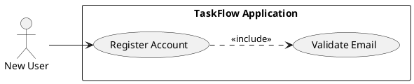

#### UC-002: Log In
- Actor(s): Registered User
- Goal: Authenticate and obtain valid session tokens to access the dashboard.
- Preconditions: User is registered and not locked out.
- Success Scenario:
  1. User submits email and password via login form.
  2. System validates credentials and rate limits.
  3. System issues access and refresh tokens and updates last_login.
  4. User is redirected to dashboard.
- Extensions/Alternatives:
  - 2a. Invalid credentials → return 401 Unauthorized; increment failed attempts.
  - 2b. Account locked after threshold → return 423 Locked with unlock instructions.
- Postconditions: User has valid access tokens and session.

##### Use Case Diagram
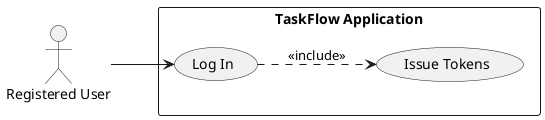

##### Sequence Diagram (Login Flow: UC-002)
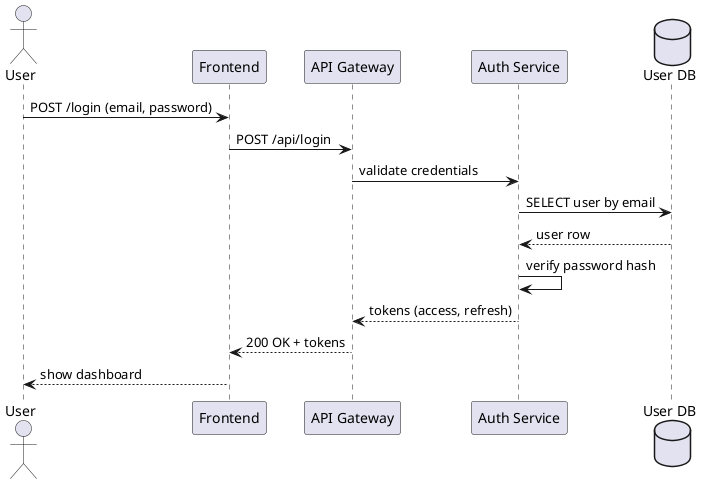

#### UC-003: Create Task
- Actor(s): Authenticated User
- Goal: Create a new task that appears on dashboards and can be assigned.
- Preconditions: User authenticated; user is member of at least one team.
- Success Scenario:
  1. User fills task form and submits.
  2. System validates title and other fields.
  3. System creates task record with status=New, created_by, created_at.
  4. System returns 201 Created and task appears on dashboards per permissions.
- Extensions/Alternatives:
  - 2a. Validation error (missing title) → return 400 Bad Request with details.
  - 3a. DB constraint error → 500 Internal Server Error and operation retried per idempotency guidance.
- Postconditions: Task persisted and visible in relevant dashboards.

##### Use Case Diagram
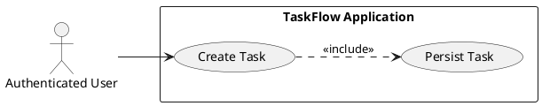

##### Sequence Diagram (Create -> Assign -> Notify combined: UC-003 + UC-004 + UC-009)
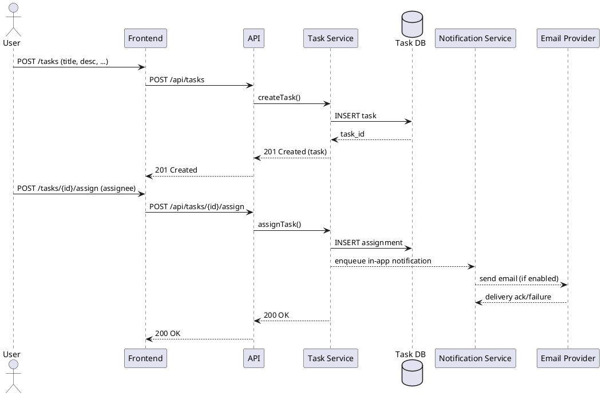

#### UC-004: Assign Task to User
- Actor(s): Authenticated User (creator or manager)
- Goal: Assign a task to another team member and notify them.
- Preconditions: Task exists; assignee exists and is in same team (MVP assumption).
- Success Scenario:
  1. User selects assignee and triggers assign action.
  2. System validates membership and ACL.
  3. System records assignment and timestamps.
  4. System sends in-app notification and optional email.
- Extensions/Alternatives:
  - 2a. Assignee not in team → return 400 with explanatory error and do not create assignment.
  - 3a. Notification queue full or email failure → retry per backoff, log failure.
- Postconditions: Assignment record persisted; notification enqueued.

##### Use Case Diagram
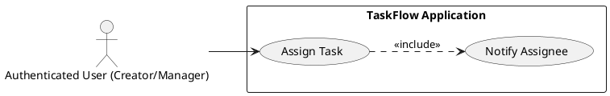

##### Sequence Diagram (Assign Task: UC-004)
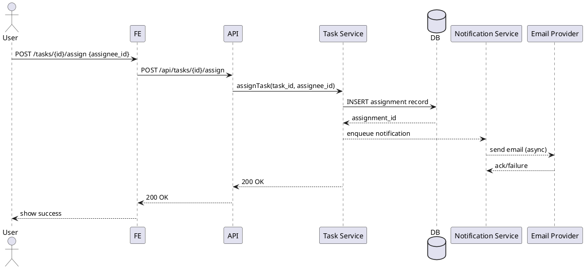

#### UC-005: Edit Task
- Actor(s): Creator, Assignee (when policy allows)
- Goal: Modify task fields while preserving audit trail and avoiding overwrite conflicts.
- Preconditions: User authorized to edit; task not soft-deleted.
- Success Scenario:
  1. User submits edits including current version token.
  2. System validates version; if matches, apply updates and increment version.
  3. System persists audit entry (who, what, when).
  4. System returns 200 OK with new version.
- Extensions/Alternatives:
  - 2a. Version mismatch → return 409 Conflict with current version and diff hint.
- Postconditions: Task updated and audit record created.

##### Use Case Diagram
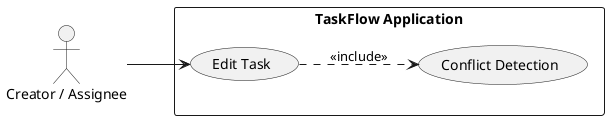

#### UC-006: Mark Task Completed
- Actor(s): Assignee or privileged user
- Goal: Record task completion and timestamp.
- Preconditions: Task assigned or user has permission to complete.
- Success Scenario:
  1. User triggers complete action.
  2. System validates permission and current status.
  3. System sets status = Completed and completed_at timestamp.
  4. System returns 200 OK.
- Extensions/Alternatives:
  - 2a. User lacks permission → 403 Forbidden.
  - 2b. Task already completed → 200 OK (idempotent).
- Postconditions: Task status updated and recorded.

##### Use Case Diagram
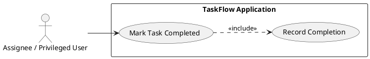

##### Sequence Diagram (Complete Task: UC-006)
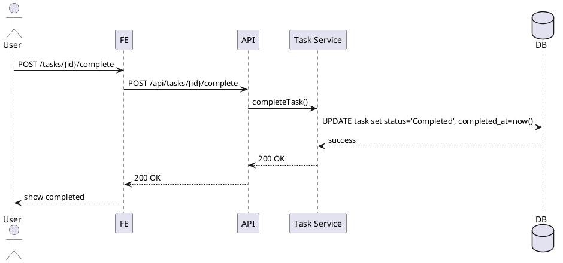

#### UC-007: Delete Task (Soft-delete)
- Actor(s): Creator or Admin
- Goal: Soft-delete a task to remove from default views while keeping recoverability.
- Preconditions: Task exists and user has permission.
- Success Scenario:
  1. User triggers delete.
  2. System sets deleted_at and deleted_by and returns 200 OK.
  3. Task excluded from default dashboard queries.
- Extensions/Alternatives:
  - 2a. User lacks permission → 403 Forbidden.
- Postconditions: Task soft-deleted and recoverable until retention window elapses.

##### Use Case Diagram
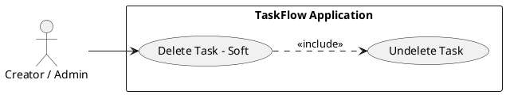

#### UC-008: View Dashboard & Filter Tasks
- Actor(s): Any Authenticated User
- Goal: Load task list for user/team and apply filters and sort.
- Preconditions: User authenticated.
- Success Scenario:
  1. User navigates to dashboard.
  2. Frontend requests GET /api/tasks with paging & filters.
  3. Backend validates permissions and returns paginated tasks matching filters.
  4. Frontend renders results and supports client-side sort toggles.
- Extensions/Alternatives:
  - 2a. Invalid filter parameter → 400 Bad Request.
  - 3a. Large result sets → return cursor for pagination.
- Postconditions: Dashboard rendered with selected filters.

##### Use Case Diagram
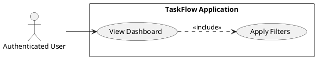

##### Sequence Diagram (Dashboard Load: UC-008)
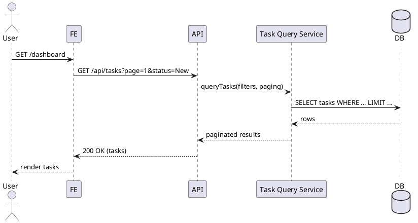

#### UC-009: Receive Assignment Notification
- Actor(s): Assignee (End User)
- Goal: Assignee receives in-app and email notification when a task is assigned.
- Preconditions: Assignment created and user has valid contact/email.
- Success Scenario:
  1. Assignment is created.
  2. Notification service enqueues in-app notification and email (if opt-in).
  3. Assignee sees in-app notification and receives email per preferences.
- Extensions/Alternatives:
  - 2a. Email delivery fails → retry per backoff and log failure.
  - 2b. User opted out of email → only in-app notification created.
- Postconditions: Notification logs updated; assignee aware of assignment.

##### Use Case Diagram
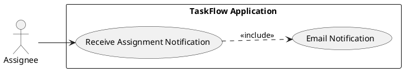

##### Sequence Diagram (Notify Assignee: UC-009)
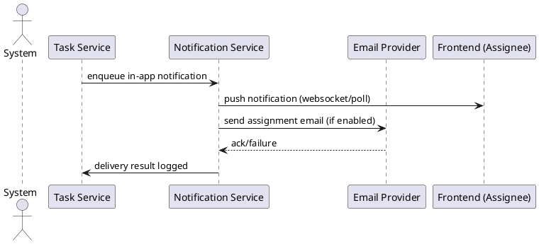

#### UC-010: Team Management (Light)
- Actor(s): Admin / Project Owner
- Goal: Add or remove team members and reflect availability for assignment.
- Preconditions: Admin authenticated and has team management privileges.
- Success Scenario:
  1. Admin updates team roster.
  2. System updates membership mapping and permissions.
  3. Assignable user lists reflect changes immediately.
- Extensions/Alternatives:
  - 2a. Attempt to remove self as sole admin → prevent or require transfer of ownership.
- Postconditions: Team roster updated and visible in UI.

##### Use Case Diagram
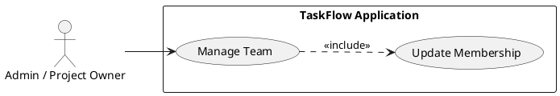

**Note**: Each use case diagram above focuses on the actor(s) and the primary use case; sequence diagrams are included for the prioritized flows UC-002, UC-003/UC-004/UC-009 combined, UC-006, UC-008, and UC-009 to show interaction sequences across frontend, API, DB, and notification/email subsystems.

## Risks & Mitigations
- Risk: Time-to-deliver constraint (3 months).  
  - Mitigation: Strict MVP scope, iterative sprints (Sprint 0: infra & auth; Sprint 1: auth + user flows; Sprint 2: tasks CRUD + assignments; Sprint 3: dashboard + notifications), leverage open-source starter templates.
- Risk: Ambiguous notification requirements leading to rework.  
  - Mitigation: Fix MVP channels to in-app + optional email; document preference model and retry semantics; use managed email provider.
- Risk: Security/regulatory breach of user PII.  
  - Mitigation: Apply OWASP controls, use Argon2/bcrypt, HTTPS everywhere, minimal PII storage, rotate secrets via environment/secret manager, disable verbose errors in prod.
- Risk: Scale mismatch (unexpected high concurrency).  
  - Mitigation: Design with horizontal scaling, use caching for hot reads (Redis), perform load testing and set autoscaling policies.
- Risk: Concurrency conflicts on task edits leading to data loss.  
  - Mitigation: Use optimistic locking (version/ETag), return 409 on conflicts and show diff/merge guidance in UI.

## Constraints & Assumptions
- Constraint: Initial release MUST be delivered within 3 months; limits scope to core features only (no AI, no mobile native apps).
- Constraint: Use only open-source technologies where feasible; prefer managed services for email and DB to keep ops costs low.
- Assumption: Teams will have <50 members; task assignment for MVP SHALL be single-assignee per task.
- Assumption: Default notification channel is in-app; email optional and user-controlled.
- Assumption: Soft-delete retention default is 30 days before hard-delete; configurable by admin.

## Previous Analysis and Reasoning
1) Executive summary / business context  
- Problem being solved: Small teams lack a lightweight, single-place tool to create, assign, and track tasks; they rely on email/spreadsheets causing lost context, poor visibility, and weak accountability.  
- Why now / expected outcome: Deliver TaskFlow to increase visibility and accountability, reduce coordination overhead, and help managers monitor progress. Success measured by adoption (≥80% target users), improved task completion rates, and operational KPIs.  
- MVP focus: Core user authentication, task lifecycle (create/assign/edit/complete/delete), dashboard & filtering, simple notifications. Exclude advanced analytics, AI suggestions, mobile native apps, and third-party PM integrations.

2) Key business objectives and priority (MoSCoW + rationale)  
- Must have (highest priority)  
  1. Reliable user authentication and account management (FR-001, FR-002).  
  2. Task lifecycle: create, assign, edit, complete, delete (FR-003–FR-007).  
  3. Dashboard with filtering (FR-008, FR-009).  
  4. Notifications when tasks are assigned (FR-010).  
- Should have (medium)  
  - Task priority field, due-dates, role-aware views.  
- Could have (low)  
  - Bulk actions, recurring tasks, CSV import/export.  
- Won’t have (initial release)  
  - AI suggestions, mobile native apps, external integrations.

3) Main functional areas (modules)  
- Authentication & Authorization: registration, login, password reset, JWT lifecycle, secure password storage (Argon2/bcrypt).  
- User Management: profiles, team membership.  
- Task Management: CRUD, statuses, priorities, due dates, audit fields.  
- Assignment & Collaboration: single-assignee semantics, assignment history, ACLs.  
- Notification System: in-app store and email queueing with retry/backoff.  
- Dashboard & Filtering: paginated queries, indices.  
- Data & Persistence: Postgres schema for User, Task, Assignment; migrations and backups.  
- Platform & Ops: Docker, CI/CD, monitoring, logging.

4) Critical requirements needing detailed spec (priority & why)  
- Authentication: password policies, hashing, JWT expiry/refresh, rate limiting, account lockouts.  
- Task lifecycle: valid statuses, allowed transitions, optimistic locking, validation rules.  
- Assignment semantics: single assignee, membership checks, who can assign.  
- Notifications: in-app + email MVP, retry/backoff policies, preference settings.  
- Dashboard: filters, pagination, default views, permission boundaries.  
- Security & transport: HTTPS, OWASP mitigations, input validation.  
- Performance: P95 dashboard <2s at 500 concurrent users; caching strategy for lists.

5) Use cases to document (UC list)  
- Documented above: UC-001 through UC-010. Sequence diagrams included for prioritized flows (UC-002, UC-003+UC-004+UC-009 combined, UC-006, UC-008, UC-009).

6) Non-functional requirements considered (concise)  
- Scalability & Performance: support 500 concurrent users; P95 dashboard < 2s.  
- Availability: uptime ≥ 99.5% recommended.  
- Security & Compliance: HTTPS, OWASP, Argon2/bcrypt, JWT best practices.  
- Data Durability: daily backups, point-in-time recovery where supported.  
- Observability: structured logs, tracing, basic metrics and alerts.  
- UX & Accessibility: responsive UI and basic WCAG A/AA compliance for essential flows.  
- Cost: prefer managed services and autoscaling to minimize ops costs.  
- Testability: unit, integration, and e2e for auth, task lifecycle, notifications.

7) Potential risks and constraints (top items + mitigations)  
- Time-to-deliver → Strict MVP and iterative sprints.  
- Notification ambiguity → Fix MVP behavior and document preferences.  
- Security risk → Secure defaults, minimal PII, audits.  
- Scale mismatch → Design for horizontal scaling and load-test.  
- Concurrency data integrity → Optimistic locking and conflict UX.

8) Specification structure and deliverable plan (how to organize spec.md)  
- This document follows the planned structure: goals, scope, FRs, UCs, NFRs, security, API outlines, UI notes, data model, and roadmap.

9) Work product / next steps and decisions required before implementation  
- Confirm notification channels for MVP: in-app + email (recommended — assumes yes).  
- Confirm assignment model: single assignee for MVP (recommended — assumes yes).  
- Confirm team construct: tasks scoped to teams (assumed yes).  
- Confirm soft-delete retention policy (default 30 days).  
- Product Owner sign-off on Must/Should/Could lists and 3-month milestone plan.

## Non-Functional Requirements (NFR)
- NFR-001: Performance — The system SHALL support 500 concurrent users with P95 API response < 2 seconds for dashboard endpoints.  
  - Acceptance Criteria: Load test demonstrates P95 < 2s for GET /api/tasks under 500 concurrent users in staging.
- NFR-002: Availability — The system SHALL have an uptime target ≥ 99.5%.  
  - Acceptance Criteria: Monitoring reports aggregated uptime ≥ 99.5% over a 30-day period in production.
- NFR-003: Security — All communication SHALL use HTTPS; passwords SHALL be hashed using Argon2 or bcrypt; JWT tokens SHALL be short-lived and refreshable.  
  - Acceptance Criteria: No plaintext passwords stored; TLS enforced; access tokens 15m expiry; refresh token rotation tested.
- NFR-004: Data Durability — Daily backups and point-in-time recovery (where supported) SHALL be in place.  
  - Acceptance Criteria: Backup job succeeds 7/7 days with weekly restore test documented.
- NFR-005: Observability — Structured logs, request tracing, and basic alerting (error rate, latency) SHALL be configured.  
  - Acceptance Criteria: Alerts fire when error rate > threshold (configurable) and when P95 latency exceeds 2s; traces available for failed requests.
- NFR-006: UX & Accessibility — Core UI flows SHALL be responsive and meet WCAG A/AA basics for forms and navigation.  
  - Acceptance Criteria: Manual accessibility audit of key flows passes WCAG AA checklist items for forms and navigation.
- NFR-007: Maintainability — API SHALL be documented with OpenAPI and CI pipeline SHALL run linting and unit tests.  
  - Acceptance Criteria: OpenAPI spec published; CI pipeline green for PRs and unit coverage >= 60% for core modules.

## Security & Privacy (summary)
- Authentication: JWT access tokens (short-lived) + refresh token mechanism; rotate refresh tokens on use. Session cookie options SHALL be HttpOnly and Secure.
- Passwords: MUST be hashed with Argon2 (preferred) or bcrypt and never logged; password policy enforced on registration.
- Input Validation: All inputs validated server-side using strict schemas; parameterized DB queries to prevent injection.
- Secrets: All secrets and credentials SHALL be stored in environment variables or secret manager; never hardcoded.
- Transport: HTTPS enforced for all endpoints and redirects.
- Logging: No PII (passwords, tokens) in logs; structured logs for tracing.
- OWASP: Implement CSP, HSTS, X-Content-Type-Options headers, and disable debug on prod.

## Data Model (high level)
- User
  - user_id (uuid, PK)
  - name (varchar, required)
  - email (varchar, unique, required)
  - password_hash (text)
  - created_at (timestamp)
  - last_login (timestamp)
  - preferences (jsonb) - includes notification preferences
- Task
  - task_id (uuid, PK)
  - title (varchar(255), required)
  - description (text, optional)
  - status (enum: New, In Progress, Completed, Archived)
  - priority (enum: Low, Medium, High; default Medium)
  - due_date (date, optional)
  - created_by (uuid -> User)
  - created_at (timestamp)
  - updated_at (timestamp)
  - version (int) - for optimistic locking
  - deleted_at (timestamp, nullable)
  - completed_at (timestamp, nullable)
- Assignment
  - assignment_id (uuid, PK)
  - task_id (uuid -> Task)
  - user_id (uuid -> User)
  - assigned_by (uuid -> User)
  - assigned_at (timestamp)
- Notification (in-app)
  - notification_id (uuid, PK)
  - user_id (uuid -> User)
  - type (enum)
  - payload (jsonb)
  - read_at (timestamp, nullable)
  - created_at (timestamp)

Indexes:
- Tasks: index on created_by, status, priority, due_date, (team_id if team scoping implemented).
- Assignments: index on user_id, task_id.
- Users: unique index on email.

Retention:
- Soft-deleted tasks retained for 30 days by default; configurable. Hard delete job runs after retention period.

## API Surface (high-level, examples)
- POST /api/register — create account → 201 Created
- POST /api/login — authenticate → 200 OK (access + refresh)
- POST /api/tasks — create task → 201 Created
- GET /api/tasks — list tasks (filters, paging) → 200 OK
- GET /api/tasks/{id} — get task details → 200 OK
- PATCH /api/tasks/{id} — edit task (with version) → 200 OK / 409 Conflict
- POST /api/tasks/{id}/assign — assign task → 200 OK
- POST /api/tasks/{id}/complete — mark completed → 200 OK
- DELETE /api/tasks/{id} — soft delete → 200 OK
- POST /api/teams/{id}/members — manage team membership → 200 OK

Error codes:
- 400 Bad Request — validation errors
- 401 Unauthorized — invalid/expired credentials
- 403 Forbidden — ACL violations
- 404 Not Found — resource not found or access denied
- 409 Conflict — version/concurrency conflicts or duplicate resource
- 500 Internal Server Error — unexpected failures

## UI Impact & Design Notes
- Screens required for MVP:
  - Login / Register / Password reset
  - Dashboard (list view) with filters sidebar and search
  - Task Create/Edit modal or page
  - Task details page with assignment history and activity/audit feed
  - Notification center accessible from header
  - Team management minimal UI for admins
- Responsive breakpoints: desktop + tablet primary support; mobile supported in responsive layouts but not optimized as native app.
- UX: Present conflicts to users with clear message + option to reload or merge.

## Data Migration & Retention Policy
- Migrations: Use a migration tool (Alembic) for schema evolution. Each migration MUST be reversible when feasible.
- Backups: Daily DB snapshots; weekly restore test.
- Retention: Soft-delete retention default 30 days; configurable per environment. Admins may trigger earlier hard deletes.

## Implementation Roadmap / Release Plan (high-level)
- Sprint 0 (1 week): Infra, CI/CD, DB schema, skeleton app, auth library.
- Sprint 1 (2 weeks): Registration, Login, JWT, user management, basic UI shell.
- Sprint 2 (2 weeks): Task model, Create Task, Read Task, Task list endpoints, DB indices.
- Sprint 3 (2 weeks): Assignment mechanics, in-app notifications, email integration (managed provider).
- Sprint 4 (2 weeks): Edit/optimistic locking, complete/delete flows, dashboard filters and pagination.
- Sprint 5 (1-2 weeks): QA, load testing, security hardening, accessibility fixes, release prep.

## QA Plan & Acceptance Testing Checklist
For each FR map to test cases:
- FR-001: Unit + integration tests for registration; e2e test for sign-up and login path. Verify password hashing and duplicate email handling.
- FR-002: Auth tests for token issuance, expiry and refresh; rate limit and lockout tests.
- FR-003..FR-007: CRUD tests with permissions, validation, concurrency (simulate concurrent edits to confirm 409).
- FR-008..FR-009: Performance tests for list endpoints under load; filter correctness tests.
- FR-010: Notification unit tests (queueing) and integration tests for email delivery with simulated provider responses.

## Appendix: Monitoring & Deployment Checklist
- CI: PR lint, unit tests, integration tests.
- CD: Docker image build, staging deploy, smoke tests.
- Observability: Request traces, error-rate alerts, latency dashboards.
- Backups: Daily snapshot job, restore runbook.
- Runbook: Steps for rollback, DB restore, and token revocation.

## Final Notes and Decisions Required
- Confirm notification MVP channels (assumed: in-app + email). Decision REQUIRED from Product Owner.
- Confirm single-assignee model for MVP (assumed yes). Decision REQUIRED if multi-assignee desired.
- Confirm team scoping semantics (assumed tasks are team-scoped). Decision REQUIRED for global vs team-only tasks.
- Product Owner sign-off REQUIRED on MoSCoW priorities and 3-month timeline.

