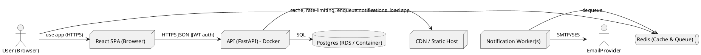

Architecture Design Document: TaskFlow
Revision: 1.0
Author: Senior Solutions Architect
Date: 2026-03-13

Retrieved references used
- Architecture workflow guidelines: iterative-development-guide.md, language-agnostic-standards.md, markdown-styleguide.md
- Architecture rules: performance-best-practices.md, security-standards-owasp.md, code-anti-patterns.md, dry-principle-guidelines.md
- Architecture template: (standard architecture template followed: context → containers → components → APIs → data → infra → security → observability → ADRs)

Executive summary
- Purpose: Define a scalable, secure, maintainable architecture for TaskFlow — a lightweight team task management web app supporting ~500 concurrent users, deliverable within a 3-month MVP timeframe.
- Primary goals: Implement MVP features (user registration/auth, task CRUD, assignment, dashboard/filtering, notifications), meet performance targets (<2s list endpoints under normal load), ensure secure defaults (HTTPS, password hashing, JWT), and enable easy deployment via Docker on AWS or Azure.
- High-level decision: Cloud-native, containerized architecture using React frontend, FastAPI backend, PostgreSQL for persistence, Redis for caching and task queue (RQ/Celery-compatible), and observability via Prometheus/Grafana + OpenTelemetry.

Table of contents
1. Requirements mapping
2. System context (C4 - Level 1)
3. Container architecture (C4 - Level 2)
4. Component design (C4 - Level 3)
5. API design (contracts)
6. Data architecture
7. Infrastructure & deployment
8. Security architecture
9. Observability, logging, and monitoring
10. Scalability, availability & performance plan
11. Testing strategy & CI/CD
12. Operational runbook & backup/recovery
13. Technology stack rationale
14. Risks & mitigations (key)
15. Architecture Decision Records (ADRs)
16. Appendix: PlantUML diagrams and ERD

1. Requirements mapping
- Mapped core FRs to components and acceptance criteria:
  - FR-001 Register: POST /auth/register => create user with password_hash (bcrypt/argon2), return 201 + user_id + set auth JWT cookie.
  - FR-002 Login: POST /auth/login => return short-lived access JWT (stored HttpOnly cookie) and refresh token option; rate limiting on endpoint.
  - FR-003 Create task: POST /tasks => persist task (created_by), return 201 task_id.
  - FR-004 Assign task: POST /tasks/{id}/assign => create assignment record, set task.assignee, enqueue notification.
  - FR-005 Edit task: PATCH /tasks/{id} => 200 updated resource; 403/409 per rules.
  - FR-006 Complete: PATCH /tasks/{id}/status => set completed_at; optional notify creator.
  - FR-007 Delete: DELETE /tasks/{id} => soft-delete (deleted_at), 204.
  - FR-008 Dashboard: GET /tasks with pagination/filtering => returns paginated results within NFR.
  - FR-009 Filter: GET /tasks?status=completed etc.
  - FR-010 Notifications: Notification Service + queue ensures delivery within 1 minute target; retries for transient failures.

Non-functional requirements (explicit/derived)
- Performance: <2s for list endpoints under normal load (500 concurrent users).
- Security: HTTPS-only, JWT-based auth, bcrypt/argon2 password hashing, OWASP controls, rate limiting.
- Availability: >=99.5% uptime target; use managed services and health checks.
- Maintainability: Containerized services, clear component boundaries, infra-as-code.
- Deployability: Docker-based images, CI/CD, support AWS/Azure.

2. System context (C4 - Level 1)
Purpose: Show TaskFlow in its environment.

PlantUML (C4 Context)
```plantuml
@startuml
!define AWSPUML https://raw.githubusercontent.com/awslabs/aws-icons-for-plantuml/v14.0/Advanced/AWSCommon.puml
actor "End User (Browser)" as User
actor "Admin / Manager" as Manager
rectangle "TaskFlow System" {
  rectangle "Web App (React)" as Frontend
  rectangle "API Backend (FastAPI)" as Backend
  rectangle "Notification Worker" as Notif
  rectangle "PostgreSQL" as DB
  rectangle "Redis (cache & queue)" as Redis
}
User --> Frontend : uses (HTTPS)
Manager --> Frontend : uses (HTTPS)
Frontend --> Backend : HTTPS JSON REST (JWT)
Backend --> DB : SQL (Postgres)
Backend --> Redis : cache reads/writes, enqueue notifications
Notif --> Redis : dequeue, process notifications
Notif --> Email Provider (SMTP/SES) : deliver email
@enduml
```

Context narrative
- Actors: Registered Users (developers, managers), Admins. External systems: Email provider (SMTP/SES), optional webhook receivers.
- System boundary: TaskFlow consists of Frontend, API backend, Notification worker(s), and shared persistence/caching.

3. Container architecture (C4 - Level 2)
Containers
- Web Frontend
  - Purpose: UI built in React; static assets served via CDN (S3 + CloudFront) or static webserver (nginx).
  - Characteristics: Client-rendered SPA; calls backend REST APIs; performs local caching and optimistic UI updates.
- API Backend (FastAPI)
  - Purpose: Business logic, auth issuing/validation, data access layer, input validation.
  - Characteristics: Stateless; horizontally scalable; exposes REST API with OpenAPI schema; integrates with Redis, PostgreSQL, and Notification queue.
- Notification Worker(s)
  - Purpose: Consume assignment events, deliver email/in-app notifications, handle retry/backoff, update delivery status.
  - Characteristics: Stateful process for retries; horizontally scalable workers.
- PostgreSQL
  - Purpose: Primary data store for users, tasks, assignments, audit logs.
  - Characteristics: Managed instance recommended (RDS/Azure DB); backups and point-in-time recovery.
- Redis
  - Purpose: Cache frequently-read results (dashboard fragments), session/locks, message broker for notification queue.
  - Characteristics: Single primary with replicas; persistence optional (AOF/RDB); used also for rate-limiting counters.
- Optional: CDN for static frontend assets; SMTP/SES external provider.

Container diagram (PlantUML)


4. Component design (C4 - Level 3)
API Backend internal components
- HTTP/API Layer
  - Responsibility: Request validation, auth (JWT verification), rate limiting, input sanitization, OpenAPI docs.
- Auth module
  - Responsibility: Registration, login, password hashing, JWT issuance, refresh token handling (if used), account lockout.
- Task Service
  - Responsibility: CRUD for tasks, status transitions, soft-delete, optimistic concurrency/versioning (ETag or version field).
- Assignment Service
  - Responsibility: Create assignment record, validate team membership, enforce authorization, write audit record, enqueue notification.
- Notification Enqueuer
  - Responsibility: Publish assignment events to Redis queue with metadata (recipient, method).
- Notification Worker
  - Responsibility (separate container): Consume queue, deliver in-app & email notifications, retry with exponential backoff, persist delivery logs.
- Persistence Layer / Repositories
  - Responsibility: Encapsulate SQL queries, migrations, pooling.
- Caching Layer
  - Responsibility: Cache common read queries (e.g., recent tasks list), invalidate on write, use TTL.
- Audit & Metrics module
  - Responsibility: Record audit logs for actions (create/edit/delete/assign), emit metrics (Prometheus).
- Background Jobs module
  - Responsibility: Scheduled cleanup (soft-delete retention), digest emails (future), health-check tasks.

Component interaction sequence: Create & assign task
1. User -> API (POST /tasks) -> Task Service validates, writes Task to Postgres.
2. If assignee provided -> Assignment Service creates Assignment row and calls Notification Enqueuer.
3. Enqueuer pushes message to Redis queue.
4. Notification Worker consumes, attempts delivery (email or in-app), writes delivery status to DB, emits metrics.

Concurrency control
- Use optimistic concurrency control via a task.version integer and conditional UPDATE ... WHERE id = X AND version = V to detect conflicting edits; return 409 on mismatch with latest resource representation.

5. API design (contracts)
General
- API style: RESTful JSON over HTTPS. All endpoints require Authorization except register/login.
- Auth: Bearer JWT or HttpOnly Secure cookie with Access JWT; endpoints protected with OAuth2PasswordBearer semantics. Recommend short-lived access token (15 minutes) and optional refresh token (7-30 days) stored as HttpOnly refresh cookie.
- Rate-limiting: IP & account rate limits on auth and write endpoints (e.g., 10 req/min login).

Core endpoints (essential subset)

Auth
- POST /api/v1/auth/register
  - Request: { "name": string, "email": string, "password": string }
  - Responses:
    - 201 { "user_id": UUID, "email": string, "created_at": ISO8601 }
    - 400 validation errors
- POST /api/v1/auth/login
  - Request: { "email": string, "password": string }
  - Responses:
    - 200 { "access_token": string, "token_type": "bearer", "user": { user fields } } and sets HttpOnly cookie OR returns token in body
    - 401 invalid credentials
- POST /api/v1/auth/logout
  - Request: Authorization
  - Response: 204

Users
- GET /api/v1/users/me
  - Response: 200 user profile
- GET /api/v1/teams/{team_id}/members
  - Response: 200 list of users

Tasks
- POST /api/v1/tasks
  - Request: { "title": string, "description": string|null, "priority": "low"|"medium"|"high" (opt), "assignee_id": UUID|null }
  - Response:
    - 201 { "task_id": UUID, ... }
    - 400 validation errors
- GET /api/v1/tasks
  - Query params: page / limit or cursor, status, assignee_id, sort (priority, created_at)
  - Response: 200 { "items": [Task], "meta": { total, page, limit } }
- GET /api/v1/tasks/{id}
  - Response: 200 { Task } or 404
- PATCH /api/v1/tasks/{id}
  - Request: partial fields to update + optional If-Match header with version or ETag
  - Response:
    - 200 updated Task
    - 403 unauthorized
    - 409 conflict
- DELETE /api/v1/tasks/{id}
  - Response:
    - 204 on success (soft-delete)
    - 403 unauthorized

Assignments
- POST /api/v1/tasks/{id}/assign
  - Request: { "assignee_id": UUID }
  - Response:
    - 201 { "assignment_id": UUID }
    - 400 if assignee invalid
    - 409 on conflicting concurrent assignment policy
- GET /api/v1/tasks/{id}/assignments
  - Response: 200 list

Notifications (internal)
- POST /internal/api/v1/notifications/enqueue
  - Request: { "recipient_id": UUID, "type": "assignment", "payload": {...} }
  - Response: 202 accepted

Errors and standard fields
- Use uniform error envelope:
  - { "error": { "code": "INVALID_INPUT", "message": "Title is required", "details": { ... } } }
- Use HTTP status codes appropriately (4xx client, 5xx server).

Authentication & Authorization
- JWT includes sub=user_id, roles, team_id, iat, exp, jti.
- Authorization rules:
  - Create/Edit/Delete allowed for creators or admins; assignees allowed to mark complete.
  - Manager role: read across team.
  - Authorization decisions enforced in API layer.

6. Data architecture
Logical data model (concise)
- user (user_id PK UUID, name, email UNIQUE, password_hash, created_at, team_id, role, is_active)
- team (team_id PK, name, created_at)
- task (task_id PK UUID, title, description TEXT, status ENUM {open,in_progress,completed,archived}, priority ENUM, created_by FK->user, assignee_id FK->user nullable, assigned_at timestamp nullable, created_at, updated_at, completed_at, deleted_at, version INT)
- assignment (assignment_id PK, task_id FK->task, user_id FK->user, assigned_by FK->user, assigned_at, reason TEXT)
- notification (notification_id PK, recipient_id FK->user, type ENUM, payload JSONB, status ENUM {queued,sent,failed}, attempts INT, last_attempt_at)
- audit_log (id PK, actor_id, action, resource_type, resource_id, data JSONB, created_at)

Indexes & constraints
- Unique index on user.email
- Indexes on task(created_by), task(status), task(assignee_id), assignment(user_id)
- Partial index on task (deleted_at IS NULL) to accelerate normal queries
- Foreign keys with ON DELETE SET NULL for assignee to preserve tasks if user removed

Data retention & soft-delete
- Soft-delete: task.deleted_at timestamp; cron job/maintenance job to permanently delete after retention period (e.g., 90 days)
- Backups: daily full backups, point-in-time for RDS.

Sample ERD (Appendix includes diagram)

7. Infrastructure & deployment
Deployment targets
- MVP: Docker images orchestrated via:
  - Option A (recommended for speed & cost): AWS ECS Fargate + RDS(Postgres) + ElastiCache Redis + SES; or Azure equivalents (ACR + AKS/Managed SQL + Redis).
  - Option B (dev/local): Docker Compose for local and test environments.
- CI/CD: GitHub Actions (or GitLab CI) building images, running tests, scanning dependencies, pushing to container registry, deploying via IaC (Terraform or ARM/Bicep) to target cloud.

Infrastructure components
- Container registry: ECR/ACR
- App servers: ECS Fargate tasks or AKS pods (FastAPI + workers)
- Frontend hosting: S3 + CloudFront (or Azure Static Web Apps) for static assets
- DB: Managed Postgres (RDS/Azure DB) multi-AZ
- Redis: Managed ElastiCache / Azure Cache for Redis
- Secrets manager: AWS Secrets Manager / Azure Key Vault
- SMTP: SES or external SMTP
- Observability: Prometheus/Grafana for metrics, Loki/ELK for logs, Jaeger for traces
- Load balancer & TLS: ALB/ALB with ACM-managed certs or Azure Application Gateway, enforce HTTPS

Deployment pattern
- Blue/green or rolling updates for backend services
- Health checks (liveness/readiness) for all pods/containers
- Autoscaling policies: CPU/memory and custom metrics (queue length) triggers

Container resource sizing (initial)
- API: 2 vCPU, 2GB RAM × 2 replicas
- Worker: 1 vCPU, 1GB RAM × 1-2 (scale with queue)
- Redis: cache.t3.medium equivalent with replica for read
- Postgres: db.t3.medium equivalent with multi-AZ

Network & VPC
- Private subnets for DB/Redis; public subnets for load balancer and NAT.
- Security groups restricting access.
- Use TLS for all external/intra-service traffic.

8. Security architecture
Security principles applied
- Least privilege, defense-in-depth, secure defaults, explicit whitelist-based network rules, input validation and sanitization, rate limiting, audit trails.

Authentication & tokens
- Password hashing: Argon2id preferred, fallback bcrypt with high work factor if Argon2 not available.
- Access tokens: short-lived (15 minutes) JWT signed with asymmetric keys (RS256) or rotating secrets; use refresh tokens (longer-lived) stored in secure HttpOnly SameSite cookies.
- Store secrets in managed secrets store.

Session storage & cookie policy
- Recommend HttpOnly, Secure, SameSite=Strict for cookies. If SPA needs token in JS, use a pattern with refresh cookie and backend endpoint to mint access token; otherwise, prefer cookie-based session to reduce XSS risk.

Transport & storage
- Enforce HTTPS/TLS v1.2+; HSTS header.
- Sensitive data at rest: DB encrypted (managed service encryption). Backups encrypted.
- No logging of plaintext passwords or secrets; mask PII in logs.

OWASP protections
- Input validation with Pydantic schemas.
- CSRF protection for cookie-based auth (double-submit or CSRF tokens).
- XSS mitigation: escape outputs in frontend; use Content Security Policy (CSP).
- SQL injection: use parameterized queries/ORM (SQLAlchemy core/ORM).
- Rate limiting: on auth endpoints and abusive write endpoints.
- Brute-force: account lockout + exponential backoff.

Secrets & keys
- Store JWT signing keys and DB passwords in Secrets Manager or Key Vault. Use IAM roles for services.

Data access & permissions
- Database user only with necessary privileges.
- Apply RBAC (users, managers, admins) at API level. Record authorizations in audit_log.

Security testing
- Dependency vulnerability scans in CI.
- Static Application Security Testing (SAST) and baseline dynamic checks (DAST).
- Pen-test prior to GA.

9. Observability, logging, and monitoring
- Metrics: instrument FastAPI and workers with Prometheus client; key metrics: request latency, error rates, DB query times, queue length, notification delivery times.
- Tracing: OpenTelemetry instrumentation for distributed traces; Jaeger or managed tracing.
- Logs: Structured JSON logs, include request_id/correlation_id. Forward to centralized log storage (CloudWatch Logs/Elastic/Loki).
- Alerts: Configure alerts for high error rate, high latency, queue backlog > threshold, DB failover, instance health.
- Health: /health/live and /health/ready endpoints for containers.
- Dashboards:
  - API latency P95/P99, error rate, throughput
  - Queue depth and worker throughput
  - Notification delivery success rate
  - Database connections and slow queries

10. Scalability, availability & performance plan
Stateless services
- API servers are stateless allowing horizontal scaling behind load balancer.

Caching strategy
- Use Redis for caching task list fragments (team-level dashboards) with short TTL (30s-120s) and invalidate on writes.
- Client-side caching and pagination to reduce server load.

Queue & worker scaling
- Monitor queue length; autoscale workers based on backlog and delivery SLA (1 minute target for assignment notifications).

Database scaling & partitioning
- Initial: single primary with read replicas if necessary.
- Use connection pooling (pgbouncer) to avoid overloading DB with many connections.
- Indexes to support frequent filters (status, assignee, created_by). Use pagination with cursor-based approach when large datasets likely.

Performance testing
- Load-test GET /tasks with 500 concurrent simulated users; tune DB indexes, cache, and query plans.
- Use query plan analysis to optimize.

Availability & backup
- Multi-AZ DB, auto-failover; worker health checks and restarts; backups daily + PITR.

11. Testing strategy & CI/CD
Testing
- Unit tests for business logic (pytest).
- Integration tests for DB and queue interactions (use ephemeral containers).
- End-to-end UI tests (Cypress) covering register/login/create/assign/dashboard flows.
- Load testing (k6 or Locust) to simulate 500 concurrent users focusing on task list endpoints.
- Security checks (dependency scan, SAST) integrated into CI.

CI/CD
- Build pipeline:
  - Lint + tests -> Build container images -> Security scans -> Push to registry -> Deploy to staging -> Run automated E2E tests -> Manual approval -> Deploy to production.
- Use feature flags for toggling non-MVP features.

12. Operational runbook & backup/recovery
Operational runbook (key actions)
- Deploy: CI/CD automated; rollback triggers via previous image.
- Incident: Alert -> On-call notified -> create incident ticket -> use /health endpoints to isolate service -> scale workers or DB read replica promotion if needed.
- DB restore: Restore from latest backup or PITR; follow documented recovery steps.
- Soft-delete recovery: Admin endpoint to list soft-deleted tasks and restore within retention window.

Backups & retention
- Daily snapshots retained 30 days, point-in-time recovery for 7 days (configurable).
- Soft-delete retention for user-visible restore: 90 days.

13. Technology stack rationale
- Frontend: React — leverage team familiarity; fast to deliver responsive SPA.
- Backend: FastAPI (Python) — rapid development, Pydantic validation, asynchronous support, good performance.
- Data store: PostgreSQL — ACID, open-source, powerful JSONB for flexible payloads.
- Cache/queue: Redis — open-source, supports caching, simple RQ/Celery, and low operational overhead for MVP.
- Notification worker: Python Celery or RQ (choose RQ for minimal complexity; Celery if scheduling/ack/delivery features needed).
- Containerization: Docker — required by spec; orchestrate with ECS Fargate / AKS.
- Observability: Prometheus + Grafana; OpenTelemetry for traces.
- Email: AWS SES (recommended) or SMTP provider fallback.
Rationale: All choices favor open-source and speed-to-deliver, align with team skill assumptions and constraints.

14. Risks & mitigations (top recapped)
- Timeline/Scope creep: Strict MVP scope, weekly milestones.
- Notification delivery failures: Queue with retries, fallback in-app notifications, monitoring.
- Security misconfig: Security review and automated checks; enforce strong password policy and secrets management.
- Performance at 500 concurrent users: caching, pagination, load testing, and autoscaling.
- Data loss: Soft-delete, backups, and audit logs.

15. Architecture Decision Records (ADRs)
ADR-001: Tech stack: FastAPI + React + Postgres + Redis
- Status: Accepted
- Context: Need rapid delivery with open-source stack, good performance, async handling for notifications.
- Decision: Use FastAPI for backend, React for frontend, PostgreSQL for persistence, Redis for cache/queue.
- Consequences: Fast development & easy Dockerization; team must implement async worker pattern.

ADR-002: Token storage & session strategy
- Status: Accepted
- Context: Security tradeoffs between localStorage (XSS risk) and HttpOnly cookies (CSRF).
- Decision: Use short-lived access JWTs and HttpOnly Secure SameSite cookies for auth; implement CSRF protection if cookies are used.
- Consequences: Less XSS exposure; requires CSRF mitigations and cookie-aware setup for SPA.

ADR-003: Notification queue: Redis RQ (or Celery)
- Status: Accepted
- Context: Need reliable queued notifications and Docker deployment flexibility.
- Decision: Use Redis as broker and RQ for simple worker semantics; migrate to SQS + Lambda/Celery later if required.
- Consequences: Simpler MVP operations; may need to refactor if high volume or cloud-native scaling required.

ADR-004: Soft-delete for tasks
- Status: Accepted
- Context: Avoid accidental data loss and support recovery & audit.
- Decision: Implement soft-delete via deleted_at timestamp and plan scheduled permanent purge after retention window.
- Consequences: Additional query filters required; retention policy must be enforced.

ADR-005: Concurrency control
- Status: Accepted
- Context: Need deterministic behavior on concurrent edits and assignments.
- Decision: Use optimistic concurrency via version field and conditional updates; last-writer-wins avoided to favor explicit conflict detection with 409 responses.
- Consequences: UI will handle 409 by fetching latest and prompting user to retry/merge.

16. Appendix

PlantUML diagrams (component-level)
- C4 Context & Container diagrams provided earlier.
- Component diagram (simplified)
```plantuml
@startuml
package "API Backend (FastAPI)" {
  [HTTP Layer] --> [Auth Module]
  [HTTP Layer] --> [Task Service]
  [HTTP Layer] --> [Assignment Service]
  [Task Service] --> [Persistence / Repositories]
  [Assignment Service] --> [Notification Enqueuer]
  [Notification Enqueuer] --> Redis
  [Persistence / Repositories] --> Postgres
}
package "Workers" {
  [Notification Worker] --> Redis
  [Notification Worker] --> Email Provider
  [Notification Worker] --> Postgres (write delivery logs)
}
@enduml
```

ERD (textual)
- user (user_id PK) 1..* — tasks.created_by FK
- task (task_id PK) 1..* — assignment.task_id FK
- user 1..* — assignment.user_id FK

Operational checklist for MVP launch
- Implement core FRs (001,002,003,004,006,008,010)
- Set up managed Postgres and Redis
- Configure TLS and domain + DNS
- Implement CI/CD pipeline, unit/integration tests
- Configure observability and alerts
- Run load tests and security scans
- Security review & privacy checklist

Open questions / next steps (to resolve pre-implementation)
- Finalize team membership model (is team created on first user or via admin?). Required to validate assignment authorization.
- Confirm cookie vs token client storage policy (org preference). Implementation uses cookie approach by default.
- Decide delivery SLA for notification (1-minute target) under what load—document scaling triggers.

Contact & ownership
- Architecture owner: Senior Solutions Architect
- Implementation lead: Product Engineer (to be assigned)
- Security owner: Security Engineer

End of document.