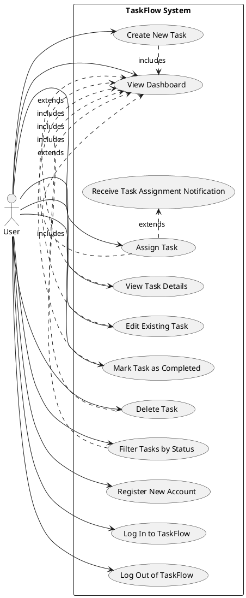

# Product Specification: TaskFlow – Simple Team Task Management System

---

## 1. Executive Summary

TaskFlow is a lightweight web application designed to empower small teams with efficient and centralized task management capabilities. This product specification outlines the detailed requirements for developing TaskFlow, focusing on its core functionality to create, assign, track, and manage tasks, alongside essential user management and notification features. The primary goal is to improve team productivity, enhance task visibility for managers, and ensure clear accountability by providing a simple, intuitive platform, thereby reducing reliance on disparate and inefficient tools like email or spreadsheets. This document serves as the definitive guide for the development team, detailing functional and non-functional requirements, use cases, and architectural considerations necessary for a successful initial release.

---

## 2. Goals and Objectives

### 2.1. Project Goal
The overarching goal of TaskFlow is to provide a lightweight web application where small teams can create, assign, and track tasks efficiently, improving collaboration and task visibility within teams through a simple and easy-to-use interface.

### 2.2. Business Objectives
*   **OBJ-001: Improve Team Productivity:** Centralize task organization to streamline workflows and reduce time wasted on searching for task information.
*   **OBJ-002: Enable Easy Task Tracking:** Provide managers with clear oversight of task progress and team workload.
*   **OBJ-003: Ensure Clear Accountability:** Facilitate explicit task assignments to individual team members.
*   **OBJ-004: Reduce Reliance on Inefficient Tools:** Migrate teams from using email or spreadsheets for task tracking to a dedicated system.

---

## 3. Target Users

TaskFlow is designed for small teams and their leadership who require a straightforward and efficient method to manage daily tasks.

*   **Team Member:** Individuals responsible for completing assigned tasks, viewing their own task list, and updating task statuses.
*   **Team Lead / Manager:** Individuals responsible for creating, assigning, tracking, and overseeing the progress of tasks for their team. They require a holistic view of all ongoing work.

---

## 4. Functional Requirements (FR)

### FR-001: User Registration
*   **Description:** Users MUST be able to register and create a new account to access TaskFlow.
*   **Requirement:** A user SHALL provide a unique email address, a full name, and a password to register for TaskFlow.
*   **Acceptance Criteria:**
    *   The system MUST successfully create a new user record in the database upon submission of valid, unique credentials.
    *   The system MUST display an error message if the provided email address already exists.
    *   The newly registered user MUST be able to log in immediately using their new credentials.
*   **Tag:** [DETERMINISTIC]

### FR-002: Secure Login
*   **Description:** Registered users MUST be able to securely log in to their TaskFlow account.
*   **Requirement:** A user SHALL provide their registered email address and password to authenticate with the system.
*   **Acceptance Criteria:**
    *   Upon successful authentication, the system MUST grant access to the user's dashboard and establish a secure user session.
    *   The system MUST display an error message for invalid credentials (e.g., incorrect email or password).
    *   The system SHALL enforce secure session management (e.g., JWT token validity).
*   **Tag:** [DETERMINISTIC]

### FR-003: Create New Tasks
*   **Description:** Users MUST be able to create new tasks within TaskFlow.
*   **Requirement:** A logged-in user SHALL be able to define a task by providing a title, a detailed description, and a priority level (e.g., Low, Medium, High). The task MUST be associated with the user who created it.
*   **Acceptance Criteria:**
    *   A new task record MUST be successfully stored in the database with all provided details.
    *   The newly created task MUST be immediately visible on the creator's task dashboard.
    *   Default values (e.g., status as 'Open', priority as 'Medium') SHALL be applied if not explicitly set.
*   **Tag:** [DETERMINISTIC]

### FR-004: Assign Tasks to Team Members
*   **Description:** Users MUST be able to assign created tasks to other team members.
*   **Requirement:** A logged-in user SHALL be able to select an assignee for a task from a list of registered users within their team. A task MUST be assigned to at most one user at any given time.
*   **Acceptance Criteria:**
    *   The system MUST update the task record to include the selected assignee's `user_id`.
    *   The assigned task MUST appear on the assignee's dashboard and be visible with the assignee's name on the creator's dashboard.
    *   The system MUST trigger a notification to the assigned user (see FR-010).
*   **Tag:** [DETERMINISTIC]

### FR-005: Edit Existing Tasks
*   **Description:** Users MUST be able to modify the details of existing tasks.
*   **Requirement:** A user SHALL be able to edit the title, description, priority, and assignee of any task they have created or are explicitly authorized to manage.
*   **Acceptance Criteria:**
    *   The system MUST successfully update the task record in the database with the new details.
    *   Changes MUST be immediately reflected on the task dashboard for all relevant users.
    *   The system MUST validate edited inputs (e.g., assignee must be a valid user).
*   **Tag:** [DETERMINISTIC]

### FR-006: Mark Tasks as Completed
*   **Description:** Users MUST be able to update the status of tasks to 'Completed'.
*   **Requirement:** A user SHALL be able to mark a task as 'Completed'. This functionality is available for tasks they have created or tasks currently assigned to them.
*   **Acceptance Criteria:**
    *   The task's status field in the database MUST be updated to 'Completed'.
    *   The task's visual representation on the dashboard MUST reflect its 'Completed' status (e.g., distinct styling, removed from 'Open' filter).
*   **Tag:** [DETERMINISTIC]

### FR-007: Delete Tasks
*   **Description:** Users MUST be able to permanently remove tasks from the system.
*   **Requirement:** A user SHALL be able to delete any task they have created.
*   **Acceptance Criteria:**
    *   The task record MUST be permanently removed from the database.
    *   The deleted task MUST no longer be visible on any dashboard or in any task list.
    *   The system SHALL prompt for confirmation before deletion.
*   **Tag:** [DETERMINISTIC]

### FR-008: Display Dashboard of All Tasks
*   **Description:** The system MUST provide a centralized dashboard displaying all tasks relevant to the logged-in user.
*   **Requirement:** The dashboard SHALL display a list of tasks including at least the task title, current status, priority, and assigned team member (if any).
*   **Acceptance Criteria:**
    *   The dashboard MUST load within 2 seconds under normal network conditions for users with up to 100 tasks.
    *   All tasks visible to the user (created by or assigned to) MUST be present on the dashboard.
    *   Each task entry MUST clearly show its title, current status, priority, and assignee.
*   **Tag:** [DETERMINISTIC]

### FR-009: Filter Tasks by Status
*   **Description:** Users MUST be able to filter the tasks displayed on the dashboard by their status.
*   **Requirement:** The system SHALL provide filtering options to view tasks based on their status (e.g., 'Open', 'In Progress', 'Completed').
*   **Acceptance Criteria:**
    *   Selecting a filter option (e.g., 'Completed') MUST immediately update the dashboard to display only tasks matching that status.
    *   The filter options MUST be clearly labeled and easily accessible on the dashboard.
    *   The system MUST maintain the selected filter across page navigations within the dashboard until explicitly changed.
*   **Tag:** [DETERMINISTIC]

### FR-010: Receive Notifications when Tasks are Assigned
*   **Description:** Users MUST be notified when a task is assigned to them.
*   **Requirement:** The system SHALL generate an immediate in-app notification to a user whenever they are assigned a new task or when an existing task is reassigned to them.
*   **Acceptance Criteria:**
    *   An in-app notification (e.g., a banner, toast message, or icon indicator) MUST appear for the assignee within 5 seconds of the assignment.
    *   The notification MUST include the task title and ideally a direct link to the task details.
    *   The notification MUST be dismissible by the user.
*   **Tag:** [DETERMINISTIC]

---

## 5. Non-Functional Requirements (NFR)

### NFR-001: Concurrency
*   **Requirement:** The TaskFlow system MUST support at least 500 concurrent users without degradation in performance exceeding NFR-002.
*   **Acceptance Criteria:**
    *   Load testing simulations with 500 concurrent active users performing typical operations (login, view dashboard, create task, assign task) MUST achieve NFR-002 response times for 95% of requests.
    *   CPU and memory utilization on the backend servers MUST remain below 80% during concurrency tests.

### NFR-002: API Response Time
*   **Requirement:** All API endpoints for critical CRUD operations (create, read, update, delete tasks; login, registration) SHALL respond within 2 seconds under normal load (up to 500 concurrent users).
*   **Acceptance Criteria:**
    *   Automated performance tests MUST report an average response time of less than 1.5 seconds for 95% of critical API calls.
    *   The 99th percentile response time for critical API calls MUST not exceed 2 seconds.

### NFR-003: System Uptime
*   **Requirement:** The TaskFlow system uptime SHALL be at least 99.5% on a monthly basis.
*   **Acceptance Criteria:**
    *   Monthly monitoring reports from the deployment environment (e.g., AWS/Azure monitoring tools) MUST demonstrate an actual system uptime equal to or greater than 99.5%.
    *   Scheduled maintenance downtimes MUST be explicitly excluded from this calculation, provided they are communicated 24 hours in advance.

### NFR-004: Secure Password Hashing
*   **Requirement:** User passwords MUST be securely hashed using an industry-standard, slow hashing algorithm (e.g., bcrypt or Argon2) with appropriate salt before storage in the database.
*   **Acceptance Criteria:**
    *   All passwords stored in the `user_table` MUST be non-reversible hashes.
    *   A security review or code audit MUST confirm the correct implementation and configuration of the chosen hashing algorithm.
    *   The system MUST prevent plain-text passwords from being stored or transmitted insecurely.

### NFR-005: HTTPS Communication
*   **Requirement:** All communication between the client (web browser) and the TaskFlow backend server MUST be encrypted using HTTPS/TLS.
*   **Acceptance Criteria:**
    *   Accessing the application via HTTP MUST result in an automatic redirect to HTTPS.
    *   Browser security indicators (e.g., padlock icon) MUST confirm a secure HTTPS connection across all application pages.
    *   Penetration tests MUST not identify any unencrypted communication channels.

### NFR-006: Responsive User Interface
*   **Requirement:** The TaskFlow user interface MUST be responsive and provide a consistent, usable experience on desktop and tablet devices.
*   **Acceptance Criteria:**
    *   The UI layout MUST adapt gracefully and remain fully functional on screen widths ranging from 1024px (desktop) down to 768px (portrait tablet).
    *   Key interactive elements (buttons, forms, task lists) MUST be accessible and correctly rendered across these defined screen resolutions without requiring horizontal scrolling.
    *   User acceptance testing (UAT) on various desktop browsers (Chrome, Firefox, Edge, Safari) and tablet devices (e.g., iPad, Android tablets) MUST validate usability.

---

## 6. Use Case Analysis

### 6.1. Overall System Use Case Diagram

### 6.2. Detailed Use Cases

#### UC-001: Register a New User Account
*   **Actor(s):** User
*   **Goal:** To create a new user account within TaskFlow.
*   **Pre-conditions:**
    *   The user is not logged in.
    *   The user has access to a web browser.
*   **Post-conditions:**
    *   A new user account is created and stored in the database.
    *   The user is either logged in automatically or redirected to the login page.
*   **Main Flow:**
    1.  User navigates to the TaskFlow registration page.
    2.  System displays the registration form.
    3.  User enters full name, unique email address, and desired password (twice for confirmation).
    4.  User submits the registration form.
    5.  System validates inputs and creates a new user record.
    6.  System either automatically logs in the user or redirects to the login page with a success message.
*   **Alternative Flows:**
    *   **AF-1.1: Email already exists:**
        *   Step 5: System detects that the email address is already registered.
        *   Step 6: System displays an error message indicating the email is taken and prompts the user to log in or use a different email.
    *   **AF-1.2: Password mismatch:**
        *   Step 5: System detects that the two password fields do not match.
        *   Step 6: System displays an error message and prompts the user to re-enter passwords.
    *   **AF-1.3: Invalid input format:**
        *   Step 5: System detects invalid format for email or password (e.g., email missing '@').
        *   Step 6: System displays an error message and highlights the problematic field.

#### UC-002: Log In to TaskFlow
*   **Actor(s):** User
*   **Goal:** To securely access an existing TaskFlow account.
*   **Pre-conditions:**
    *   The user has a registered TaskFlow account.
    *   The user is not currently logged in.
*   **Post-conditions:**
    *   The user is successfully authenticated and directed to their TaskFlow dashboard.
    *   A secure user session is established.
*   **Main Flow:**
    1.  User navigates to the TaskFlow login page.
    2.  System displays the login form.
    3.  User enters their registered email address and password.
    4.  User submits the login form.
    5.  System authenticates the credentials against stored user data.
    6.  System generates a secure session token and redirects the user to their main dashboard.
*   **Alternative Flows:**
    *   **AF-2.1: Invalid Credentials:**
        *   Step 5: System fails to authenticate the provided email/password combination.
        *   Step 6: System displays an error message indicating invalid credentials.

#### UC-003: Log Out of TaskFlow
*   **Actor(s):** User
*   **Goal:** To securely terminate an active user session.
*   **Pre-conditions:**
    *   The user is currently logged in to TaskFlow.
*   **Post-conditions:**
    *   The user's session is terminated.
    *   The user is redirected to the login page or a public landing page.
*   **Main Flow:**
    1.  User clicks on the "Log Out" option within the TaskFlow interface.
    2.  System invalidates the current user session token.
    3.  System redirects the user to the login page.

#### UC-004: Create a New Task
*   **Actor(s):** User
*   **Goal:** To add a new work item to the TaskFlow system.
*   **Pre-conditions:**
    *   The user is logged in.
*   **Post-conditions:**
    *   A new task record is created in the database with an 'Open' status.
    *   The task is visible on the user's dashboard.
*   **Main Flow:**
    1.  User navigates to the "Create Task" section or clicks a "New Task" button.
    2.  System displays a task creation form.
    3.  User enters a task title, description, and selects a priority (e.g., Low, Medium, High).
    4.  User submits the form.
    5.  System validates inputs, creates the task record, sets default status to 'Open', and associates it with the creator.
    6.  System confirms task creation and redirects to the dashboard, displaying the new task.
*   **Alternative Flows:**
    *   **AF-4.1: Missing Title:**
        *   Step 5: System detects that the task title is empty.
        *   Step 6: System displays an error message and prevents task creation.

#### UC-005: Assign a Task
*   **Actor(s):** User
*   **Goal:** To designate a team member as responsible for a specific task.
*   **Pre-conditions:**
    *   The user is logged in.
    *   A task exists and is not yet assigned or needs reassignment.
*   **Post-conditions:**
    *   The task is updated with the selected assignee's ID.
    *   The assigned user receives a notification.
*   **Main Flow:**
    1.  User views a task on the dashboard or task details page.
    2.  User selects an option to assign or reassign the task.
    3.  System displays a list of registered team members.
    4.  User selects a team member from the list.
    5.  User confirms the assignment.
    6.  System updates the task record with the new assignee and triggers a notification to the assignee.
    7.  System displays the updated task with the assignee's name.
*   **Alternative Flows:**
    *   **AF-5.1: No Team Members Available:**
        *   Step 3: System indicates that no other registered team members are available for assignment.
        *   Step 4: User is informed that the task cannot be assigned to another user.

#### UC-006: View Task Details
*   **Actor(s):** User
*   **Goal:** To access the comprehensive information of a specific task.
*   **Pre-conditions:**
    *   The user is logged in.
    *   A task exists and is visible to the user.
*   **Post-conditions:**
    *   The full details of the selected task are displayed to the user.
*   **Main Flow:**
    1.  User views the dashboard and sees a list of tasks.
    2.  User clicks on a specific task's title or details icon.
    3.  System navigates to the task's dedicated details page.
    4.  System displays the task title, full description, current status, priority, and assignee.

#### UC-007: Edit an Existing Task
*   **Actor(s):** User
*   **Goal:** To modify specific attributes of an existing task.
*   **Pre-conditions:**
    *   The user is logged in.
    *   The user has permission to edit the task.
*   **Post-conditions:**
    *   The task record in the database is updated with the new information.
    *   The updated task details are reflected on the dashboard and task detail views.
*   **Main Flow:**
    1.  User views the details of a task (UC-006).
    2.  User clicks an "Edit Task" button.
    3.  System displays an editable form pre-populated with current task details.
    4.  User modifies one or more fields (e.g., title, description, priority, assignee).
    5.  User submits the changes.
    6.  System validates inputs and updates the task record in the database.
    7.  System confirms the update and redirects to the task details page or dashboard.
*   **Alternative Flows:**
    *   **AF-7.1: Invalid Input:**
        *   Step 6: System detects invalid input (e.g., empty title).
        *   Step 7: System displays an error message and keeps the edit form open.

#### UC-008: Mark a Task as Completed
*   **Actor(s):** User
*   **Goal:** To update the status of a task to 'Completed'.
*   **Pre-conditions:**
    *   The user is logged in.
    *   The task is currently 'Open' or 'In Progress'.
    *   The user has permission to modify the task.
*   **Post-conditions:**
    *   The task's status is changed to 'Completed'.
    *   The task's visual representation reflects the new status.
*   **Main Flow:**
    1.  User views a task on the dashboard or task details page.
    2.  User clicks a "Mark as Completed" button.
    3.  System updates the task's status in the database to 'Completed'.
    4.  System confirms the status change and updates the task's display.

#### UC-009: Delete a Task
*   **Actor(s):** User
*   **Goal:** To permanently remove a task from TaskFlow.
*   **Pre-conditions:**
    *   The user is logged in.
    *   The user has permission to delete the task (i.e., created it).
*   **Post-conditions:**
    *   The task record is permanently removed from the database.
    *   The task is no longer visible in the system.
*   **Main Flow:**
    1.  User views a task on the dashboard or task details page.
    2.  User clicks a "Delete Task" button.
    3.  System displays a confirmation dialog.
    4.  User confirms the deletion.
    5.  System permanently removes the task record from the database.
    6.  System confirms deletion and redirects to the dashboard.
*   **Alternative Flows:**
    *   **AF-9.1: User Cancels Deletion:**
        *   Step 4: User clicks "Cancel" in the confirmation dialog.
        *   Step 5: System closes the dialog and the task remains unchanged.

---

## 7. Data Model

TaskFlow will utilize a relational database (PostgreSQL) with the following core entities and their relationships:

### 7.1. User Table
*   **`user_id`** (Primary Key, UUID/Integer): Unique identifier for the user.
*   **`name`** (String): Full name of the user.
*   **`email`** (String, Unique): User's email address, used for login and unique identification.
*   **`password_hash`** (String): Securely hashed password.
*   **`created_at`** (Timestamp): Timestamp when the user account was created.

### 7.2. Task Table
*   **`task_id`** (Primary Key, UUID/Integer): Unique identifier for the task.
*   **`title`** (String): Short, descriptive title of the task.
*   **`description`** (Text): Detailed explanation of the task.
*   **`status`** (Enum/String): Current status of the task (e.g., 'Open', 'In Progress', 'Completed').
*   **`priority`** (Enum/String): Priority level of the task (e.g., 'Low', 'Medium', 'High').
*   **`created_by`** (Foreign Key to `user_id`): User who created the task.
*   **`created_at`** (Timestamp): Timestamp when the task was created.

### 7.3. Assignment Table
*   **`assignment_id`** (Primary Key, UUID/Integer): Unique identifier for the assignment record.
*   **`task_id`** (Foreign Key to `task_id`): The task being assigned.
*   **`user_id`** (Foreign Key to `user_id`): The user to whom the task is assigned.
*   **`assigned_at`** (Timestamp): Timestamp when the task was assigned.

### 7.4. Relationships
*   **One-to-Many (User to Tasks Created):** One user can create many tasks. (`Task.created_by` references `User.user_id`)
*   **One-to-Many (User to Assignments):** One user can be assigned many tasks. (`Assignment.user_id` references `User.user_id`)
*   **One-to-One (Task to Assignment - Current):** For simplicity in the MVP, each task is assigned to at most one user. Thus, `Task` table can directly include `assigned_to` foreign key, or `Assignment` table can ensure `task_id` is unique if only current assignment is tracked. The BRD suggests `Assignment` table, which allows historical assignments. For MVP, we will simplify: `Task` table will have an optional `assigned_to` (Foreign Key to `user_id`). The `Assignment` table as specified implies a history, which is out of scope for initial MVP unless specified. Given "Assignment" entity, we'll assume a `Task` has *at most one current assignment* for simplicity.

    *Revised Task Table for MVP:*
    *   **`task_id`**
    *   **`title`**
    *   **`description`**
    *   **`status`**
    *   **`priority`**
    *   **`created_by`** (FK to `user_id`)
    *   **`assigned_to`** (Optional FK to `user_id`, represents current assignee)
    *   **`created_at`**

    *The separate `Assignment` table (as per BRD) can be used to track history of assignments for a task, but for the "assign tasks to team members" functional requirement, a direct `assigned_to` column in `Task` table simplifies things for the MVP.* Given the BRD specified `Assignment` table, I will keep it, and infer it tracks the *current* assignment, or the latest entry for a task in `Assignment` table defines the current assignee. To prevent complexity, for the MVP, the `Assignment` table will represent the *current assignment* and `task_id` will be unique within this table.

---

## 8. Technology Stack

*   **Frontend:** React, Tailwind CSS
*   **Backend:** FastAPI (Python)
*   **Database:** PostgreSQL
*   **Authentication:** JWT-based authentication
*   **Deployment:** Docker, AWS or Azure Cloud

---

## 9. Constraints, Assumptions, and Risks

### 9.1. Constraints
*   **C-001: Timeframe:** Initial release MUST be completed within 3 months from project start date.
*   **C-002: Operational Costs:** The system SHOULD minimize operational costs, favoring cost-effective infrastructure and deployment strategies.
*   **C-003: Technology Choice:** Only open-source technologies SHOULD be used where possible, aligning with cost minimization and flexibility.

### 9.2. Assumptions
*   **A-001: User Familiarity:** End-users are assumed to have basic familiarity with common web applications and user interfaces.
*   **A-002: Team Size:** Target teams will consist of fewer than 50 members, influencing scalability decisions.
*   **A-003: Internet Connectivity:** Users are assumed to have stable internet connectivity to access the web application.

### 9.3. Risks
*   **R-001: Deadline Miss:**
    *   **Description:** The ambitious 3-month timeline might be missed due to unforeseen technical challenges, scope creep, or resource limitations.
    *   **Mitigation:** Strict scope management (adhering to the "Out of Scope" section), agile development methodology with frequent iterations, proactive identification and resolution of blockers, and clear prioritization of MVP features.
*   **R-002: Performance Bottlenecks:**
    *   **Description:** Exceeding 500 concurrent users or inefficient database queries could lead to API response times degrading beyond NFR-002.
    *   **Mitigation:** Regular performance testing, database query optimization, use of efficient data structures, and monitoring key system metrics post-deployment.
*   **R-003: Security Vulnerabilities:**
    *   **Description:** Improper implementation of secure password hashing (NFR-004), HTTPS (NFR-005), or JWT authentication could expose user data or system integrity.
    *   **Mitigation:** Adherence to security best practices, using well-vetted libraries for security functions, regular security audits/penetration testing, and ongoing developer training on secure coding.
*   **R-004: Low User Adoption:**
    *   **Description:** If the "simple and easy to use" goal is not fully realized, users might revert to previous inefficient tools, impacting success criteria.
    *   **Mitigation:** Early and continuous user feedback (UAT), intuitive UI/UX design, thorough testing of usability, and providing clear onboarding instructions/documentation.