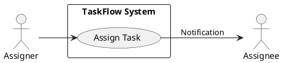
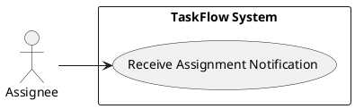

# Executive summary (Goal: current vs desired state)

Current state:
- Small teams today track tasks using email or spreadsheets causing lost context, missing accountability, and poor visibility.

Desired state:
- TaskFlow is a lightweight web application that allows teams to register, create, assign, edit, track, filter, and delete tasks with a simple dashboard and a basic notification system — enabling clear accountability and improved team productivity.

Why this spec exists:
- Translate the BRD into testable, implementable functional and non-functional requirements, use cases (with PlantUML diagrams), success metrics, constraints, and assumptions so development can deliver the initial release within the stated timeline and technology constraints.

---

## Why (Business value, problems solved, integrations)

Business value:
- Centralizes task management to improve team productivity and accountability.
- Reduces reliance on email/spreadsheets for tracking tasks.
- Enables managers to monitor task progress and surface blockers.

Problems solved:
- Unclear ownership of tasks.
- Tasks getting lost in email threads or spreadsheets.
- No single source of truth for team tasks.

Primary integrations (scope/in-scope):
- Authentication: JWT-based authentication service (internal).
- Database: PostgreSQL for persistence.
- Notifications: Simple in-app and optional email notifications (SMTP) for assigned tasks.
- Deployment: Docker container images deployed to AWS or Azure.

Out-of-scope (carried from BRD):
- Advanced analytics, AI suggestions, mobile apps, external project-management tool integrations.

---

## What (User-visible behavior and success criteria)

High-level user-visible behaviours:
- Users can register and log in.
- Authenticated users can create tasks and set title, description, priority, status.
- Authenticated users can assign tasks to team members and receive notifications on assignment.
- Users can edit and delete tasks they created (or managers depending on authorization).
- Dashboard shows all tasks for the user's team with filtering by status and basic pagination.
- Notifications surface assignment events in-app and optionally via email.

Top-level success criteria (measurable):
- Initial release supports ≥ 500 concurrent users (NFR1).
- Median API response time for typical endpoints ≤ 500 ms; 95th percentile < 2 s (NFR2).
- Uptime ≥ 99.5% (NFR3).
- 80% adoption rate among target users within agreed pilot period (BRD success criteria).

---

## Requirements to generate (FR-ID | Summary)

| FR-ID | Summary |
|-------|---------|
| FR-001 | User registration (create account) |
| FR-002 | Secure user login (JWT) |
| FR-003 | Create a new task |
| FR-004 | Assign task to team member |
| FR-005 | Edit an existing task |
| FR-006 | Mark task as completed |
| FR-007 | Delete a task |
| FR-008 | Dashboard showing all tasks |
| FR-009 | Filter tasks by status |
| FR-010 | Notifications when tasks are assigned |

AI triage (Phase 0 GenAI suitability): All features are deterministic; no AI candidate behavior detected.
- All FRs tagged: [DETERMINISTIC]

---

# Functional Requirements (FR-XXX)

Notes:
- Each FR uses MUST for required behavior and measurable acceptance criteria.
- Data model references (User, Task, Assignment) map to the DR section.

FR-001: User registration
- Requirement: The system MUST allow a new user to register and create an account using name and email; system MUST persist a password hash.
- Details:
  - Endpoint: POST /api/v1/auth/register
  - Input: name, email, password
  - Validation: email format, password >= 8 chars, unique email
  - Data: Populate User table (user_id, name, email, password_hash, created_at)
- Security: Passwords MUST be hashed with a strong algorithm (bcrypt/Argon2) per NFR4.
- Acceptance criteria:
  - Given valid name/email/password, when POST /register is called, then response 201 Created and user row inserted within 2s.
  - Given existing email, when POST /register is called, then response 409 Conflict with error code "EMAIL_ALREADY_EXISTS".
  - Password stored MUST not be reversible and verification MUST succeed for correct password.

FR-002: Secure user login (JWT)
- Requirement: The system MUST allow users to log in using email and password and receive a JWT access token.
- Details:
  - Endpoint: POST /api/v1/auth/login
  - Output: JWT access token (expires configurable; refresh tokens optional for later)
  - Success response includes user_id, name, email (no password)
- Security: Session token issued MUST be used for authorization on protected endpoints via Authorization: Bearer <token>. TLS/HTTPS MUST be used for all communication (NFR5).
- Acceptance criteria:
  - Valid credentials → 200 OK + JWT; token decodable and contains user_id and expiry.
  - Invalid credentials → 401 Unauthorized with no token.
  - System MUST rotate session state on credential change (password reset).

FR-003: Create a new task
- Requirement: Authenticated users MUST be able to create a task with title, description (optional), status (default "Open"), priority (Low/Medium/High), and optional assignee.
- Details:
  - Endpoint: POST /api/v1/tasks
  - Data persisted to Task table (task_id, title, description, status, priority, created_by, created_at)
  - If assignee present, create Assignment record and trigger assignment notification (FR-010).
- Acceptance criteria:
  - Valid request by authenticated user → 201 Created and task row exists within DB; API response contains task_id and created_at.
  - Title length validation: title MUST be non-empty and <= 250 chars; if invalid → 400 Bad Request.
  - Default status MUST be "Open" if not provided.

FR-004: Assign task to team member
- Requirement: Authenticated users MUST be able to assign a task to a team member; assignment MUST create an Assignment record with assigned_at timestamp.
- Details:
  - Endpoint: POST /api/v1/tasks/{task_id}/assign
  - Input: assignee_user_id
  - Business rule: assignee_user_id MUST be a valid user in same team/organization (team model optional for v1; if absent, allow any existing user within system — document assumption).
  - Trigger: assignment MUST enqueue/send notification (FR-010).
- Acceptance criteria:
  - Valid assign request → 200 OK; Assignment record present with task_id, user_id, assigned_at within 2s.
  - Assigning to non-existent user → 404 Not Found.
  - Reassigning (changing assignee) MUST update Assignment table with latest assigned_at and preserve history (if history unsupported, previous row may be soft-deleted) — acceptance: API returns previous_assignee_id (if existed) or null.

FR-005: Edit an existing task
- Requirement: Authenticated users MUST be able to edit task fields (title, description, status, priority, assignee) they are authorized to edit.
- Details:
  - Endpoint: PATCH /api/v1/tasks/{task_id}
  - Authorization: Only task creator or assigned user or manager role (if roles implemented) MAY edit; otherwise 403 Forbidden.
  - Validation: same as create (title max 250 chars).
- Acceptance criteria:
  - Valid edit by authorized user → 200 OK and DB state updated within 2s; GET /tasks/{task_id} returns updated values.
  - Unauthorized edit → 403 Forbidden.
  - Invalid fields → 400 Bad Request with field-level errors.

FR-006: Mark task as completed
- Requirement: Authenticated users MUST be able to change task status to "Completed".
- Details:
  - Endpoint: POST /api/v1/tasks/{task_id}/complete (or PATCH status)
  - Business rule: Status transition MUST be validated (e.g., Open/ In Progress -> Completed allowed).
- Acceptance criteria:
  - Valid transition → 200 OK; Task.status == "Completed" persisted and completed_at timestamp recorded.
  - Attempt to complete non-existent task → 404 Not Found.

FR-007: Delete a task
- Requirement: Authenticated users MUST be able to delete tasks they created (soft delete recommended). Deletion MUST remove task from default dashboard view.
- Details:
  - Endpoint: DELETE /api/v1/tasks/{task_id}
  - Behavior: Soft delete (is_deleted flag) to allow audit and reduce accidental data loss.
  - Authorization: Only task creator or manager MAY delete; otherwise 403 Forbidden.
- Acceptance criteria:
  - Authorized delete → 204 No Content and task.is_deleted == true within DB.
  - Deleted tasks MUST not appear in dashboard results or standard GET /tasks responses unless include_deleted=true parameter is used by admins.
  - Unauthorized delete → 403 Forbidden.

FR-008: Dashboard showing all tasks
- Requirement: Authenticated users MUST be presented with a dashboard listing all tasks relevant to their team or accessible scope; dashboard MUST support pagination and display core task fields (title, status, priority, assignee, created_at).
- Details:
  - Endpoint: GET /api/v1/tasks?limit=20&offset=0
  - Response: Array of task summaries, total_count for pagination
- UI: Desktop and tablet responsive layouts per NFR6
- Acceptance criteria:
  - GET /tasks with valid auth returns 200 OK with tasks sorted by updated_at desc by default, limit respected, total_count accurate.
  - Dashboard load time: median response < 500 ms; 95th percentile < 2 s under expected load (NFR2, NFR1).

FR-009: Filter tasks by status
- Requirement: Users MUST be able to filter tasks by status (Open, In Progress, Completed) on dashboard and API.
- Details:
  - Endpoint: GET /api/v1/tasks?status=Completed
  - UI: Provide status dropdown/pills to filter results client-side or server-side.
- Acceptance criteria:
  - Filtering by status returns only tasks with requested status and total_count matches filtered result.
  - Combining filters (status + assignee) MUST be supported; response time constraints same as dashboard.

FR-010: Notifications when tasks are assigned
- Requirement: The system MUST deliver notifications to users when tasks are assigned to them. Notifications MUST be available in-app; email notification MAY be sent if user has an email configured and email delivery enabled.
- Details:
  - Notification types: assignment
  - Delivery: in-app notification record persisted (Notification table) and surfaced in UI; optional email sent via SMTP service with templated content.
  - Endpoint: GET /api/v1/notifications and POST /api/v1/notifications/mark-read
  - Rate-limiting: Prevent notification spam; if multiple assignments occur within a short window (e.g., 1 minute) aggregate into a single digest notification.
- Acceptance criteria:
  - Upon successful assignment (FR-004), recipient sees an in-app notification within 5 seconds and notification record exists with created_at timestamp.
  - Optional email: when enabled and SMTP configured, an email is sent within 30s; failures logged and retried (3 attempts).
  - Notification read/unread state updated via API and reflected in UI.

---

# Non-Functional Requirements (NFR) mapping

NFR-001: Concurrency and scalability
- Requirement: The system MUST support at least 500 concurrent users.
- Measurement: Load test demonstrating 500 concurrent authenticated users performing common workflows (view dashboard, create tasks) with 95th percentile response < 2s.
- Implementation notes: Horizontal scaling of API containers; Redis optional for caching; connection pool sizing for DB.

NFR-002: API performance
- Requirement: API response time SHOULD be under 2 seconds; median < 500ms, 95th percentile < 2s.
- Measurement: Performance tests in CI that assert median and P95 thresholds on representative endpoints.

NFR-003: Uptime
- Requirement: System MUST maintain at least 99.5% uptime (monthly).
- Measurement: Monitoring and alerts via cloud provider/AWS CloudWatch or Azure Monitor.

NFR-004: Password hashing / security
- Requirement: User passwords MUST be securely hashed (bcrypt/Argon2) and salts used; secrets stored in environment/secret manager.
- Acceptance: Code review and security scan verifying hashing algorithm usage.

NFR-005: Transport security
- Requirement: Application MUST use HTTPS for all communication.
- Acceptance: TLS termination configured at load balancer; redirect HTTP -> HTTPS.

NFR-006: Responsive UI
- Requirement: UI MUST be responsive and usable on desktop and tablet breakpoints.
- Measurement: Manual verification / automated visual regression across breakpoints (>= 1024px and 768px).

Additional NFRs implied:
- Logging & Monitoring: Structured logs, error tracking, and health endpoints for orchestration.
- Backups: Daily DB backups and point-in-time recovery plan (see Constraints & Assumptions).

---

# Data requirements (summary & schemas)

Entities (from BRD):
- User (user_id PK, name, email unique, password_hash, created_at, role (optional), team_id (optional))
- Task (task_id PK, title, description, status, priority, created_by (FK User), created_at, updated_at, completed_at (nullable), is_deleted boolean)
- Assignment (assignment_id PK, task_id FK, user_id FK, assigned_at)
- Notification (notification_id PK, user_id FK, type, payload JSON, created_at, read_at nullable)

Minimal SQL-like schemas (for developer reference):
- users(user_id UUID PK, name TEXT, email TEXT UNIQUE, password_hash TEXT, created_at TIMESTAMP, role TEXT NULL, team_id UUID NULL)
- tasks(task_id UUID PK, title TEXT, description TEXT, status TEXT, priority TEXT, created_by UUID FK, created_at TIMESTAMP, updated_at TIMESTAMP, completed_at TIMESTAMP NULL, is_deleted BOOLEAN DEFAULT FALSE)
- assignments(assignment_id UUID PK, task_id UUID FK, user_id UUID FK, assigned_at TIMESTAMP)
- notifications(notification_id UUID PK, user_id UUID FK, type TEXT, payload JSONB, created_at TIMESTAMP, read_at TIMESTAMP NULL)

Data retention:
- Soft deletes maintained; audit retention policy to be defined (assumption: keep records for 90 days).

---

# Use Case Analysis (Actors & System Boundary)

Primary actors:
- End User: any authenticated team member who creates/edits/assigns tasks.
- Manager: same as End User but with broader permissions (optional role).
- System: TaskFlow backend (API, DB, Notification service).
- Email Service (External): SMTP provider for optional email notifications.
- Auth Service (internal component issuing JWTs).

System boundary:
- TaskFlow application (frontend + backend + DB + notification queue). External SMTP provider is outside boundary.

Use Cases:
- UC-001: Register Account
- UC-002: Login
- UC-003: Create Task
- UC-004: Assign Task
- UC-005: Edit Task
- UC-006: Mark Task Completed
- UC-007: Delete Task
- UC-008: View Dashboard
- UC-009: Filter Tasks
- UC-010: Receive Assignment Notification

For each UC: include actor(s), preconditions, primary flow, alternative flows, postconditions, PlantUML diagram.

UC-001: Register Account
- Actors: End User
- Preconditions: None
- Primary trigger: User clicks Sign Up and submits name/email/password.
- Primary flow:
  1. User submits registration form.
  2. Frontend POSTs to /api/v1/auth/register.
  3. Backend validates input and creates a User row with password_hash.
  4. Backend returns 201 Created.
- Alternative flows:
  - Email already exists → 409 Conflict.
  - Invalid input → 400 Bad Request.
- Postconditions: New user record exists; user may then log in.
- Acceptance criteria: See FR-001.
- PlantUML:
```plantuml
@startuml
left to right direction
actor "End User"
rectangle "TaskFlow System" {
  usecase (Register Account) as UC1
}
End User --> UC1
@enduml
```

UC-002: Login
- Actors: End User
- Preconditions: User account exists
- Primary flow:
  1. User submits email/password.
  2. Frontend POSTs to /api/v1/auth/login.
  3. Backend validates credentials and returns JWT.
- Alternative flows:
  - Invalid credentials → 401 Unauthorized.
- Postconditions: Client holds JWT to call protected APIs.
- Acceptance criteria: See FR-002.
- PlantUML:
```plantuml
@startuml
left to right direction
actor "End User"
rectangle "TaskFlow System" {
  usecase (Login) as UC2
}
End User --> UC2
@enduml
```

UC-003: Create Task
- Actors: End User
- Preconditions: Authenticated (valid JWT)
- Primary flow:
  1. User fills new task form and submits.
  2. Frontend POSTs to /api/v1/tasks.
  3. Backend validates, creates Task row, optionally Assignment row, returns 201 Created.
- Alternative flows:
  - Invalid title → 400 Bad Request.
- Postconditions: Task persisted and visible on dashboard.
- Acceptance criteria: See FR-003.
- PlantUML:
```plantuml
@startuml
left to right direction
actor "End User"
rectangle "TaskFlow System" {
  usecase (Create Task) as UC3
}
End User --> UC3
@enduml
```

UC-004: Assign Task
- Actors: End User (assigner), End User (assignee)
- Preconditions: Authenticated, task exists
- Primary flow:
  1. Assigner selects assignee and submits.
  2. Frontend POSTs to /api/v1/tasks/{id}/assign.
  3. Backend validates assignee and creates Assignment row.
  4. Backend creates Notification record and schedules/send email if enabled.
- Alternative flows:
  - Assignee not found → 404 Not Found.
- Postconditions: Assignee receives notification; task assignment persisted.
- Acceptance criteria: See FR-004 and FR-010.
- PlantUML:


UC-005: Edit Task
- Actors: End User
- Preconditions: Authenticated, authorized to edit
- Primary flow:
  1. User edits fields and submits.
  2. Backend validates authorization and updates Task row.
- Alternative flows:
  - Unauthorized → 403 Forbidden.
- Postconditions: Task updated and visible.
- Acceptance criteria: See FR-005.
- PlantUML:
```plantuml
@startuml
left to right direction
actor "End User"
rectangle "TaskFlow System" {
  usecase (Edit Task) as UC5
}
End User --> UC5
@enduml
```

UC-006: Mark Task Completed
- Actors: End User
- Preconditions: Authenticated, task exists
- Primary flow:
  1. User marks task complete via UI.
  2. Backend updates status to Completed and sets completed_at.
- Alternative flows:
  - Invalid transition → 400 Bad Request.
- Postconditions: Task status = Completed.
- Acceptance criteria: See FR-006.
- PlantUML:
```plantuml
@startuml
left to right direction
actor "End User"
rectangle "TaskFlow System" {
  usecase (Mark Task Completed) as UC6
}
End User --> UC6
@enduml
```

UC-007: Delete Task
- Actors: End User
- Preconditions: Authenticated, authorized to delete
- Primary flow:
  1. User issues delete action.
  2. Backend marks task.is_deleted = true.
- Alternative flows:
  - Unauthorized → 403 Forbidden.
- Postconditions: Task absent from default dashboard.
- Acceptance criteria: See FR-007.
- PlantUML:
```plantuml
@startuml
left to right direction
actor "End User"
rectangle "TaskFlow System" {
  usecase (Delete Task) as UC7
}
End User --> UC7
@enduml
```

UC-008: View Dashboard
- Actors: End User
- Preconditions: Authenticated
- Primary flow:
  1. User loads dashboard.
  2. Frontend GET /api/v1/tasks and renders results.
- Alternative flows:
  - Backend errors → 500 Response + user-friendly message.
- Postconditions: Tasks are displayed with pagination.
- Acceptance criteria: See FR-008.
- PlantUML:
```plantuml
@startuml
left to right direction
actor "End User"
rectangle "TaskFlow System" {
  usecase (View Dashboard) as UC8
}
End User --> UC8
@enduml
```

UC-009: Filter Tasks
- Actors: End User
- Preconditions: Authenticated
- Primary flow:
  1. User selects status filter UI.
  2. Frontend requests /api/v1/tasks?status=...
- Postconditions: Dashboard displays only filtered tasks.
- Acceptance criteria: See FR-009.
- PlantUML:
```plantuml
@startuml
left to right direction
actor "End User"
rectangle "TaskFlow System" {
  usecase (Filter Tasks) as UC9
}
End User --> UC9
@enduml
```

UC-010: Receive Assignment Notification
- Actors: Assignee (End User)
- Preconditions: Assignment exists
- Primary flow:
  1. System creates Notification record upon assignment.
  2. Frontend pulls notifications or pushes via websocket (optional); user sees notification.
  3. Optional: System sends email via SMTP.
- Postconditions: Notification persisted and visible.
- Acceptance criteria: See FR-010.
- PlantUML:


---

# Risks & Mitigations (Top 5, scoped to FRs)

1. Risk: Authentication/authorization vulnerabilities (affects FR-001, FR-002, FR-005, FR-007)
   - Mitigation: Use proven libraries for password hashing and JWT; enforce role checks; run security scan and peer review; apply OWASP best practices (see security-standards-owasp).

2. Risk: Notification spam or delays (FR-010)
   - Mitigation: Implement aggregation/rate-limiting and retry policies; monitor queue lengths and delivery failure metrics; configurable email enable/disable.

3. Risk: Insufficient performance at target concurrency (FR-008, NFR-001, NFR-002)
   - Mitigation: Load test early, use connection pooling, add caching (Redis) for frequently-read dashboard queries, scale horizontally behind LB.

4. Risk: Data loss from accidental deletes (FR-007)
   - Mitigation: Implement soft deletes and deletion confirmation UI; keep daily DB backups and enable point-in-time recovery.

5. Risk: Scope creep impacting 3-month timeline (general)
   - Mitigation: Enforce MoSCoW prioritization; freeze feature list for M0 release; plan subsequent releases for extras (role-based permissions, team model).

---

# Constraints & Assumptions (Top 5, scoped to FRs)

Constraints:
1. Timebox: Initial release MUST be completed within 3 months (BRD constraint).
2. Cost: Minimize operational cost; initially use a single cloud region and modest instance sizing.
3. Tech stack: Use open-source components where possible (React, Tailwind, FastAPI, PostgreSQL, Docker) as required by the BRD.
4. No mobile apps for v1; support desktop and tablet only.
5. No external project-management integrations in v1.

Assumptions (explicit):
1. Users have basic familiarity with web apps (BRD assumption). This affects UI complexity and onboarding flows.
2. Teams will be < 50 members; data model & authorization designed for small teams; tag: may need scaling later.
3. Internet connectivity available for users; offline mode not required.
4. Team/organization model: BRD did not define teams; assume a flat system where tasks are visible to all users in pilot. If team isolation is required, this will be scoped to v2.
5. Email notifications require SMTP credentials configured by ops; if missing, email notifications will be disabled and in-app notifications will remain.

Document these assumptions must be validated with Product Owner before development start.

---

# Implementation considerations & APIs (high-level)

Authentication:
- JWT issued at login. All protected endpoints require Authorization header.
- Passwords hashed using bcrypt/Argon2 stored in DB.

API design (examples):
- POST /api/v1/auth/register
- POST /api/v1/auth/login
- POST /api/v1/tasks
- GET /api/v1/tasks?limit=&offset=&status=&assignee=
- GET /api/v1/tasks/{id}
- PATCH /api/v1/tasks/{id}
- POST /api/v1/tasks/{id}/assign
- POST /api/v1/tasks/{id}/complete
- DELETE /api/v1/tasks/{id}
- GET /api/v1/notifications
- POST /api/v1/notifications/{id}/mark-read

Notification delivery:
- In-app: persist notifications and expose GET endpoint and websocket push (optional).
- Email: optional SMTP with retry/backoff (3 attempts) and logging.

Data access:
- Use parameterized queries / ORM (SQLAlchemy) to avoid injection.
- Indexing: tasks.status, tasks.created_by, assignments.user_id for queries.

Deployment:
- Containerize frontend and backend using Docker.
- Use managed PostgreSQL (AWS RDS/Azure Database).
- CI/CD pipeline to build and push images; run unit and integration tests and performance checks.

Monitoring & logging:
- Health endpoint /health
- Structured logging; errors captured in Sentry or equivalent.
- Metrics: request latency, error rate, queue lengths, notification delivery success.

Backups:
- Daily backups of PostgreSQL with point-in-time recovery enabled for production.

---

# Success metrics (traceable to business objectives)

- Adoption: 80% of target users actively using TaskFlow within pilot period (BRD success).
- Task operations: >95% success rate for create/edit/assign API calls.
- Task completion rate: measurable increase in completed tasks vs baseline (specific baseline to be measured during pilot).
- Performance: median API latency < 500 ms; P95 < 2 s; support 500 concurrent users under load test.
- Reliability: 99.5% uptime monthly.
- Notification delivery: In-app notifications delivered within 5s for 95% of assignment events; email delivery success >= 90% when enabled.

---

# Traceability matrix (mapping BRD -> Spec artifacts)

- BRD FR1 (Users register) -> FR-001, UC-001
- BRD FR2 (Login) -> FR-002, UC-002
- BRD FR3 (Create tasks) -> FR-003, UC-003
- BRD FR4 (Assign tasks) -> FR-004, UC-004
- BRD FR5 (Edit tasks) -> FR-005, UC-005
- BRD FR6 (Mark completed) -> FR-006, UC-006
- BRD FR7 (Delete tasks) -> FR-007, UC-007
- BRD FR8 (Dashboard) -> FR-008, UC-008
- BRD FR9 (Filter by status) -> FR-009, UC-009
- BRD FR10 (Notifications) -> FR-010, UC-010
- NFR1-NFR6 -> NFR section and acceptance criteria embedded in FR-008 (performance), FR-001/002 (security/HTTPS), UI work for NFR6.

---

# QA & Acceptance testing guidance

- Unit tests for business logic (task creation, assignment rules).
- Integration tests for API endpoints including auth flows.
- End-to-end tests for critical user flows: register -> login -> create task -> assign -> notification visible.
- Performance tests: simulate 500 concurrent users performing reads & writes; verify response percentiles.
- Security review: verify password hashing algorithm, token handling, OWASP checks.
- Accessibility: light checks for keyboard navigation and screen reader labels for major UI components.

Pre-delivery checklist:
- Business alignment: requirements covered above (yes).
- Stakeholder coverage: Product Owner / PM / Dev team validated.
- Testability: Each FR has acceptance criteria.
- FR completeness: FR-001 through FR-010 expanded.
- Clarity: Must/SHALL used for required behavior.
- Traceability: Matrix above provided.
- Risk assessment: Top 5 risks documented with mitigation.

---

# Open questions (to resolve prior to development)

1. Team model: Should tasks be scoped to a team/organization or globally visible to all users in v1? (Assumption currently: global/pilot)
2. Roles and permissions: Is a Manager role required in v1 or deferred to v2? (Assumption: optional; basic creator/assignee rules enforced)
3. Email notifications: Will SMTP credentials be provided for initial deployment, or should email remain disabled for the pilot?
4. Assignment history: Is preserving full assignment history required in v1 or is storing only latest assignee acceptable?
5. Refresh tokens: Are refresh tokens required for session management in v1 or can short-lived JWT only be used?

Each question MUST be answered by Product Owner before sprint 0.

---

# Appendix: Implementation priorities (MUST/SHOULD/CAN - MoSCoW)

Must (M0) for initial release (3 months):
- FR-001 Registration
- FR-002 Login (JWT)
- FR-003 Create Task
- FR-004 Assign Task (basic assignment + in-app notification)
- FR-005 Edit Task
- FR-006 Mark Completed
- FR-007 Delete Task (soft delete)
- FR-008 Dashboard (list + pagination)
- FR-009 Filter by status
- NFR-004 & NFR-005 (secure hashing, HTTPS)
- Basic monitoring, backups, and deployment pipeline

Should (M1) for early post-release:
- Email notifications (FR-010 optional email)
- Role-based Manager permissions
- Assignment history tracking

Could (M2) for later:
- Websocket-based real-time updates
- Team/organization isolation and admin console

Won't (M3) for current project:
- Advanced analytics, AI-based features, mobile applications, external integrations

---

End of Product Specification for TaskFlow.