## Product Specification: TaskFlow – Simple Team Task Management System

---

### 1. Executive Summary

TaskFlow is a lightweight web application designed to empower small teams to efficiently create, assign, and track tasks. This product specification outlines the core functionalities, non-functional requirements, and technical architecture for TaskFlow, aiming to improve team collaboration, task visibility, and overall productivity. The primary goal is to provide a simple, easy-to-use platform that centralizes task management, reducing reliance on fragmented communication methods like email or spreadsheets. This document serves as the definitive guide for the development team to build the Minimum Viable Product (MVP) within the stipulated three-month timeline.

---

### 2. Goals and Objectives

#### 2.1. Project Goal
The overarching goal of TaskFlow is to provide a lightweight web application where small teams can create, assign, and track tasks efficiently, thereby improving collaboration and task visibility within teams while keeping the interface simple and easy to use.

#### 2.2. Business Objectives
1.  **Improve team productivity by organizing tasks in one platform:** Centralize task management to eliminate inefficiencies from disparate tools.
2.  **Allow managers to track task progress easily:** Provide clear visibility into ongoing and completed tasks for better oversight.
3.  **Provide clear accountability through task assignments:** Ensure every task has a clear owner to foster responsibility.
4.  **Reduce reliance on email or spreadsheets for task tracking:** Offer a dedicated, streamlined solution for task management.

---

### 3. Target Users

The primary target users for TaskFlow are individuals within small teams (defined as fewer than 50 members) who need a straightforward way to manage their daily tasks and collaborate with team members. This includes:

*   **Team Members:** Individuals responsible for executing tasks, who need to create, view, edit, mark as complete, and receive assignments.
*   **Team Leaders/Managers:** Individuals responsible for overseeing team projects and tasks, who need to track progress, assign tasks, and maintain overall visibility.

---

### 4. Functional Requirements (FR)

This section details the functional capabilities of TaskFlow. Each requirement includes measurable acceptance criteria and a tag indicating its nature. All functional requirements for TaskFlow are [DETERMINISTIC] as they involve predictable, rule-based system responses without AI or machine learning components.

**FR-001: User Registration** [DETERMINISTIC]
*   **Requirement:** A new user SHALL be able to register for an account using a unique email address and a password that meets defined complexity requirements.
*   **Acceptance Criteria:**
    *   User MUST be able to submit a registration form with a valid, unique email address and a password.
    *   The system SHALL create a new user record in the `User` table upon successful registration.
    *   The system MUST display a success message upon account creation.
    *   If the email address already exists, the system SHALL display an error message stating "Email already registered."
    *   Passwords MUST be at least 8 characters long, include at least one uppercase letter, one lowercase letter, one number, and one special character.

**FR-002: User Login** [DETERMINISTIC]
*   **Requirement:** Registered users MUST be able to log in to their account using their registered email and password securely.
*   **Acceptance Criteria:**
    *   User MUST be able to submit valid login credentials (email and password).
    *   The system SHALL authenticate the user against stored credentials within 2 seconds (NFR2).
    *   Upon successful login, the user SHALL be redirected to the main dashboard (FR-008).
    *   Upon failed login (e.g., incorrect email/password), the system SHALL display an error message "Invalid credentials."
    *   The system MUST issue and manage a JWT-based authentication token for authenticated sessions.

**FR-003: Task Creation** [DETERMINISTIC]
*   **Requirement:** An authenticated user MUST be able to create a new task, providing a title, description, initial status, and priority.
*   **Acceptance Criteria:**
    *   User MUST be able to access a "Create Task" interface (e.g., button, form).
    *   User MUST be able to input a task title (mandatory, max 255 characters).
    *   User MUST be able to input a task description (optional, max 1000 characters).
    *   User MUST be able to select an initial status from a predefined list (e.g., 'To Do', 'In Progress').
    *   User MUST be able to select a priority level from a predefined list (e.g., 'Low', 'Medium', 'High').
    *   Upon successful creation, the new task record SHALL be stored in the `Task` table and immediately visible on the user's dashboard (FR-008).

**FR-004: Task Assignment** [DETERMINISTIC]
*   **Requirement:** An authenticated user MUST be able to assign an existing task to another registered team member.
*   **Acceptance Criteria:**
    *   User MUST be able to select an existing task.
    *   User MUST be presented with a list of active registered team members to choose from.
    *   User MUST be able to select exactly one team member for assignment.
    *   Upon successful assignment, a new record SHALL be created in the `Assignment` table, linking the task to the selected user.
    *   The assigned user SHALL receive an in-application notification (FR-010).

**FR-005: Task Editing** [DETERMINISTIC]
*   **Requirement:** An authenticated user (the task creator or current assignee) MUST be able to edit the title, description, status, and priority of an existing task.
*   **Acceptance Criteria:**
    *   User MUST be able to select an existing task from the dashboard or a task detail view.
    *   User MUST be able to modify the task's title, description, status, and priority fields.
    *   Upon saving, the changes SHALL be persisted in the `Task` table and reflected on the dashboard and task detail view.
    *   Only the `created_by` user or the `user_id` in the `Assignment` table (current assignee) SHALL have permission to edit the task.

**FR-006: Mark Task as Completed** [DETERMINISTIC]
*   **Requirement:** An authenticated user MUST be able to change the status of a task to "Completed".
*   **Acceptance Criteria:**
    *   User MUST be able to select a task and choose the "Completed" status option.
    *   The system SHALL update the `status` field of the selected task to "Completed" in the `Task` table.
    *   The dashboard (FR-008) and task filtering (FR-009) SHALL immediately reflect the updated "Completed" status.

**FR-007: Task Deletion** [DETERMINISTIC]
*   **Requirement:** An authenticated user who created a task MUST be able to delete it.
*   **Acceptance Criteria:**
    *   User MUST be able to select an existing task for deletion.
    *   The system SHALL prompt the user for confirmation before proceeding with deletion.
    *   Upon user confirmation, the task record SHALL be permanently removed from the `Task` table, and all associated records in the `Assignment` table MUST also be removed.
    *   Only the `created_by` user SHALL have permission to delete the task.

**FR-008: Dashboard Display** [DETERMINISTIC]
*   **Requirement:** The system MUST display a dashboard showing all tasks accessible to the logged-in user (either created by them or assigned to them).
*   **Acceptance Criteria:**
    *   The dashboard SHALL load and display tasks within 2 seconds of user login or navigation (NFR2).
    *   Each task entry on the dashboard MUST display at least the Title, current Status, Priority, and Assigned To (if applicable).
    *   The dashboard SHALL default to displaying tasks sorted by `created_at` (newest first) and optionally by `priority`.
    *   The dashboard MUST accurately reflect the most current state of all accessible tasks.

**FR-009: Task Filtering by Status** [DETERMINISTIC]
*   **Requirement:** The dashboard MUST allow users to filter the displayed tasks based on their current status.
*   **Acceptance Criteria:**
    *   User MUST be able to select one or more status options (e.g., 'To Do', 'In Progress', 'Completed') from a user interface element (e.g., dropdown, checkboxes).
    *   The dashboard SHALL dynamically update to show only tasks matching the selected status filter(s) within 1 second.
    *   The selected filters MUST be visually indicated on the dashboard.

**FR-010: Task Assignment Notification** [DETERMINISTIC]
*   **Requirement:** When a task is assigned to a user (FR-004), the assigned user MUST receive an in-application notification.
*   **Acceptance Criteria:**
    *   Upon successful task assignment, the assigned user's in-application notification counter SHALL update.
    *   The assigned user MUST be able to view the notification within a dedicated area of the application.
    *   Notification content MUST clearly state "Task [Task Title] has been assigned to you by [Assigner's Name]".
    *   Notifications SHALL persist until explicitly dismissed or marked as read by the user.

**FR-011: View Team Members** [DETERMINISTIC]
*   **Requirement:** An authenticated user SHALL be able to view a list of registered team members to facilitate task assignment.
*   **Acceptance Criteria:**
    *   When assigning a task (FR-004), the user interface MUST display a list of all active registered users.
    *   The list of team members SHALL display at least their `name` or `email`.

**FR-012: View Task Details** [DETERMINISTIC]
*   **Requirement:** An authenticated user MUST be able to view the full details of a specific task.
*   **Acceptance Criteria:**
    *   User MUST be able to click on a task from the dashboard (FR-008) to navigate to a dedicated task details page.
    *   The task details page MUST display the full `title`, `description`, `status`, `priority`, `created_by` user, `created_at` timestamp, and current `assigned_to` user.
    *   The task details page SHALL load within 2 seconds.

**FR-013: Password Reset (Inferred)** [DETERMINISTIC]
*   **Requirement:** A user who has forgotten their password MUST be able to initiate a password reset process.
*   **Acceptance Criteria:**
    *   User MUST be able to request a password reset from the login page, providing their registered email address.
    *   The system SHALL send a password reset link to the provided registered email.
    *   The password reset link MUST be valid for a limited time (e.g., 60 minutes).
    *   User MUST be able to set a new password via the reset link, adhering to FR-001 password complexity rules.
    *   Upon successful password reset, the user SHALL be able to log in with the new password.

---

### 5. Non-Functional Requirements (NFR)

This section details the quality attributes and technical constraints for TaskFlow.

**NFR-001: Scalability - Concurrent Users**
*   **Requirement:** The system MUST support at least 500 concurrent users without degradation in performance.
*   **Acceptance Criteria:**
    *   During load testing with 500 concurrent active users, API response times (NFR2) MUST remain below 2 seconds for 95% of requests.
    *   CPU utilization on application servers MUST not exceed 80% during peak load (500 concurrent users).
    *   Database connection pool saturation MUST not exceed 80% during peak load.

**NFR-002: Performance - API Response Time**
*   **Requirement:** All API response times SHOULD be under 2 seconds.
*   **Acceptance Criteria:**
    *   90% of all API endpoints (e.g., login, task creation, task retrieval) MUST respond within 1 second under normal load (up to 100 concurrent users).
    *   99% of all API endpoints MUST respond within 2 seconds under normal load.
    *   Specific critical endpoints (e.g., dashboard load, task create) MUST respond within 500ms for 90% of requests.

**NFR-003: Reliability - System Uptime**
*   **Requirement:** The system uptime SHOULD be at least 99.5% per month.
*   **Acceptance Criteria:**
    *   Total unscheduled downtime for the production environment MUST not exceed 3.6 hours per month.
    *   Automated monitoring tools (e.g., Prometheus, Grafana) MUST be in place to track and report uptime metrics.

**NFR-004: Security - Password Hashing**
*   **Requirement:** User passwords MUST be securely hashed and salted before storage.
*   **Acceptance Criteria:**
    *   The system MUST use a strong, industry-standard cryptographic hashing algorithm (e.g., bcrypt, Argon2) with a sufficient work factor (cost parameter) for all password storage.
    *   Each password hash MUST include a unique, randomly generated salt.
    *   No plaintext passwords or easily reversible encryption of passwords SHALL be stored in the database.

**NFR-005: Security - HTTPS Communication**
*   **Requirement:** The application MUST use HTTPS for all communication between clients and servers.
*   **Acceptance Criteria:**
    *   All HTTP requests to the TaskFlow domain MUST be automatically redirected to HTTPS.
    *   A valid SSL/TLS certificate MUST be installed and configured on all public-facing servers.
    *   Browser security indicators (e.g., padlock icon) MUST confirm a secure connection.

**NFR-006: Usability - UI Responsiveness**
*   **Requirement:** The User Interface (UI) MUST be responsive and usable on desktop and tablet devices.
*   **Acceptance Criteria:**
    *   The UI layout and elements MUST adapt gracefully to screen widths from 768px (tablet portrait) up to 1920px (standard desktop).
    *   All interactive elements (buttons, forms) MUST be fully functional and easily accessible on both desktop and tablet resolutions without horizontal scrolling.
    *   Text and images MUST scale appropriately to maintain readability across specified devices.

---

### 6. Use Case Analysis

#### 6.1. Use Case Diagram

```plantuml
@startuml
skinparam actorStyle awesome

actor User as "TaskFlow User"

rectangle "TaskFlow System" {
  (Register Account)
  (Log In)
  (Reset Password)
  (Create Task)
  (View Tasks Dashboard)
  (View Task Details)
  (Edit Task)
  (Assign Task)
  (Mark Task Completed)
  (Delete Task)
  (Filter Tasks by Status)
  (Receive Task Assignment Notification)
  (View Team Members)
}

User -- (Register Account)
User -- (Log In)
User -- (Reset Password)
User -- (Create Task)
User -- (View Tasks Dashboard)
User -- (View Task Details)
User -- (Edit Task)
User -- (Assign Task)
User -- (Mark Task Completed)
User -- (Delete Task)
User -- (Filter Tasks by Status)
User -- (Receive Task Assignment Notification)

(Assign Task) .> (View Team Members) : <<uses>>
(Assign Task) .> (Receive Task Assignment Notification) : <<includes>>
(Create Task) .> (View Tasks Dashboard) : <<extends>>
(Edit Task) .> (View Tasks Dashboard) : <<extends>>
(Mark Task Completed) .> (View Tasks Dashboard) : <<extends>>
(Delete Task) .> (View Tasks Dashboard) : <<extends>>
(Filter Tasks by Status) .> (View Tasks Dashboard) : <<extends>>
(View Task Details) .> (View Tasks Dashboard) : <<extends>>

@enduml
```

#### 6.2. Detailed Use Cases

**UC-001: Register a New Account**
*   **Actors:** User
*   **Preconditions:**
    *   User is not logged in.
    *   User has access to the TaskFlow registration page.
*   **Postconditions:**
    *   A new user account is created in the system.
    *   User is logged in and redirected to the dashboard, OR prompted to log in.
*   **Main Flow:**
    1.  User navigates to the registration page.
    2.  User enters a unique email address and a strong password (FR-001 criteria).
    3.  User submits the registration form.
    4.  System validates input data (FR-001).
    5.  System hashes the password (NFR-004) and creates a new `User` record.
    6.  System displays a "Registration Successful" message.
    7.  System optionally logs in the user directly or prompts for login.
*   **Alternative Flows:**
    *   **AF 1.1 - Invalid Input:** If email format is invalid or password fails complexity rules, system displays specific error messages (e.g., "Invalid email format," "Password too weak"). User remains on the registration page.
    *   **AF 1.2 - Email Already Exists:** If the email address is already registered, system displays "Email already registered" error. User remains on the registration page.

**UC-002: Log In to Existing Account**
*   **Actors:** User
*   **Preconditions:**
    *   User has a registered account.
    *   User is not logged in.
    *   User has access to the TaskFlow login page.
*   **Postconditions:**
    *   User is successfully authenticated and granted access to the system.
    *   User is redirected to the dashboard.
*   **Main Flow:**
    1.  User navigates to the login page.
    2.  User enters registered email and password.
    3.  User submits the login form.
    4.  System validates credentials (FR-002).
    5.  System issues a JWT (FR-002) for session management.
    6.  System redirects user to the dashboard (FR-008).
*   **Alternative Flows:**
    *   **AF 2.1 - Invalid Credentials:** If email/password combination is incorrect, system displays "Invalid credentials" error. User remains on the login page.
    *   **AF 2.2 - Password Reset:** User clicks "Forgot Password?" link, initiating UC-013.

**UC-003: Create a New Task**
*   **Actors:** User
*   **Preconditions:**
    *   User is logged in.
*   **Postconditions:**
    *   A new task is created and saved in the system.
    *   The task is visible on the user's dashboard.
*   **Main Flow:**
    1.  User clicks "Create Task" button/link (FR-003).
    2.  System presents a "New Task" form.
    3.  User enters task title, description, selects initial status and priority (FR-003).
    4.  User clicks "Save Task."
    5.  System validates inputs.
    6.  System stores new task in `Task` table.
    7.  System redirects user to dashboard or confirms task creation.
*   **Alternative Flows:**
    *   **AF 3.1 - Invalid Input:** If mandatory fields are missing or inputs are invalid, system displays specific error messages. User remains on the form.

**UC-004: View Tasks Dashboard**
*   **Actors:** User
*   **Preconditions:**
    *   User is logged in.
*   **Postconditions:**
    *   User sees a dashboard displaying tasks accessible to them.
*   **Main Flow:**
    1.  User logs in (UC-002) or navigates to the home URL.
    2.  System retrieves all tasks created by or assigned to the user.
    3.  System displays tasks on a dashboard, including title, status, priority, and assignee (FR-008).
    4.  Dashboard loads within 2 seconds (NFR-002).
*   **Alternative Flows:**
    *   **AF 4.1 - No Tasks:** If no tasks exist for the user, system displays a "No tasks found" message and prompts to create a new task.

**UC-005: Edit an Existing Task**
*   **Actors:** User
*   **Preconditions:**
    *   User is logged in.
    *   User has permission to edit the task (creator or assignee).
*   **Postconditions:**
    *   The task's details are updated in the system.
*   **Main Flow:**
    1.  User views the dashboard (UC-004) or task details (UC-012).
    2.  User clicks "Edit" icon/button for a specific task.
    3.  System displays an editable form pre-filled with task details (FR-005).
    4.  User modifies title, description, status, or priority.
    5.  User clicks "Save Changes."
    6.  System validates inputs and updates the `Task` record.
    7.  System redirects user to dashboard or task details page, confirming changes.
*   **Alternative Flows:**
    *   **AF 5.1 - No Permission:** If the user attempts to edit a task they don't have permission for, system displays "Access Denied" error.

**UC-006: Assign a Task to a Team Member**
*   **Actors:** User
*   **Preconditions:**
    *   User is logged in.
    *   An existing task is selected.
*   **Postconditions:**
    *   The selected task is assigned to a team member.
    *   The assigned team member receives a notification.
*   **Main Flow:**
    1.  User selects a task to assign from the dashboard or task details page.
    2.  User clicks "Assign Task" button.
    3.  System displays a list of available team members (FR-011).
    4.  User selects a team member from the list (FR-004).
    5.  User confirms assignment.
    6.  System updates the `Assignment` table (FR-004).
    7.  System triggers an in-app notification to the assigned user (FR-010).
    8.  System confirms successful assignment.
*   **Alternative Flows:**
    *   **AF 6.1 - No Team Members:** If no other registered users exist, system displays "No team members available."
    *   **AF 6.2 - Already Assigned:** If the task is already assigned to the selected member, system displays "Task already assigned to this user."

**UC-007: Mark a Task as Completed**
*   **Actors:** User
*   **Preconditions:**
    *   User is logged in.
    *   User has permission to modify the task (creator or assignee).
*   **Postconditions:**
    *   The task's status is updated to "Completed."
*   **Main Flow:**
    1.  User views the dashboard (UC-004) or task details (UC-012).
    2.  User selects the option to "Mark as Completed" for a specific task (FR-006).
    3.  System updates the `status` field of the `Task` record to "Completed."
    4.  System confirms the status change to the user.
*   **Alternative Flows:**
    *   **AF 7.1 - No Permission:** If user lacks permission, system displays "Access Denied."

**UC-008: Delete a Task**
*   **Actors:** User
*   **Preconditions:**
    *   User is logged in.
    *   User is the creator of the task.
*   **Postconditions:**
    *   The task and its assignments are removed from the system.
*   **Main Flow:**
    1.  User views the dashboard (UC-004) or task details (UC-012).
    2.  User clicks "Delete" icon/button for a specific task.
    3.  System displays a confirmation prompt: "Are you sure you want to delete this task?" (FR-007).
    4.  User confirms deletion.
    5.  System deletes the `Task` record and all related `Assignment` records.
    6.  System redirects user to dashboard or confirms deletion.
*   **Alternative Flows:**
    *   **AF 8.1 - No Permission:** If the user attempts to delete a task they didn't create, system displays "Access Denied."
    *   **AF 8.2 - User Cancels:** If user cancels deletion, the task remains unchanged.

**UC-009: Filter Tasks by Status**
*   **Actors:** User
*   **Preconditions:**
    *   User is logged in and viewing the dashboard (UC-004).
*   **Postconditions:**
    *   The dashboard displays only tasks matching the selected status filter(s).
*   **Main Flow:**
    1.  User accesses the filter options on the dashboard (FR-009).
    2.  User selects one or more task statuses (e.g., "In Progress," "Completed").
    3.  System dynamically updates the dashboard to show only tasks with the selected statuses within 1 second.
    4.  System visually indicates the active filters.
*   **Alternative Flows:**
    *   **AF 9.1 - No Tasks Match Filter:** If no tasks match the selected filter, system displays "No tasks found for this status."

**UC-010: Receive Task Assignment Notification**
*   **Actors:** User
*   **Preconditions:**
    *   User is logged in.
    *   Another user has assigned a task to this user (via UC-006).
*   **Postconditions:**
    *   The user is notified of a new task assignment.
*   **Main Flow:**
    1.  System assigns a task to the user.
    2.  System increments the user's in-app notification counter (FR-010).
    3.  User clicks on the notification icon.
    4.  System displays the notification details, including "Task [Task Title] has been assigned to you by [Assigner's Name]".
*   **Alternative Flows:**
    *   **AF 10.1 - User Offline:** If user is offline, notification is queued and displayed upon next login.

**UC-011: View Team Members**
*   **Actors:** User
*   **Preconditions:**
    *   User is logged in.
    *   User is initiating task assignment (part of UC-006).
*   **Postconditions:**
    *   User sees a list of available team members.
*   **Main Flow:**
    1.  User initiates task assignment.
    2.  System queries the `User` table for active users.
    3.  System displays a list of names/emails of team members (FR-011).
*   **Alternative Flows:**
    *   **AF 11.1 - No Other Users:** If no other users are registered, system displays "No other team members found."

**UC-012: View Task Details**
*   **Actors:** User
*   **Preconditions:**
    *   User is logged in.
    *   A task is visible on the dashboard (UC-004).
*   **Postconditions:**
    *   User is presented with a detailed view of the selected task.
*   **Main Flow:**
    1.  User clicks on a specific task from the dashboard (FR-012).
    2.  System retrieves full details of the task from the `Task` table.
    3.  System displays a dedicated page showing title, description, status, priority, creator, creation date, and assignee (FR-012).
*   **Alternative Flows:**
    *   **AF 12.1 - Task Not Found:** If the task ID is invalid or task was deleted, system displays "Task not found."

**UC-013: Reset Password**
*   **Actors:** User
*   **Preconditions:**
    *   User is not logged in.
    *   User has a registered account.
*   **Postconditions:**
    *   User's password is successfully updated.
*   **Main Flow:**
    1.  User clicks "Forgot Password?" link on the login page (FR-013).
    2.  System prompts user to enter their registered email address.
    3.  User enters email and submits.
    4.  System verifies email exists and sends a password reset link to that email (FR-013).
    5.  User receives email and clicks the reset link.
    6.  System displays a "Set New Password" form.
    7.  User enters and confirms a new password (adhering to FR-001 complexity).
    8.  System hashes the new password and updates the `User` record.
    9.  System confirms password reset and redirects to login page.
*   **Alternative Flows:**
    *   **AF 13.1 - Invalid Email:** If email is not registered, system displays "Email not found."
    *   **AF 13.2 - Expired Link:** If the reset link is expired, system displays "Link expired, please request a new one."

---

### 7. Data Model

The core data entities and their relationships are:

*   **User:** Represents a registered user of the TaskFlow system.
    *   `user_id` (Primary Key)
    *   `name`
    *   `email` (Unique)
    *   `password_hash` (Securely hashed)
    *   `created_at`
*   **Task:** Represents a single task within the system.
    *   `task_id` (Primary Key)
    *   `title`
    *   `description`
    *   `status` (e.g., 'To Do', 'In Progress', 'Completed')
    *   `priority` (e.g., 'Low', 'Medium', 'High')
    *   `created_by` (Foreign Key to `User.user_id`)
    *   `created_at`
*   **Assignment:** Represents the assignment of a task to a user.
    *   `assignment_id` (Primary Key)
    *   `task_id` (Foreign Key to `Task.task_id`)
    *   `user_id` (Foreign Key to `User.user_id`)
    *   `assigned_at`

---

### 8. Technology Stack

*   **Frontend:**
    *   React: JavaScript library for building user interfaces.
    *   Tailwind CSS: Utility-first CSS framework for responsive design.
*   **Backend:**
    *   FastAPI (Python): High-performance web framework for API development.
*   **Database:**
    *   PostgreSQL: Powerful, open-source relational database.
*   **Authentication:**
    *   JWT-based authentication: Secure method for stateless user authentication.
*   **Deployment:**
    *   Docker: Containerization platform for consistent environments.
    *   AWS or Azure Cloud: Cloud infrastructure for hosting and scalability.

---

### 9. Constraints, Assumptions, and Risks

#### 9.1. Constraints
*   **C-001: Timeline:** The initial release MUST be completed within 3 months. This is a hard deadline that will influence scope decisions and require agile development practices.
*   **C-002: Operational Costs:** The system SHOULD minimize operational costs. This guides technology choices (open-source preference) and deployment architecture to be cost-effective.
*   **C-003: Open-Source Technologies:** Only open-source technologies SHOULD be used where possible. The chosen technology stack adheres to this constraint.

#### 9.2. Assumptions
*   **A-001: User Familiarity:** Users have basic familiarity with web applications and common UI patterns (e.g., forms, buttons, navigation).
*   **A-002: Team Size:** Teams using TaskFlow will consist of fewer than 50 members. This impacts scalability expectations and UI design choices.
*   **A-003: Internet Connectivity:** Users will have stable internet connectivity to access and use the web application.

#### 9.3. Risks
*   **R-001: Scope Creep (High):** The 3-month timeline (C-001) is aggressive. Any expansion beyond the defined MVP could jeopardize the release. *Mitigation: Strict backlog grooming, clear definition of "Done," strong product owner gatekeeping.*
*   **R-002: Performance under Load (Medium):** NFR1 (500 concurrent users) and NFR2 (API < 2s) are demanding for an MVP within 3 months. Inefficient database queries or unoptimized API endpoints could lead to performance bottlenecks. *Mitigation: Early performance testing, database indexing, code reviews focusing on efficiency, stress testing environment setup.*
*   **R-003: Security Vulnerabilities (Medium):** While NFR4 and NFR5 are defined, implementation errors could lead to security breaches. *Mitigation: Adherence to secure coding practices, peer reviews, use of established libraries/frameworks, penetration testing prior to release.*
*   **R-004: UI/UX Quality (Medium):** Achieving NFR6 (responsive and usable UI) within the tight timeline requires focused effort. Poor UI/UX could hinder adoption (Success Criteria). *Mitigation: Utilize Tailwind CSS for rapid prototyping, conduct early user feedback sessions, prioritize core user flows for polish.*

---

### 10. Success Criteria

The TaskFlow project will be considered successful if:

*   **SC-001: Task Management Ease:** 90% of target users report that they can create, assign, and manage tasks easily, as measured by post-release surveys.
*   **SC-002: Improved Task Completion:** Team task completion rates show an average improvement of 15% across target teams within 2 months of consistent TaskFlow usage, as measured by internal team metrics (if available) or user self-reporting.
*   **SC-003: System Adoption:** System adoption reaches at least 80% of the target users within 3 months post-release, tracked by active user logins and feature usage statistics.