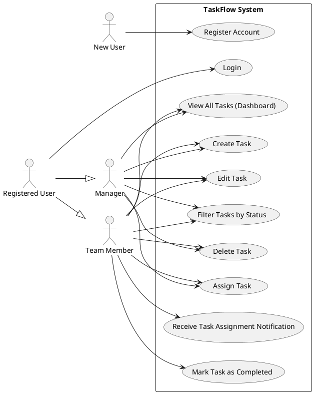

This Product Specification document translates the TaskFlow Business Requirements Document (BRD) into detailed, actionable requirements for the development team. It outlines the system's purpose, functional and non-functional specifications, and critical success criteria, ensuring alignment with business objectives.

---

# Product Specification: TaskFlow – Simple Team Task Management System

**Version:** 1.0
**Date:** October 26, 2023
**Author:** Senior Product Manager

---

## 1. Executive Summary

TaskFlow is a lightweight web application designed to enhance productivity and collaboration for small teams by centralizing task management. It aims to reduce reliance on disparate tools like email and spreadsheets, offering a single platform for task creation, assignment, tracking, and basic notifications. This specification details the core functionalities, performance benchmarks, security measures, and usability standards required to deliver a simple, efficient, and secure task management solution within a three-month initial release timeline.

## 2. Goals and Objectives

### 2.1 Project Goal
The primary goal of TaskFlow is to provide a lightweight web application where small teams can efficiently create, assign, and track tasks. The system MUST improve collaboration and task visibility within teams while maintaining a simple and easy-to-use interface.

### 2.2 Business Objectives
1.  **P1: Improve team productivity by organizing tasks in one platform.**
    *   *Success Metric:* 80% of target users actively using TaskFlow for daily task management.
2.  **P1: Allow managers to track task progress easily.**
    *   *Success Metric:* Managers report a 30% reduction in time spent tracking team tasks manually.
3.  **P1: Provide clear accountability through task assignments.**
    *   *Success Metric:* Tasks assigned in TaskFlow have a clear assignee in 95% of cases.
4.  **P2: Reduce reliance on email or spreadsheets for task tracking.**
    *   *Success Metric:* A 50% decrease in task-related email threads and spreadsheet usage reported by target teams.

## 3. Target Users

The primary target users for TaskFlow are:
*   **Team Members:** Individuals responsible for creating, managing, and completing tasks within a small team.
*   **Team Managers/Leaders:** Individuals responsible for overseeing team progress, assigning tasks, and monitoring overall task completion.
*   **New Users:** Individuals new to a team or the platform who need to quickly onboard and begin managing tasks.

## 4. Functional Requirements (FR)

This section details the specific features and functionalities the TaskFlow system SHALL provide.

### 4.1 User Management
**FR-001: User Registration** [DETERMINISTIC]
*   The system SHALL allow new users to register and create an account.
*   **Acceptance Criteria:**
    *   MUST provide a registration form requiring email, name, and password.
    *   MUST validate email format upon submission.
    *   MUST validate password strength (e.g., minimum 8 characters, alphanumeric).
    *   MUST create a unique `user_id` upon successful registration.
    *   MUST store `name`, `email`, `password_hash`, and `created_at` in the `User` table.
    *   MUST notify the user of successful registration.

**FR-002: User Login** [DETERMINISTIC]
*   The system SHALL allow registered users to log in securely.
*   **Acceptance Criteria:**
    *   MUST provide a login form requiring email and password.
    *   MUST authenticate users against securely stored credentials (`password_hash`).
    *   MUST issue a JSON Web Token (JWT) upon successful authentication.
    *   MUST redirect the user to the main dashboard upon successful login.
    *   MUST display an error message for invalid credentials.

### 4.2 Task Management
**FR-003: Task Creation** [DETERMINISTIC]
*   Users SHALL be able to create new tasks.
*   **Acceptance Criteria:**
    *   MUST provide a form or modal for task creation.
    *   MUST allow users to input a `title` (required, max 255 chars).
    *   MUST allow users to input a `description` (optional, max 1000 chars).
    *   MUST allow users to select a `priority` (e.g., Low, Medium, High – default Medium).
    *   MUST set the initial `status` to "Pending".
    *   MUST record the `created_by` user's `user_id` and `created_at` timestamp.
    *   MUST store the task details in the `Task` table.

**FR-004: Task Assignment** [DETERMINISTIC]
*   Users SHALL be able to assign tasks to team members.
*   **Acceptance Criteria:**
    *   MUST provide a mechanism (e.g., dropdown, search) to select an existing registered team member (by `user_id`) for a task.
    *   MUST allow a task to be assigned to only one user at a time.
    *   MUST record the `task_id`, `user_id`, and `assigned_at` timestamp in the `Assignment` table.
    *   MUST update the `Task` entity to reflect the current assignee.

**FR-005: Task Editing** [DETERMINISTIC]
*   Users SHALL be able to edit existing tasks.
*   **Acceptance Criteria:**
    *   MUST allow the original creator or assignee to modify the `title`, `description`, and `priority` of a task.
    *   MUST prevent modification of `task_id`, `created_by`, and `created_at`.
    *   MUST display current task details in an editable form.
    *   MUST update the `Task` table with the new details upon saving.

**FR-006: Task Status Tracking** [DETERMINISTIC]
*   Users SHALL be able to mark tasks as completed.
*   **Acceptance Criteria:**
    *   MUST provide a clear action (e.g., button, checkbox) to change a task's `status` to "Completed".
    *   MUST ensure only the assignee or task creator can mark a task as completed.
    *   MUST update the `status` field in the `Task` table.

**FR-007: Task Deletion** [DETERMINISTIC]
*   Users SHALL be able to delete tasks.
*   **Acceptance Criteria:**
    *   MUST provide a clear action (e.g., delete button) for tasks.
    *   MUST prompt the user for confirmation before permanent deletion.
    *   MUST allow only the original creator of the task to delete it.
    *   MUST remove the task from the `Task` table.
    *   MUST also remove associated entries from the `Assignment` table.

### 4.3 Dashboard & Task Visibility
**FR-008: Dashboard Display** [DETERMINISTIC]
*   The system SHALL display a dashboard of all tasks relevant to the logged-in user's team.
*   **Acceptance Criteria:**
    *   MUST display a list of tasks including `title`, `status`, `priority`, and `assignee`.
    *   MUST default to showing all tasks.
    *   MUST be accessible immediately after login.
    *   MUST refresh task list automatically or on user request to reflect latest changes.

**FR-009: Task Filtering** [DETERMINISTIC]
*   Users SHALL be able to filter tasks by status on the dashboard.
*   **Acceptance Criteria:**
    *   MUST provide filter options for at least "Pending", "In Progress" (if introduced later), and "Completed" statuses.
    *   MUST update the displayed task list dynamically based on the selected filter.
    *   MUST support filtering by `status` from the `Task` table.

### 4.4 Notifications
**FR-010: Task Assignment Notifications** [DETERMINISTIC]
*   Users SHALL receive notifications when tasks are assigned to them.
*   **Acceptance Criteria:**
    *   MUST trigger a simple in-app notification or display a visual cue (e.g., badge) to the assigned user upon task assignment.
    *   MUST deliver the notification to the assignee's active session if logged in.
    *   MUST clearly indicate the task title and the assigner.
    *   MAY include a link to the assigned task.

## 5. Non-Functional Requirements (NFR)

This section details the quality attributes and performance benchmarks for TaskFlow.

**NFR-001: Scalability**
*   The system SHALL support at least 500 concurrent users.
*   **Acceptance Criteria:**
    *   Load testing with 500 concurrent virtual users performing typical operations (login, create task, view dashboard) SHALL show no more than 5% error rate.
    *   Average response time under 500 concurrent users SHALL remain below 5 seconds.

**NFR-002: Performance**
*   API response time SHALL be under 2 seconds for 90% of requests.
*   **Acceptance Criteria:**
    *   All core API endpoints (e.g., `/api/tasks`, `/api/users/login`) SHALL respond within 2 seconds for individual requests under typical load (up to 100 concurrent users).
    *   Average database query execution time SHALL be below 500ms.

**NFR-003: Reliability**
*   System uptime SHALL be at least 99.5%.
*   **Acceptance Criteria:**
    *   The system (frontend and backend services) SHALL be available for users 99.5% of the time, excluding scheduled maintenance.
    *   Monitoring tools SHALL confirm continuous availability against this target.

**NFR-004: Security (Password Hashing)**
*   User passwords MUST be securely hashed before storage.
*   **Acceptance Criteria:**
    *   The system SHALL use a robust, industry-standard hashing algorithm (e.g., bcrypt, Argon2) for all new and updated user passwords.
    *   Passwords MUST NOT be stored in plain text or easily reversible formats.
    *   Authentication SHALL verify passwords against their hashes.

**NFR-005: Security (Data in Transit)**
*   The application MUST use HTTPS for all communication.
*   **Acceptance Criteria:**
    *   All traffic between the client (browser) and the backend server SHALL be encrypted using TLS/SSL (HTTPS).
    *   Attempts to access the application via HTTP SHALL be automatically redirected to HTTPS.
    *   JWTs SHALL be transmitted securely over HTTPS.

**NFR-006: Usability & Responsiveness**
*   The UI MUST be responsive and usable on desktop and tablet devices.
*   **Acceptance Criteria:**
    *   The application layout SHALL adapt gracefully to screen sizes from 768px (tablet portrait) up to typical desktop resolutions (1920px+).
    *   All interactive elements (buttons, forms) SHALL be easily clickable/tappable without horizontal scrolling on tablet devices.
    *   Text and images SHALL remain legible across supported screen sizes.

## 6. Use Case Analysis

### 6.1 Use Case Diagram (High-Level)

### 6.2 Detailed Use Cases

#### UC1: Register a New User Account
*   **Description:** Allows a new user to create an account to access TaskFlow.
*   **Actors:** New User
*   **Pre-conditions:** User has internet connectivity and access to the TaskFlow registration page.
*   **Main Flow:**
    1.  New User navigates to the TaskFlow registration page.
    2.  System displays the registration form.
    3.  New User enters email, name, and desired password.
    4.  New User submits the form.
    5.  System validates input (email format, password strength, uniqueness of email).
    6.  System hashes the password and creates a new user record in the database.
    7.  System displays a success message and redirects to the login page.
*   **Alternative Flows:**
    *   **A1: Invalid Input:** If validation fails, system displays specific error messages for each invalid field.
    *   **A2: Email Already Exists:** If the email is already registered, system displays an error message.
*   **Post-conditions:** A new user account is created and stored securely.

#### UC2: Log In to TaskFlow
*   **Description:** Allows a registered user to securely access their TaskFlow account.
*   **Actors:** Registered User
*   **Pre-conditions:** User has a registered TaskFlow account and is on the login page.
*   **Main Flow:**
    1.  Registered User enters their email and password into the login form.
    2.  Registered User submits the form.
    3.  System verifies credentials against stored data.
    4.  System generates and issues a JWT.
    5.  System redirects the user to the main TaskFlow dashboard.
*   **Alternative Flows:**
    *   **A1: Invalid Credentials:** If credentials do not match, system displays an "Invalid email or password" error.
*   **Post-conditions:** User is authenticated and granted access to TaskFlow features; a valid JWT is issued.

#### UC3: Create a New Task
*   **Description:** Enables a team member to define and add a new work item to the system.
*   **Actors:** Team Member, Manager
*   **Pre-conditions:** User is logged in and has access to the task creation interface.
*   **Main Flow:**
    1.  User clicks on "Create New Task" (or similar action).
    2.  System displays the task creation form/modal.
    3.  User inputs task title, description (optional), and selects priority.
    4.  User submits the task form.
    5.  System validates input, sets default status to "Pending," records creator and timestamp.
    6.  System saves the task to the database.
    7.  System displays the newly created task on the dashboard.
*   **Alternative Flows:**
    *   **A1: Invalid Input:** If title is missing, system displays an error message.
*   **Post-conditions:** A new task record is created in the `Task` table and visible on the dashboard.

#### UC4: Assign a Task to a Team Member
*   **Description:** Allows a user to delegate responsibility for a task to another team member.
*   **Actors:** Team Member, Manager
*   **Pre-conditions:** A task exists, and the user has permission to assign it.
*   **Main Flow:**
    1.  User navigates to a task's details or selects a task from the dashboard.
    2.  User initiates the "Assign Task" action.
    3.  System presents a list of available team members.
    4.  User selects a team member.
    5.  User confirms the assignment.
    6.  System updates the task's assignee in the `Task` and `Assignment` tables.
    7.  System triggers a notification to the assigned team member.
*   **Alternative Flows:**
    *   **A1: No Team Members:** If no other team members are available, the option to assign is disabled or an informative message is shown.
*   **Post-conditions:** The task is linked to an assignee, and a notification is sent.

#### UC5: Edit Task Details
*   **Description:** Allows the task creator or assignee to modify the title, description, or priority of an existing task.
*   **Actors:** Team Member
*   **Pre-conditions:** User is logged in and has permission to edit the specific task.
*   **Main Flow:**
    1.  User selects a task from the dashboard.
    2.  User initiates the "Edit Task" action.
    3.  System displays an editable form pre-filled with current task details.
    4.  User modifies the desired fields (title, description, priority).
    5.  User saves the changes.
    6.  System updates the `Task` record in the database.
    7.  System displays the updated task on the dashboard.
*   **Post-conditions:** The task's details are updated in the system.

#### UC6: Mark Task as Completed
*   **Description:** Allows the assignee to indicate that work on a task is finished.
*   **Actors:** Team Member
*   **Pre-conditions:** User is logged in and is the assignee (or creator) of the task, and the task is not already "Completed."
*   **Main Flow:**
    1.  User selects a task from the dashboard or task details view.
    2.  User initiates the "Mark as Completed" action.
    3.  System updates the `status` of the task to "Completed" in the `Task` table.
    4.  System displays the updated task status on the dashboard.
*   **Post-conditions:** Task status is updated to "Completed."

#### UC7: Delete Task
*   **Description:** Allows the task creator to permanently remove a task from the system.
*   **Actors:** Team Member, Manager
*   **Pre-conditions:** User is logged in and is the creator of the task.
*   **Main Flow:**
    1.  User selects a task from the dashboard or task details view.
    2.  User initiates the "Delete Task" action.
    3.  System displays a confirmation dialog.
    4.  User confirms deletion.
    5.  System removes the task record from the `Task` table and associated entries from the `Assignment` table.
    6.  System updates the dashboard to reflect the task's removal.
*   **Alternative Flows:**
    *   **A1: User Cancels:** User cancels the confirmation, and the task remains.
*   **Post-conditions:** Task and its assignments are permanently removed from the database.

#### UC8: View All Team Tasks (Dashboard)
*   **Description:** Allows a team member or manager to get an overview of current tasks and their statuses.
*   **Actors:** Team Member, Manager
*   **Pre-conditions:** User is logged in.
*   **Main Flow:**
    1.  User successfully logs in, or navigates to the dashboard.
    2.  System retrieves all relevant tasks (e.g., all tasks for the user's team).
    3.  System displays tasks in a structured list, showing title, status, priority, and assignee.
*   **Post-conditions:** User has a current view of all team tasks.

#### UC9: Filter Tasks on Dashboard
*   **Description:** Allows a user to find specific tasks based on their status.
*   **Actors:** Team Member, Manager
*   **Pre-conditions:** User is on the dashboard with tasks displayed.
*   **Main Flow:**
    1.  User selects a filter option for task status (e.g., "Pending", "Completed").
    2.  System dynamically updates the dashboard to display only tasks matching the selected status.
*   **Alternative Flows:**
    *   **A1: No Matching Tasks:** If no tasks match the filter, system displays a "No tasks found" message.
*   **Post-conditions:** The dashboard view is updated to show only tasks matching the filter criteria.

#### UC10: Receive Task Assignment Notification
*   **Description:** Informs a task assignee when a new task is delegated to them.
*   **Actors:** Task Assignee
*   **Pre-conditions:** A task has been assigned to the user.
*   **Main Flow:**
    1.  A user (assigner) assigns a task to the Assignee.
    2.  System generates an in-app notification.
    3.  Assignee's client-side application receives and displays the notification (e.g., a banner, badge update).
    4.  Assignee can click on the notification to view the assigned task.
*   **Post-conditions:** Assignee is aware of the new task.

## 7. Data Requirements (DR)

### 7.1 Entity Relationship Overview
The system relies on three core entities: User, Task, and Assignment, linked by their respective IDs.

### 7.2 Data Schemas

#### User Table
*   `user_id` (Primary Key, UUID/Integer)
*   `name` (VARCHAR, NOT NULL)
*   `email` (VARCHAR, NOT NULL, UNIQUE)
*   `password_hash` (VARCHAR, NOT NULL)
*   `created_at` (TIMESTAMP, NOT NULL, DEFAULT CURRENT_TIMESTAMP)

#### Task Table
*   `task_id` (Primary Key, UUID/Integer)
*   `title` (VARCHAR, NOT NULL)
*   `description` (TEXT, NULLABLE)
*   `status` (VARCHAR, NOT NULL, e.g., 'Pending', 'In Progress', 'Completed')
*   `priority` (VARCHAR, NOT NULL, e.g., 'Low', 'Medium', 'High')
*   `created_by` (UUID/Integer, Foreign Key to `User.user_id`, NOT NULL)
*   `created_at` (TIMESTAMP, NOT NULL, DEFAULT CURRENT_TIMESTAMP)

#### Assignment Table
*   `assignment_id` (Primary Key, UUID/Integer)
*   `task_id` (UUID/Integer, Foreign Key to `Task.task_id`, NOT NULL)
*   `user_id` (UUID/Integer, Foreign Key to `User.user_id`, NOT NULL)
*   `assigned_at` (TIMESTAMP, NOT NULL, DEFAULT CURRENT_TIMESTAMP)

## 8. Technology Stack

*   **Frontend:** React, Tailwind CSS
*   **Backend:** FastAPI (Python)
*   **Database:** PostgreSQL
*   **Authentication:** JWT-based authentication
*   **Deployment:** Docker (for containerization), AWS or Azure Cloud (for hosting)

## 9. Constraints, Assumptions, and Risks

### 9.1 Constraints
*   **Time Constraint:** The initial release MUST be completed within 3 months from project kickoff. This heavily influences scope prioritization.
*   **Cost Constraint:** The system SHOULD minimize operational costs. This will guide infrastructure choices and resource provisioning (e.g., utilizing managed services where cost-effective).
*   **Technology Constraint:** Only open-source technologies SHOULD be used where possible. This restricts the use of proprietary tools or platforms.

### 9.2 Assumptions
*   **User Familiarity:** Users are assumed to have basic familiarity with web applications and common UI patterns.
*   **Team Size:** Teams using TaskFlow are assumed to consist of fewer than 50 members. This impacts scalability considerations and UI design for visibility.
*   **Internet Connectivity:** Reliable internet connectivity is assumed to be available to all users accessing the TaskFlow system.

### 9.3 Risks
*   **Scope Creep:** Given the "simple" nature, there's a risk of stakeholders requesting features out of scope (e.g., "advanced project analytics," "AI features") during development.
    *   *Mitigation:* Strict adherence to the defined "In Scope" features and a clear change management process for any new requests.
*   **Performance Under Load:** Achieving NFR1 (500 concurrent users) and NFR2 (<2s API response) within the 3-month timeline might be challenging if not architected and optimized carefully from the start.
    *   *Mitigation:* Early performance testing, database indexing, efficient API design, and horizontal scaling strategies.
*   **Security Vulnerabilities:** Imperfect implementation of NFR4 (password hashing), NFR5 (HTTPS), or JWT could lead to data breaches or unauthorized access.
    *   *Mitigation:* Use of established libraries for security features, regular security reviews (e.g., static code analysis), and penetration testing prior to launch.
*   **User Adoption:** Despite the goal, if the UI/UX isn't truly intuitive or if there are unexpected usability issues, adoption might fall short of the 80% success criteria.
    *   *Mitigation:* Iterative UI/UX design with user feedback, beta testing with target users, and clear onboarding documentation.