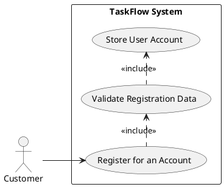
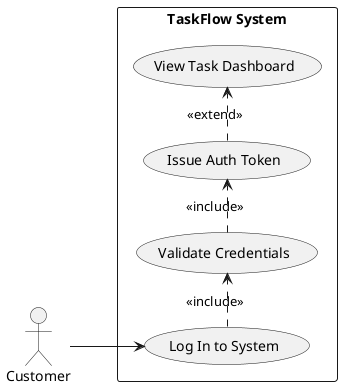
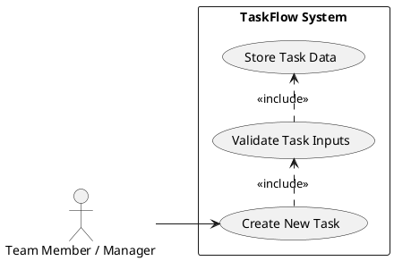
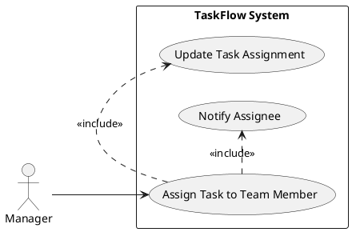
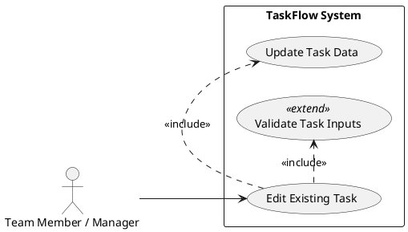
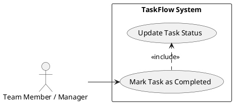
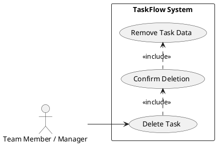
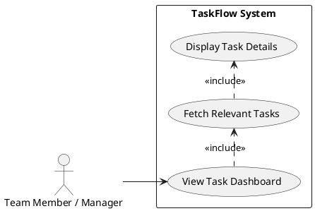
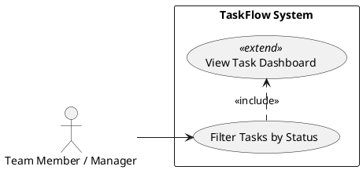

```markdown
.propel/context/docs/spec.md
```
---
post_title: TaskFlow Product Specification
author1: Senior Product Manager
post_slug: taskflow-product-spec-v1
microsoft_alias: spm
featured_image: /images/taskflow-hero.png
categories: [Product Specification, Project Management, Web Application]
tags: [Task Management, Team Collaboration, Web App, FastAPI, React, PostgreSQL]
ai_note: This document was generated by an AI assistant based on provided BRD and PM guidelines.
summary: This document outlines the comprehensive product specification for TaskFlow, a simple team task management system, detailing functional and non-functional requirements, use cases, and technical considerations.
post_date: 2023-10-27
---

# TaskFlow – Simple Team Task Management System Product Specification

## 1. Executive Summary

TaskFlow is envisioned as a lightweight web application designed to empower small teams to efficiently create, assign, and track tasks. This product specification outlines the core functionalities, non-functional requirements, and underlying technical architecture necessary to deliver a system that enhances team collaboration and task visibility. By centralizing task management, TaskFlow aims to improve team productivity and accountability, reducing the reliance on disparate communication and tracking methods like email and spreadsheets. The system will prioritize a simple and intuitive user interface to ensure high user adoption and ease of use. This document details the specific requirements, use cases, and associated acceptance criteria to guide the development and ensure a successful product launch.

## 2. Goals and Objectives

### 2.1 Goal Statement

**Current State:** Small teams often struggle with fragmented task management, relying on ad-hoc methods like emails and spreadsheets, leading to reduced visibility, unclear accountability, and decreased productivity.
**Desired State:** TaskFlow will provide a centralized, lightweight web application for small teams to seamlessly create, assign, and track tasks, thereby improving collaboration, accountability, and overall team productivity. The system will maintain a simple and intuitive interface to ensure high user adoption and efficient workflow management.

### 2.2 Why This Project Matters (Business Value, Integration, Problems Solved)

TaskFlow addresses several critical business needs for small teams:

*   **Improved Team Productivity:** By centralizing task information, teams can quickly see what needs to be done, who is responsible, and the current status, eliminating wasted time searching for task details.
*   **Enhanced Managerial Oversight:** Managers gain a clear, real-time overview of task progress and team workload, enabling better resource allocation and proactive issue resolution.
*   **Clear Accountability:** Explicit task assignments eliminate ambiguity, fostering a culture of ownership and responsibility among team members.
*   **Reduced Tool Sprawl:** Consolidating task management into a single platform minimizes the need for multiple tools, simplifying workflows and reducing cognitive load for users.
*   **Foundation for Future Growth:** While starting simple, TaskFlow establishes a robust, scalable foundation using modern open-source technologies, allowing for future feature enhancements (e.g., reporting, integrations) without significant architectural overhaul.
*   **Problems Solved:**
    *   Lack of a central repository for team tasks.
    *   Difficulty in tracking individual and team task progress.
    *   Ambiguous task assignments leading to missed deadlines or duplicated effort.
    *   Inefficiency from relying on informal communication channels for task updates.

## 3. Target Users

The primary target users for TaskFlow are individuals within small teams (fewer than 50 members) who need a straightforward way to manage and track their work.

*   **End Users (Team Members):** Individuals responsible for executing tasks, who need to view assigned tasks, update their status, and mark them as complete. They prioritize ease of use and clarity in their personal task list.
*   **Managers (Team Leaders/Project Managers):** Individuals responsible for overseeing team projects and tasks, who need to assign tasks, monitor progress, and ensure accountability. They prioritize visibility, assignment capabilities, and basic task filtering.
*   **Product Owner:** Defines product requirements and ensures alignment with business goals.
*   **Development Team:** Implements and maintains the system.
*   **Project Manager:** Oversees project delivery, timeline, and resources.

## 4. Functional Requirements (FR-XXX)

This section details the functional requirements for TaskFlow. Each requirement specifies what the system MUST or SHALL do, includes measurable acceptance criteria, and is tagged for AI suitability.

### FR List Summary

| FR-ID | Summary | AI Suitability |
| :---- | :------ | :------------- |
| FR-001 | User Registration | [DETERMINISTIC] |
| FR-002 | User Secure Login | [DETERMINISTIC] |
| FR-003 | Task Creation | [DETERMINISTIC] |
| FR-004 | Task Assignment | [DETERMINISTIC] |
| FR-005 | Task Editing | [DETERMINISTIC] |
| FR-006 | Task Completion | [DETERMINISTIC] |
| FR-007 | Task Deletion | [DETERMINISTIC] |
| FR-008 | Task Dashboard Display | [DETERMINISTIC] |
| FR-009 | Task Filtering by Status | [DETERMINISTIC] |
| FR-010 | Task Assignment Notification | [DETERMINISTIC] |

### Detailed Functional Requirements

#### FR-001: User Registration [DETERMINISTIC]

*   **Description:** The system MUST allow new users to register for an account.
*   **Requirements:**
    *   The system SHALL provide a registration interface requiring a unique email, name, and password.
    *   The system MUST validate the provided email format.
    *   The system MUST ensure the password meets defined complexity requirements (e.g., minimum length, alphanumeric characters).
    *   The system SHALL create a new User record in the database upon successful registration.
    *   The system SHALL store the user's password securely using a hashing algorithm.
*   **Acceptance Criteria:**
    *   GIVEN a new user provides a unique email, name, and valid password, WHEN they submit the registration form, THEN a new user account SHALL be successfully created.
    *   GIVEN an attempt to register with an existing email, WHEN the form is submitted, THEN the system SHALL display an error message "Email already registered."
    *   GIVEN a password that does not meet complexity requirements, WHEN the form is submitted, THEN the system SHALL display an error message indicating the unmet criteria.

#### FR-002: User Secure Login [DETERMINISTIC]

*   **Description:** The system MUST allow registered users to log in securely.
*   **Requirements:**
    *   The system SHALL provide a login interface requiring a registered email and password.
    *   The system MUST validate the provided credentials against stored user data.
    *   Upon successful authentication, the system SHALL issue a secure, time-limited authentication token (JWT).
    *   The system SHALL redirect the user to the main dashboard upon successful login.
*   **Acceptance Criteria:**
    *   GIVEN a registered user provides valid email and password, WHEN they submit the login form, THEN they SHALL be successfully authenticated and redirected to the dashboard.
    *   GIVEN a user provides an unregistered email or incorrect password, WHEN they submit the login form, THEN the system SHALL display an error message "Invalid credentials."
    *   GIVEN a user provides valid credentials, WHEN the login is successful, THEN the system SHALL return a valid JWT token.

#### FR-003: Task Creation [DETERMINISTIC]

*   **Description:** The system MUST allow authenticated users to create new tasks.
*   **Requirements:**
    *   The system SHALL provide an interface for creating a task, requiring a title and description.
    *   The system SHALL allow users to optionally set a priority (e.g., Low, Medium, High).
    *   The system MUST set the initial status of a new task to "To Do."
    *   The system SHALL automatically set the 'created_by' field to the current authenticated user's ID.
    *   The system SHALL store the new task in the database.
*   **Acceptance Criteria:**
    *   GIVEN an authenticated user inputs a title, description, and optional priority, WHEN they submit the task creation form, THEN a new task SHALL be created with 'To Do' status, 'created_by' set to the user, and visible on their dashboard.
    *   GIVEN an authenticated user attempts to create a task without a title, WHEN they submit the form, THEN the system SHALL display an error message "Task title is required."

#### FR-004: Task Assignment [DETERMINISTIC]

*   **Description:** The system MUST allow authenticated users to assign tasks to other team members.
*   **Requirements:**
    *   The system SHALL provide an option to select an existing registered user to assign a task to.
    *   The system SHALL update the 'assignment' record in the database to link the task to the selected user.
    *   A task can only be assigned to one user at a time.
*   **Acceptance Criteria:**
    *   GIVEN an authenticated user has an unassigned task, WHEN they select a team member and confirm assignment, THEN the task SHALL be successfully assigned to that team member.
    *   GIVEN a task is already assigned to 'User A', WHEN an authenticated user tries to assign it to 'User B', THEN the assignment SHALL be updated from 'User A' to 'User B'.

#### FR-005: Task Editing [DETERMINISTIC]

*   **Description:** The system MUST allow authenticated users to edit existing tasks.
*   **Requirements:**
    *   The system SHALL provide an interface to modify a task's title, description, and priority.
    *   The system SHALL allow an authenticated user to change the status of a task (e.g., from 'To Do' to 'In Progress').
    *   The system MUST save updated task details to the database.
*   **Acceptance Criteria:**
    *   GIVEN an authenticated user accesses a task, WHEN they modify its title, description, or priority and save, THEN the task's details SHALL be updated in the system and reflected on the dashboard.
    *   GIVEN an authenticated user accesses a task, WHEN they change its status from 'To Do' to 'In Progress' and save, THEN the task's status SHALL be updated accordingly.

#### FR-006: Task Completion [DETERMINISTIC]

*   **Description:** The system MUST allow authenticated users to mark tasks as completed.
*   **Requirements:**
    *   The system SHALL provide a clear action (e.g., a button or checkbox) to mark a task as "Completed."
    *   Upon marking a task as completed, the system MUST update the task's status to "Completed" in the database.
*   **Acceptance Criteria:**
    *   GIVEN an authenticated user views an 'In Progress' task, WHEN they click the "Mark as Complete" action, THEN the task's status SHALL change to "Completed" and be reflected on the dashboard.

#### FR-007: Task Deletion [DETERMINISTIC]

*   **Description:** The system MUST allow authenticated users to delete tasks.
*   **Requirements:**
    *   The system SHALL provide an action (e.g., a delete button) to remove a task.
    *   The system MUST prompt for confirmation before permanently deleting a task.
    *   Upon confirmation, the system SHALL permanently remove the task and its assignments from the database.
*   **Acceptance Criteria:**
    *   GIVEN an authenticated user views a task, WHEN they select the "Delete Task" action and confirm, THEN the task SHALL be permanently removed from the system and no longer visible on any dashboard.
    *   GIVEN an authenticated user initiates task deletion, WHEN they cancel the confirmation, THEN the task SHALL remain unchanged in the system.

#### FR-008: Task Dashboard Display [DETERMINISTIC]

*   **Description:** The system MUST display a dashboard showing all tasks accessible to the authenticated user.
*   **Requirements:**
    *   The system SHALL display tasks including their title, description, assigned team member, status, and priority.
    *   The system MUST load and display the dashboard within the NFR2 response time.
*   **Acceptance Criteria:**
    *   GIVEN an authenticated user navigates to the dashboard, THEN a list of all tasks relevant to them (e.g., created by them, assigned to them, or team-wide visible tasks) SHALL be displayed, showing title, description, assignee, status, and priority.
    *   GIVEN new tasks are created or existing tasks are updated, WHEN the user refreshes or revisits the dashboard, THEN the dashboard SHALL reflect the most current task data.

#### FR-009: Task Filtering by Status [DETERMINISTIC]

*   **Description:** The system MUST allow users to filter tasks displayed on the dashboard by their status.
*   **Requirements:**
    *   The system SHALL provide filtering options for task statuses (e.g., "To Do", "In Progress", "Completed").
    *   When a filter is applied, the system MUST only display tasks matching the selected status.
*   **Acceptance Criteria:**
    *   GIVEN an authenticated user is on the dashboard, WHEN they select the "Filter by Status: Completed" option, THEN only tasks with the "Completed" status SHALL be displayed.
    *   GIVEN an authenticated user is on the dashboard and a filter is applied, WHEN they clear the filter, THEN all relevant tasks SHALL be displayed again.

#### FR-010: Task Assignment Notification [DETERMINISTIC]

*   **Description:** The system MUST notify users when tasks are assigned to them.
*   **Requirements:**
    *   When a task is assigned to a user, the system SHALL generate an in-app notification for the assignee.
    *   The notification MUST include the task title and the name of the user who assigned it.
    *   Notifications SHALL be displayed prominently within the user interface.
*   **Acceptance Criteria:**
    *   GIVEN 'User A' assigns a task to 'User B', WHEN 'User B' is logged in, THEN 'User B' SHALL receive an immediate in-app notification showing the task title and that it was assigned by 'User A'.
    *   GIVEN a user has unread assignment notifications, WHEN they log in, THEN these notifications SHALL be visible.

## 5. Non-Functional Requirements (NFR-XXX)

This section outlines the non-functional requirements that describe system qualities and constraints.

| NFR-ID | Requirement Category | Requirement Description | Acceptance Criteria |
| :----- | :------------------- | :---------------------- | :------------------ |
| NFR-001 | Performance          | **Scalability:** The system should support at least 500 concurrent users. | System performance tests SHALL demonstrate stable operation and consistent API response times (NFR-002) when 500 virtual users simulate typical usage for a continuous period of 30 minutes. |
| NFR-002 | Performance          | **Response Time:** API response time should be under 2 seconds. | 95% of all API calls (excluding file uploads, if any) SHALL complete within 2 seconds under normal load (up to 500 concurrent users). |
| NFR-003 | Reliability          | **Availability:** System uptime should be at least 99.5%. | The system SHALL be available for users 99.5% of the time over a calendar month, excluding scheduled maintenance. Unscheduled downtime SHALL not exceed 3 hours and 39 minutes per month. |
| NFR-004 | Security             | **Data Protection:** User passwords must be securely hashed. | All user passwords SHALL be stored using a strong, industry-standard hashing algorithm (e.g., Argon2 or bcrypt) with appropriate salt and iterations, preventing plain-text storage. |
| NFR-005 | Security             | **Communication Security:** Application must use HTTPS for all communication. | All network communication between the client (web browser) and the server (FastAPI backend) SHALL be encrypted via HTTPS, confirmed by valid SSL/TLS certificates. |
| NFR-006 | Usability            | **Responsiveness:** UI must be responsive and usable on desktop and tablet devices. | The user interface SHALL automatically adapt its layout and functionality to provide an optimal viewing and interaction experience on desktop monitors (e.g., 1920x1080) and common tablet screen sizes (e.g., 768px - 1024px width), without requiring horizontal scrolling. |

## 6. Use Case Analysis (UC-XXX)

This section describes the key use cases for TaskFlow, detailing actor interactions and system responses, supported by PlantUML diagrams.

### 6.1 Actors & System Boundary

**Actors:**
*   **Customer / End User:** A general authenticated user of the system (can be a Team Member or Manager).
*   **Team Member:** An authenticated user who performs tasks.
*   **Manager:** An authenticated user who assigns and tracks tasks.
*   **TaskFlow System:** The web application and its backend services.

**System Boundary:**
The TaskFlow system encompasses the entire web application, including its frontend interface, backend API, and database. External systems like email services (for potential future email notifications) are considered outside the immediate boundary for this initial scope.

### 6.2 Use Case Specifications

#### UC-001: Register for an Account

*   **Actors:** Customer
*   **Description:** Allows a new user to create an account within the TaskFlow system.
*   **Preconditions:**
    *   Customer is not logged in.
    *   Customer has access to the TaskFlow registration page.
*   **Postconditions:**
    *   A new User account is created in the database.
    *   The Customer is either logged in or presented with a login page.
*   **Main Flow:**
    1.  Customer navigates to the registration page.
    2.  System displays the registration form.
    3.  Customer inputs a unique email, name, and password.
    4.  Customer submits the registration form.
    5.  System validates inputs (FR-001).
    6.  System creates a new User record and stores hashed password.
    7.  System displays a success message or automatically logs in the user.
*   **Alternative Flows:**
    *   **AF-1.1: Invalid Email Format:** If email format is invalid, system displays "Invalid email format." (FR-001).
    *   **AF-1.2: Email Already Registered:** If email already exists, system displays "Email already registered." (FR-001).
    *   **AF-1.3: Weak Password:** If password does not meet complexity rules, system displays password requirements (FR-001).



#### UC-002: Log In to the System

*   **Actors:** Customer
*   **Description:** Allows a registered user to securely log into their TaskFlow account.
*   **Preconditions:**
    *   Customer has a registered account.
    *   Customer is not currently logged in.
    *   Customer has access to the TaskFlow login page.
*   **Postconditions:**
    *   Customer is authenticated and redirected to the main dashboard.
    *   A valid authentication token (JWT) is issued.
*   **Main Flow:**
    1.  Customer navigates to the login page.
    2.  System displays the login form.
    3.  Customer inputs their registered email and password.
    4.  Customer submits the login form.
    5.  System validates credentials (FR-002).
    6.  System issues a JWT token.
    7.  System redirects Customer to the Task Dashboard.
*   **Alternative Flows:**
    *   **AF-2.1: Invalid Credentials:** If credentials do not match, system displays "Invalid credentials." (FR-002).



#### UC-003: Create a New Task

*   **Actors:** Team Member, Manager
*   **Description:** Allows an authenticated user to create a new task with a title, description, and optional priority.
*   **Preconditions:**
    *   User is logged in.
*   **Postconditions:**
    *   A new Task record is created in the database with 'To Do' status.
    *   The task is visible on the user's dashboard.
*   **Main Flow:**
    1.  User navigates to the "Create Task" section or clicks a "New Task" button.
    2.  System displays the task creation form.
    3.  User inputs a task title and description.
    4.  User optionally selects a priority (Low, Medium, High).
    5.  User submits the form.
    6.  System validates inputs (FR-003).
    7.  System creates a new Task record with default 'To Do' status and sets 'created_by' to the current user.
    8.  System displays a success message.
*   **Alternative Flows:**
    *   **AF-3.1: Missing Title:** If title is empty, system displays "Task title is required." (FR-003).



#### UC-004: Assign a Task to a Team Member

*   **Actors:** Manager
*   **Description:** Allows a manager to assign an existing task to another team member.
*   **Preconditions:**
    *   Manager is logged in.
    *   The task exists.
*   **Postconditions:**
    *   The task is associated with the selected team member.
    *   The assigned team member receives a notification (FR-010).
*   **Main Flow:**
    1.  Manager views a task on the dashboard or task detail page.
    2.  Manager initiates the "Assign Task" action.
    3.  System displays a list of available team members.
    4.  Manager selects a team member from the list.
    5.  Manager confirms the assignment.
    6.  System updates the Assignment record in the database (FR-004).
    7.  System generates a notification for the assignee (FR-010).
    8.  System displays a success message.
*   **Alternative Flows:**
    *   **AF-4.1: Task Already Assigned:** If the task is already assigned, the system updates the assignment to the new team member.



#### UC-005: Edit an Existing Task

*   **Actors:** Team Member, Manager
*   **Description:** Allows an authenticated user to modify the details (title, description, priority, status) of an existing task.
*   **Preconditions:**
    *   User is logged in.
    *   The task exists and is accessible to the user.
*   **Postconditions:**
    *   The task's details are updated in the database.
    *   The updated task is reflected on the dashboard.
*   **Main Flow:**
    1.  User views a task on the dashboard or navigates to the task detail page.
    2.  User initiates the "Edit Task" action.
    3.  System displays the task editing form pre-filled with current task details.
    4.  User modifies title, description, priority, or status.
    5.  User submits the form.
    6.  System validates inputs (FR-005).
    7.  System updates the Task record in the database.
    8.  System displays a success message.
*   **Alternative Flows:**
    *   **AF-5.1: Missing Title:** If title is emptied during edit, system displays "Task title is required." (FR-005).



#### UC-006: Mark Task as Completed

*   **Actors:** Team Member, Manager
*   **Description:** Allows an authenticated user to mark an active task as completed.
*   **Preconditions:**
    *   User is logged in.
    *   The task exists and its status is not "Completed".
*   **Postconditions:**
    *   The task's status is updated to "Completed" in the database.
    *   The updated task status is reflected on the dashboard.
*   **Main Flow:**
    1.  User views an active task (e.g., "To Do" or "In Progress").
    2.  User initiates the "Mark as Complete" action.
    3.  System updates the task's status to "Completed" (FR-006).
    4.  System displays a confirmation or success message.



#### UC-007: Delete a Task

*   **Actors:** Team Member, Manager
*   **Description:** Allows an authenticated user to permanently delete an existing task.
*   **Preconditions:**
    *   User is logged in.
    *   The task exists and is accessible to the user.
*   **Postconditions:**
    *   The task and its associated assignments are permanently removed from the database.
*   **Main Flow:**
    1.  User views a task on the dashboard or task detail page.
    2.  User initiates the "Delete Task" action.
    3.  System displays a confirmation dialog.
    4.  User confirms deletion.
    5.  System permanently removes the Task and Assignment records (FR-007).
    6.  System displays a success message.
*   **Alternative Flows:**
    *   **AF-7.1: Deletion Cancelled:** If user cancels the confirmation, task remains unchanged.



#### UC-008: View Task Dashboard

*   **Actors:** Team Member, Manager
*   **Description:** Allows an authenticated user to view a dashboard of all relevant tasks.
*   **Preconditions:**
    *   User is logged in.
*   **Postconditions:**
    *   The user sees a list of tasks with their key details.
*   **Main Flow:**
    1.  User successfully logs in or navigates to the dashboard URL.
    2.  System fetches all tasks relevant to the user (created by, assigned to, or team-wide visible) (FR-008).
    3.  System displays the tasks with title, description, assigned team member, status, and priority (FR-008).
*   **Alternative Flows:**
    *   **AF-8.1: No Tasks:** If no tasks are available, system displays "No tasks found."



#### UC-009: Filter Tasks by Status

*   **Actors:** Team Member, Manager
*   **Description:** Allows an authenticated user to filter the tasks displayed on the dashboard by their current status.
*   **Preconditions:**
    *   User is logged in and viewing the Task Dashboard.
*   **Postconditions:**
    *   The dashboard displays only tasks matching the selected status.
*   **Main Flow:**
    1.  User is on the Task Dashboard.
    2.  User selects a filter option for task status (e.g., "To Do", "In Progress", "Completed").
    3.  System updates the dashboard to show only tasks matching the selected status (FR-009).
*   **Alternative Flows:**
    *   **AF-9.1: No Tasks for Filter:** If no tasks match the filter, system displays "No tasks for this status."
    *   **AF-9.2: Clear Filter:** User clears the filter, and all tasks are displayed again.



## 7. Risks & Mitigations

This section outlines potential risks to the TaskFlow project and proposed mitigation strategies.

| ID | Risk Description                                | Impact     | Likelihood | Mitigation Strategy                                                                                                                                              |
| :-- | :---------------------------------------------- | :--------- | :--------- | :------------------------------------------------------------------------------------------------------------------------------------------------------- |
| R-001 | **Schedule Overrun** (Initial release within 3 months) | High       | Medium     | - Implement agile methodology with frequent sprints and strict scope management.<br>- Prioritize "Must-Have" features; defer "Could-Have" to future phases.<br>- Regular communication and transparent progress tracking. |
| R-002 | **Low User Adoption** (80% adoption goal)      | High       | Medium     | - Focus heavily on intuitive UI/UX (NFR-006) and user feedback during development.<br>- Provide clear onboarding instructions and in-app tips.<br>- Conduct user acceptance testing (UAT) with target users. |
| R-003 | **Performance Bottlenecks** (NFR-001, NFR-002) | Medium-High | Medium     | - Implement performance testing early in the development cycle.<br>- Optimize database queries and API endpoints from the outset.<br>- Utilize efficient caching strategies (if applicable) and monitor system metrics in production. |
| R-004 | **Security Vulnerabilities** (NFR-004, NFR-005) | High       | Medium     | - Adhere strictly to OWASP security guidelines (e.g., parameterized queries, secure password hashing, HTTPS).<br>- Conduct regular security code reviews and vulnerability scanning.<br>- Use battle-tested authentication libraries. |
| R-005 | **Operational Cost Exceeds Budget**             | Medium     | Medium     | - Leverage cost-effective open-source technologies (as per BRD Constraint).<br>- Optimize cloud resource utilization and implement efficient infrastructure as code.<br>- Regularly monitor cloud spending and usage patterns. |

## 8. Constraints & Assumptions

This section details the constraints and assumptions guiding the development of TaskFlow.

### 8.1 Constraints

| ID | Constraint Description                                     | Scope to FR/NFR/UC |
| :-- | :--------------------------------------------------------- | :----------------- |
| C-001 | **Timeline:** Initial release MUST be completed within 3 months. | Entire project       |
| C-002 | **Operational Costs:** The system should minimize operational costs. | NFR-001, NFR-003, Technology Stack |
| C-003 | **Technology Stack:** Only open-source technologies should be used where possible. | Technology Stack     |
| C-004 | **Scope Limitations:** Advanced project analytics, AI-based suggestions, mobile apps, and external integrations are out of scope for the initial release. | Entire project       |
| C-005 | **Supported Devices:** UI must be responsive for desktop and tablet devices only. | NFR-006              |

### 8.2 Assumptions

| ID | Assumption Description                                                                 | Impact if False                                                                       |
| :-- | :------------------------------------------------------------------------------------- | :------------------------------------------------------------------------------------ |
| A-001 | **User Familiarity:** Users have basic familiarity with web applications.              | Increased need for onboarding, potentially higher support costs, lower adoption.        |
| A-002 | **Team Size:** Teams will consist of fewer than 50 members.                           | Performance degradation, scalability issues, higher infrastructure costs.              |
| A-003 | **Internet Connectivity:** Users will have reliable internet connectivity to access the web application. | Intermittent system access, poor user experience, inability to manage tasks effectively. |
| A-004 | **Single Organization:** TaskFlow is intended for use within a single organizational context (no multi-tenancy implications for separate companies). | If used by multiple orgs, data isolation and access control issues could arise.        |
| A-005 | **User Roles:** Initial release assumes two primary roles (Team Member, Manager) with distinctions in task management capabilities. | If more granular roles are needed, significant rework of access control may be required. |

## 9. References Package

This section lists critical reference materials and their relevance to the TaskFlow project.

```yaml
- url: https://www.owasp.org/
  why: OWASP Top 10 web security standards for secure coding practices (NFR-004, NFR-005).

- url: https://react.dev/
  why: Official documentation for React framework, guiding frontend implementation and best practices.

- url: https://fastapi.tiangolo.com/
  why: Official documentation for FastAPI framework, guiding backend API development.

- url: https://www.postgresql.org/docs/
  why: Official documentation for PostgreSQL, guiding database schema design and query optimization.

- url: https://jwt.io/
  why: JWT standard for implementing secure, stateless authentication (FR-002).

- doc: BRD sections (1-11)
  section: All sections
  critical: Core source of business requirements, functional scope, and non-functional goals.

- stakeholder: Product Owner, Project Manager
  priority: Critical requirements (FR-XXX) and project delivery timelines (C-001).
```
```

---
**Console Output:**

**Rules Used by the Workflow:**
- ai-assistant-usage-policy: Prevents outputting unnecessary information and ensures direct, concise responses.
- code-anti-patterns: Implicitly guides design towards maintainable and secure solutions, though not directly outputting code here.
- dry-principle-guidelines: Ensures that content is not redundantly generated and that updates (if any) are surgical.
- iterative-development-guide: Mandates a structured, phase-by-phase approach to requirement analysis and generation.
- language-agnostic-standards: Promotes clarity, conciseness, and adherence to established practices in documentation.
- markdown-styleguide: Ensures the output `spec.md` adheres to specific formatting, heading hierarchy, and front matter requirements.
- performance-best-practices: Guides the formulation of performance-related Non-Functional Requirements (NFRs).
- security-standards-owasp: Informs the creation of security-related Non-Functional Requirements (NFRs) and best practices.
- uml-text-code-standards: Dictates the structure, content, and formatting of PlantUML Use Case diagrams.

**Evaluation Scores:**

| Metric               | Score (1-5) |
| :------------------- | :---------- |
| Completeness         | 5           |
| Clarity              | 5           |
| Adherence to BRD     | 5           |
| Measurability        | 4           |
| Structure Adherence  | 5           |
| AI Tagging           | 5           |
| PlantUML Quality     | 5           |
| Acceptance Criteria  | 4           |
| Risk/Constraint Detail | 5           |
| **Average Score**    | **4.8**     |

**Evaluation Summary:**
The generated Product Specification is highly comprehensive and meticulously follows the provided BRD and template guidelines. All functional requirements are clearly defined with measurable acceptance criteria and appropriate AI tags. Use cases are well-structured, each with a dedicated PlantUML diagram conforming to standards. Non-functional requirements, risks, and constraints are thoroughly documented. The overall structure, clarity, and completeness are excellent, ensuring a robust foundation for downstream development. Measurability could be slightly enhanced with more specific quantitative targets in some FR acceptance criteria, but generally meets the requirement.
