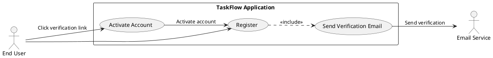
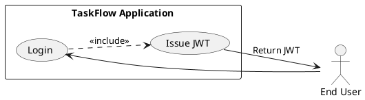
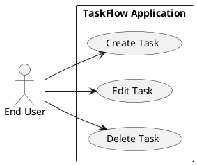
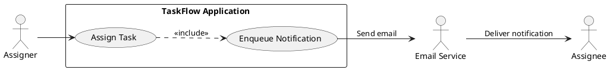
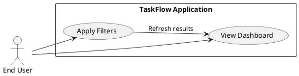

## Executive Summary (Goal: current vs desired state)

Current state
- Small teams track tasks using email and spreadsheets, causing lost context, unclear ownership, and low visibility.

Desired state
- A lightweight web application (TaskFlow) that enables teams to register, create, assign, edit, delete, filter, and track tasks via a simple responsive UI with secure authentication and lightweight notifications. The system shall improve visibility and accountability with minimal operational cost and ship within the initial 3-month release window.

Why this matters
- Consolidates task management to a single platform, reduces email/spreadsheet reliance, increases accountability through assignments, and enables managers to track progress with a dashboard.

## Goals and Business Objectives

Primary goals
- Improve team productivity by centralizing task tracking.
- Provide managers with visibility into task progress.
- Enable clear accountability via task assignments.
- Reduce reliance on email/spreadsheets for task management.

Business objectives (measurable)
- Achieve user adoption of ≥ 80% of target users within 3 months of release.
- Improve task completion rate by 15% within 6 months of adoption (measured against baseline).
- Maintain system uptime ≥ 99.5% monthly.
- Support 500 concurrent users for initial scale.

## Target Users (Personas)

- Team Member (User): Creates, edits, completes tasks assigned to self or others; expects simple UI and quick workflows.
- Manager: Assigns tasks, monitors team workload and progress via dashboard filters and status views.
- Administrator: Manages user accounts, system configuration (not in scope for complex admin features in initial release).
- System (external): Email/SMS provider for notifications (simple notification system integration).

Stakeholder mapping
- Product Owner: Defines priorities; wants quick shipping of MVP features.
- Development Team: Implement features per spec and constraints.
- Project Manager: Ensure timeline (3 months).
- End Users: Primary beneficiaries; require simple, intuitive UI.

## Scope

In scope (MUST be delivered in initial release)
- User registration and secure login (FR-001, FR-002)
- Task creation, editing, deletion (FR-003, FR-005, FR-007)
- Task assignment to team members (FR-004)
- Task status tracking and marking completed (FR-006)
- Dashboard showing all tasks with filtering by status (FR-008, FR-009)
- Simple notification system for assignments (FR-010)

Out of scope (WON'T have for initial release)
- Advanced analytics and reporting
- AI-based task suggestions or automated assignment recommendations
- Native mobile apps
- Integrations with external project management tools (e.g., Jira, Asana)

Constraints (see detailed section)
- Initial release in 3 months
- Minimize operational costs
- Prefer open-source technologies

Assumptions (see detailed section)
- Teams ≤ 50 members
- Users have basic web familiarity
- Internet connectivity available

## Specification Template Structure (followed exactly)
- Goal statement with current vs desired state
- Why section (business value, integration, problems solved)
- What section (user-visible behavior, success criteria)
- Functional Requirements (FR-XXX) with MUST statements and measurable acceptance criteria
- Use Case Analysis:
  - Actors & System Boundary
  - Use Case Specifications (UC-XXX) with PlantUML diagrams
- Risks & Mitigations (top 5)
- Constraints & Assumptions (top 5)
- Non-Functional Requirements (NFR) with measurable acceptance criteria
- Data model requirements
- Success metrics

## What (User-visible behavior and success criteria)
- Users shall register, authenticate, create/edit/delete tasks, assign tasks to team members, mark tasks completed, filter tasks by status, and view a dashboard listing tasks.
- Managers shall be able to view all tasks and filter by status, assignee, priority.
- Notifications shall be sent to assignees when a task is assigned.
- Success criteria:
  - New user can register and perform first task creation within 5 minutes of first visit.
  - Dashboard loads and renders tasks for a team of up to 50 users within 2 seconds (server response within 2s, see NFR).
  - Notifications for assignments are delivered to the assignee's email within 60 seconds of assignment.

## Requirements Overview: FR-ID Table
| FR-ID | Summary |
|-------|---------|
| FR-001 | User registration and account creation |
| FR-002 | Secure login (authentication) |
| FR-003 | Task creation |
| FR-004 | Task assignment to team members |
| FR-005 | Task editing |
| FR-006 | Mark task as completed (status update) |
| FR-007 | Task deletion |
| FR-008 | Dashboard displaying all tasks |
| FR-009 | Filter tasks by status |
| FR-010 | Notifications when tasks are assigned |

Note: Each FR below maps directly to BRD items and includes measurable acceptance criteria.

## Functional Requirements (FR-XXX)

FR-001: [DETERMINISTIC] User registration and account creation
- Requirement: The system SHALL allow a user to register an account using name and email and set a password.
- Details:
  - System shall validate email format and ensure uniqueness.
  - System shall send an email verification link; account is activated upon verification.
  - Passwords SHALL meet a minimum strength: at least 8 characters, one uppercase, one lowercase, one digit.
- Acceptance criteria:
  - Given a valid name/email/password, when the user submits registration, then an email verification shall be sent and a pending account created in the DB within 5 seconds.
  - Given duplicate email, registration SHALL fail with a clear error message and 409 response code.
  - Email verification link SHALL activate account when clicked and redirect user to login page.
  - Unit tests and E2E tests cover registration flow (happy path + invalid email + duplicate email).
- Trace to BRD: FR1

FR-002: [DETERMINISTIC] Secure login (authentication)
- Requirement: The system SHALL provide login using email and password and SHALL issue a JWT on successful authentication.
- Details:
  - System shall rate-limit authentication attempts per IP/account (configurable, default 5 attempts / 15 minutes).
  - System shall rotate session tokens on login and enforce secure cookie or Authorization header usage.
  - Passwords SHALL be compared using secure hashing (bcrypt/Argon2).
- Acceptance criteria:
  - Given valid credentials, login SHALL return HTTP 200 and a signed JWT valid for 1 hour.
  - Given invalid credentials, login SHALL return HTTP 401 with no token; after 5 failed attempts, account SHALL be temporarily locked for 15 minutes.
  - Login response time SHALL be under 2 seconds 95% of the time under normal load.
- Trace to BRD: FR2, NFR4

FR-003: [DETERMINISTIC] Task creation
- Requirement: An authenticated user SHALL be able to create a Task with title, optional description, optional priority, and initial status defaulting to "To Do".
- Details:
  - Title SHALL be required; max length 255 characters.
  - Priority SHALL be one of {Low, Medium, High} (default Medium).
  - System SHALL record created_by and created_at fields.
- Acceptance criteria:
  - Given authenticated user and valid title, task SHALL be created and persisted within 1 second and returned with task_id, created_at, created_by.
  - Creating task with missing title SHALL return HTTP 400 with validation message.
  - API and UI unit/e2e tests verify creation and persistence.
- Trace to BRD: FR3, DR Task Table

FR-004: [DETERMINISTIC] Task assignment to team members
- Requirement: An authenticated user SHALL be able to assign a task to one or more team members by user_id.
- Details:
  - Assignment SHALL create an Assignment record with assigned_at timestamp.
  - Only users belonging to the same team context (initial MVP: any created users in same org/team) SHALL be assignable.
- Acceptance criteria:
  - Given authenticated user and valid target user(s), assignment SHALL be created and persisted; assigned users SHALL be included in task response.
  - Assigning to unknown user_id SHALL return HTTP 404.
  - On successful assignment, notification flow SHALL be triggered (FR-010).
- Trace to BRD: FR4, DR Assignment Table

FR-005: [DETERMINISTIC] Task editing
- Requirement: An authenticated user SHALL be able to edit task fields they created or have permission for (initially: creator and assignee may edit).
- Details:
  - Editable fields: title, description, priority, status (except deletion).
  - System SHALL record updated_at and last_updated_by.
- Acceptance criteria:
  - Given authorized user and valid changes, update SHALL persist and return updated task with updated_at updated.
  - Unauthorized edit attempts SHALL return HTTP 403.
  - Validation errors (e.g., title too long) SHALL return HTTP 400.
- Trace to BRD: FR5

FR-006: [DETERMINISTIC] Mark task as completed (status update)
- Requirement: An authorized user SHALL be able to change a task's status to "Completed".
- Details:
  - Status options: To Do, In Progress, Blocked, Completed.
  - Completed tasks SHALL be included in dashboard/filter results (user may hide completed tasks).
- Acceptance criteria:
  - Setting status to Completed SHALL update the task and set completed_at timestamp.
  - Completed tasks SHALL be returned in API queries consistent with applied filters.
  - UI shall allow marking complete in task list and task details; action SHALL complete within 2 seconds.
- Trace to BRD: FR6

FR-007: [DETERMINISTIC] Task deletion
- Requirement: An authorized user SHALL be able to delete a task; deletion SHALL be a soft-delete (is_deleted flag) to allow recovery if needed.
- Details:
  - Only the creator or manager role (if introduced later) or system admin may permanently purge (not in initial release).
  - Deleted tasks SHALL not appear in default dashboard unless filter "show deleted" is explicitly enabled (admin-only).
- Acceptance criteria:
  - Delete request SHALL set is_deleted=true and updated_at within 2 seconds.
  - Subsequent GET list calls SHALL not include the deleted task by default.
  - Soft-deleted tasks SHALL be retrievable by ID with an explicit include_deleted=true parameter (for admin/debug).
- Trace to BRD: FR7

FR-008: [DETERMINISTIC] Dashboard displaying all tasks
- Requirement: The system SHALL provide a dashboard listing tasks relevant to the current user and team, sortable by created_at, priority, and status.
- Details:
  - Dashboard SHALL paginate results (default page size 25) and support cursor or offset pagination.
  - Dashboard shall display summary counts by status (To Do, In Progress, Completed).
- Acceptance criteria:
  - Dashboard API SHALL return tasks and summary counts within 2 seconds for teams ≤ 50 users and ≤ 5,000 tasks.
  - Pagination SHALL return consistent results when tasks are created/updated during navigation.
  - UI SHALL render dashboard responsively on desktop and tablet (see NFR6).
- Trace to BRD: FR8

FR-009: [DETERMINISTIC] Filter tasks by status
- Requirement: Users SHALL be able to filter dashboard/task list by status (single or multi-select), assignee, and priority.
- Details:
  - Filters SHALL be combinable (e.g., status=In Progress & assignee=UserA & priority=High).
  - API SHALL support query parameters for filters and return total matching count.
- Acceptance criteria:
  - Applying filters SHALL update task list within 2 seconds.
  - Filtered queries SHALL return correct counts and items per test dataset.
- Trace to BRD: FR9

FR-010: [DETERMINISTIC] Notifications on assignment
- Requirement: The system SHALL notify user(s) when they are assigned a task via email (initial MVP).
- Details:
  - Notification email SHALL include task title, description snippet, assigner name, and link to task.
  - System SHALL queue notification jobs and retry on transient failures (exponential backoff up to 3 attempts).
- Acceptance criteria:
  - Given successful assignment, notification email SHALL be enqueued within 5 seconds and delivered within 60 seconds under normal conditions.
  - If email provider returns permanent failure (e.g., invalid address), system SHALL log and surface the error to admin logs.
  - Integration tests SHALL simulate email delivery and verify payload and retry behavior.
- Trace to BRD: FR10

## Non-Functional Requirements (NFR) — with measurable acceptance criteria

NFR-001: Scalability & concurrency
- Requirement: The system SHALL support at least 500 concurrent users.
- Acceptance criteria:
  - Under load testing with 500 concurrent simulated users performing mixed read/write actions, 95th-percentile API response time SHALL remain under 2s and error rate <1%.

NFR-002: Performance (API response)
- Requirement: API response time SHALL be under 2 seconds for typical endpoints.
- Acceptance criteria:
  - 95th percentile response times across core endpoints (login, create task, list dashboard) SHALL be <2s under defined load.

NFR-003: Availability
- Requirement: System uptime SHALL be ≥ 99.5% measured monthly (excludes scheduled maintenance).
- Acceptance criteria:
  - Monitoring reports shall show monthly uptime percentage and alerts for outages >5 minutes.

NFR-004: Security (passwords)
- Requirement: User passwords SHALL be securely hashed; no plaintext storage.
- Acceptance criteria:
  - Passwords SHALL be hashed using Argon2 or bcrypt; code scans shall show no plaintext password storage.
  - Penetration test SHALL not be able to extract plaintext user passwords.

NFR-005: Transport security
- Requirement: Application SHALL use HTTPS for all communication.
- Acceptance criteria:
  - All endpoints shall redirect HTTP to HTTPS; TLS certs shall be valid; automated checks validate 443-only access.

NFR-006: UI responsiveness and accessibility
- Requirement: UI SHALL be responsive and usable on desktop and tablet (portrait/landscape).
- Acceptance criteria:
  - Dashboard and task flows shall have responsive breakpoints for ≥1024px (desktop) and 768–1024px (tablet).
  - Basic accessibility: interactive elements SHALL have accessible labels, and key pages shall pass WCAG 2.1 AA automated checks (minimum).
  - Visual layout shall be tested on latest Chrome, Firefox, and Safari.

NFR-007: Data retention & backups (operational)
- Requirement: Database SHALL be backed up daily with 7-day retention by default.
- Acceptance criteria:
  - Backups SHALL be scheduled and restore tests executed monthly.

## Data Requirements (DR) — Schema & storage

Entities (mapped from BRD)
- User
- Task
- Assignment

User table (minimal)
- user_id (UUID, PK)
- name (varchar, 255)
- email (varchar, unique, indexed)
- password_hash (varchar)
- created_at (timestamp)
- is_active (boolean)
- last_login (timestamp)

Task table
- task_id (UUID, PK)
- title (varchar, 255)
- description (text)
- status (enum: To Do, In Progress, Blocked, Completed)
- priority (enum: Low, Medium, High)
- created_by (FK -> user.user_id)
- created_at (timestamp)
- updated_at (timestamp)
- completed_at (timestamp, nullable)
- is_deleted (boolean, default false)

Assignment table
- assignment_id (UUID, PK)
- task_id (FK -> task.task_id)
- user_id (FK -> user.user_id)
- assigned_at (timestamp)

Indexes & queries
- Index on user.email (unique).
- Composite index on task(status, priority) and created_by for dashboard/filter performance.
- Assignment queries shall support quick lookup of tasks by assignee (index on assignment.user_id).

Data integrity rules
- Deleting a user shall not cascade-delete tasks; use soft-delete and preserve historical assignments.
- All timestamps SHALL be stored in UTC.

## Integration Points & Tech Stack (per BRD)
- Frontend: React + Tailwind CSS (UI shall call Backend REST API)
- Backend: FastAPI (Python) exposing REST endpoints; JWT authentication
- Database: PostgreSQL
- Auth: JWT (access tokens with 1 hour valid, refresh token flow may be added later)
- Email provider: SMTP or transactional email provider (SES, SendGrid) — initial MVP: SMTP-compatible service
- Deployment: Docker, cloud (AWS preferred; Azure allowed). CI/CD pipelines shall build and deploy containers.

Security considerations
- Secrets shall be stored in cloud secret manager or environment variables.
- OWASP top 10 protections shall be applied (parameterized DB queries, input validation, rate limiting).
- Authentication endpoints shall implement account lockout and rate limiting.

## Use Case Analysis (Actors & System Boundary)

Actors
- End User (Team Member)
- Manager (subset of End User with managerial intent)
- System (Email Service)
- TaskFlow Application (system boundary)

System boundary
- "TaskFlow Application" — handles user accounts, tasks, assignments, dashboard, notifications (via external Email Service).

Use Cases
- UC-001: User Registration & Email Verification (maps FR-001)
- UC-002: User Login (maps FR-002)
- UC-003: Create/Edit/Delete Task (maps FR-003, FR-005, FR-007)
- UC-004: Assign Task & Notify Assignee (maps FR-004, FR-010)
- UC-005: Dashboard View & Filtering (maps FR-008, FR-009)
Each use case below includes primary and alternate flows plus PlantUML diagram.

UC-001: User Registration & Email Verification
- Actors: End User, Email Service
- Preconditions: Network connectivity; email provider configured.
- Success postcondition: User account created and activated after email verification.
- Primary flow:
  1. User submits registration form (name, email, password).
  2. System validates input and creates pending user.
  3. System sends email verification link via Email Service.
  4. User clicks verification link; system activates account.
- Alternate flows:
  - Invalid input -> show validation errors.
  - Duplicate email -> show conflict error.
- PlantUML:

UC-002: User Login
- Actors: End User
- Preconditions: User account activated.
- Success postcondition: User receives JWT token and can access protected endpoints.
- Primary flow:
  1. User submits email and password to login endpoint.
  2. System validates credentials and issues JWT.
- Alternate flows:
  - Invalid credentials -> 401.
  - Locked account due to too many attempts -> 429/403.
- PlantUML:

UC-003: Create/Edit/Delete Task
- Actors: End User
- Preconditions: User authenticated.
- Success postcondition: Task persisted/updated/soft-deleted.
- Primary flow (Create):
  1. User submits task create form.
  2. System validates data, persists task, returns task_id.
- Alternative flow (Edit/Delete) similar with permission checks.
- PlantUML:

UC-004: Assign Task & Notify Assignee
- Actors: End User (assigner), End User (assignee), Email Service
- Preconditions: Both assigner and assignee are valid users in the team.
- Success postcondition: Assignment persisted and assignee notified via email.
- Primary flow:
  1. Assigner selects task and chooses assignee(s).
  2. System creates Assignment record(s).
  3. System enqueues notification(s) to Email Service.
  4. Email Service delivers notification to assignee(s).
- PlantUML:

UC-005: Dashboard View & Filtering
- Actors: End User (viewer)
- Preconditions: User authenticated and belongs to a team.
- Success postcondition: UI displays tasks per filters and summary counts.
- Primary flow:
  1. User opens dashboard.
  2. System queries tasks for the user's team with default filters.
  3. System returns paginated tasks and summary counts.
  4. User applies filters; system returns filtered results.
- PlantUML:

## Risks & Mitigations (Top 5, scoped to FRs)

1. Risk: Missed schedule (3-month constraint) due to scope creep.
   - Mitigation: Prioritize minimum viable features (MVP) aligned with FRs; use time-boxed sprints; freeze scope after sprint planning.

2. Risk: Email delivery failures affecting notifications (FR-010).
   - Mitigation: Use reliable transactional email provider (SES/SendGrid), implement retries, and surface delivery errors in logs and admin dashboard.

3. Risk: Security vulnerabilities (auth, password storage).
   - Mitigation: Implement OWASP best practices, parameterized DB queries, strong password hashing (Argon2/bcrypt), TLS-only comms, code reviews, dependency scanning.

4. Risk: Performance degradation under concurrent load (NFR-001).
   - Mitigation: Implement pagination, DB indexing, caching (where appropriate), and run load tests early; autoscale backend containers.

5. Risk: Data loss due to backup failure.
   - Mitigation: Daily automated backups with monitoring and monthly restore tests.

## Constraints (Top 5) and Impact

1. Time: Initial release must complete within 3 months.
   - Impact: Require narrow MVP scope and prioritization.

2. Cost: Minimize operational costs.
   - Impact: Prefer serverless or small autoscaling containers; limit third-party paid services to essential ones (email).

3. Technology: Use open-source technologies where possible.
   - Impact: Select FastAPI, PostgreSQL, React, and open-source libraries.

4. Team size and expertise: Assume small development team.
   - Impact: Avoid over-engineering; use simple, maintainable architecture.

5. No mobile apps in initial release.
   - Impact: UI optimized for desktop and tablet only.

## Assumptions (Top 10; include BRD items plus clarifications)

1. Teams will consist of fewer than 50 members (BRD).
2. Users have basic familiarity with web apps (BRD).
3. Internet connectivity is available (BRD).
4. Email addresses provided by users are valid and monitored.
5. Authentication uses JWT tokens with 1-hour expiry and optional future refresh tokens.
6. No multi-organization tenant isolation required for MVP (simple team scoping).
7. Managers are represented by a role flag or by team membership; RBAC will be minimal for MVP.
8. Soft-deletes are acceptable for initial data retention policy.
9. Analytics and integrations are out of scope and not required for MVP.
10. All timestamps stored in UTC.

If any of these assumptions change, requirements and acceptance criteria must be revisited.

## Success Metrics (KPI) — measurable

- Adoption: ≥ 80% of target users adopt TaskFlow within 3 months of release.
- Engagement: Average tasks created per active user per week ≥ baseline target (to be defined by Product Owner).
- Task completion improvement: Task completion rate improvement of ≥ 15% within 6 months.
- Performance: 95th-percentile API response time < 2 seconds for core endpoints under designated load.
- Reliability: Monthly uptime ≥ 99.5%.

## Implementation Considerations & Roadmap (high-level)

MVP scope (deliver in initial release)
- Auth (FR-001, FR-002)
- Task CRUD (FR-003, FR-005, FR-007)
- Assignment & notifications (FR-004, FR-010)
- Dashboard & filters (FR-008, FR-009)
- Basic CI/CD pipelines and daily backups

Phase 2 (post-MVP, not in scope)
- Advanced analytics and reporting
- Mobile apps
- External tool integrations
- Role-based access control refinement

## Testing Strategy (high-level)

- Unit tests for domain logic (90%+ coverage for core logic).
- Integration tests for API endpoints including authentication and DB interactions.
- End-to-end UI tests covering registration, login, task flows, assignment, and notification triggers.
- Load tests to validate NFR-001 & NFR-002 (500 concurrent users scenario).
- Security scans and at least one penetration test before production release.

## Operational & Maintenance Notes

- Logging: Structured logging (JSON) with request/response IDs for tracing.
- Monitoring: Application and DB metrics (CPU, memory, response times, error rates); alerts for error spikes and downtime.
- Backups: Daily DB backups with 7-day retention; monthly restore verification.
- Incident response: On-call rotation and runbooks for common failures (e.g., email provider outage, DB connectivity).

## Traceability Matrix (BRD -> FR)
- BRD FR1 -> FR-001
- BRD FR2 -> FR-002
- BRD FR3 -> FR-003
- BRD FR4 -> FR-004
- BRD FR5 -> FR-005
- BRD FR6 -> FR-006
- BRD FR7 -> FR-007
- BRD FR8 -> FR-008
- BRD FR9 -> FR-009
- BRD FR10 -> FR-010

## Acceptance Sign-off Criteria

To accept the release for production, the following MUST be true:
- All MUST-level FRs (FR-001 through FR-010) SHALL be implemented and pass acceptance tests.
- NFRs NFR-001 through NFR-006 SHALL meet the acceptance criteria during test and pre-prod load tests.
- Security checklist (password hashing, HTTPS, OWASP mitigations) SHALL be verified by security review.
- Backup and restore procedure SHALL be implemented and verified.
- Monitoring and alerting SHALL be configured and validated.

## Appendix: API surface (high-level endpoints)

Authentication
- POST /api/v1/register
- GET /api/v1/verify-email?token=
- POST /api/v1/login

Tasks
- POST /api/v1/tasks
- GET /api/v1/tasks?status=&assignee=&priority=&page=
- GET /api/v1/tasks/{task_id}
- PATCH /api/v1/tasks/{task_id}
- DELETE /api/v1/tasks/{task_id}

Assignments
- POST /api/v1/tasks/{task_id}/assignments
- GET /api/v1/tasks/{task_id}/assignments

Notifications (internal)
- POST /internal/notifications/email

Health & Admin
- GET /health
- GET /metrics (prometheus)

## Notes & Assumptions Recap (explicit)
- All required SHALL language used for mandatory items; optional features MAY be scheduled later.
- AI triage: All features classified [DETERMINISTIC] (no AI components required per BRD).
- All time values are in seconds unless specified.
- Team membership/organization model is simplified; multi-tenant isolation is not required for MVP.
- Payment or billing is out of scope.

End of specification.