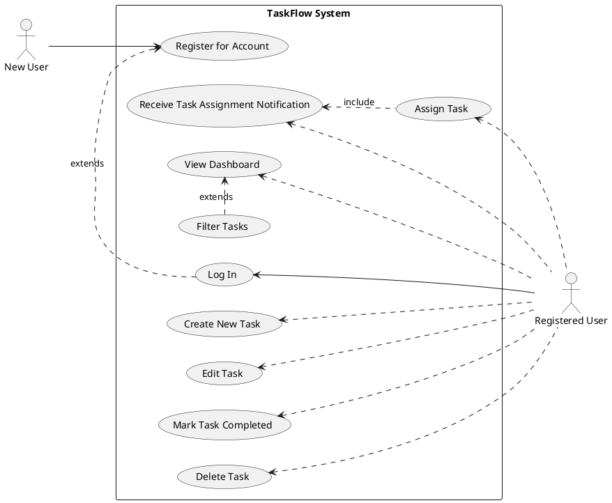

# Product Specification: TaskFlow – Simple Team Task Management System

---

## 1. Executive Summary

TaskFlow is a lightweight web application designed to empower small teams to efficiently create, assign, and track tasks. This product specification outlines the core functionalities and non-functional requirements for the initial release, focusing on improving team productivity, task visibility, and accountability. By providing a centralized platform, TaskFlow aims to reduce reliance on disparate communication methods like email and spreadsheets for task management. The system will feature secure user authentication, comprehensive task lifecycle management, a unified dashboard for tracking progress, and a simple notification mechanism, all built on a modern, open-source technology stack.

---

## 2. Goals and Objectives

### 2.1 Project Goal
The primary goal of TaskFlow is to provide a lightweight web application where small teams can create, assign, and track tasks efficiently, thereby improving collaboration and task visibility within teams while maintaining a simple and intuitive user interface.

### 2.2 Business Objectives
1.  **Improve team productivity by organizing tasks in one platform.**
    *   *Metric:* Reduction in task-related email correspondence by X% within 3 months of adoption.
    *   *Metric:* X% of target users actively use TaskFlow for task management within 1 month of release.
2.  **Allow managers to track task progress easily.**
    *   *Metric:* Managers report a Y% improvement in visibility of team task progress.
    *   *Metric:* Average time spent by managers to understand team's current task status reduced by Z%.
3.  **Provide clear accountability through task assignments.**
    *   *Metric:* A clear owner is assigned to 95% of active tasks in the system.
    *   *Metric:* Reduction in instances of 'dropped balls' or forgotten tasks by X%.
4.  **Reduce reliance on email or spreadsheets for task tracking.**
    *   *Metric:* X% decrease in teams using external tools for task tracking, as measured by user survey.
    *   *Metric:* Y% of task-related discussions moved from email to the TaskFlow platform.

---

## 3. Target Users

The primary target users for TaskFlow are individuals within small teams (under 50 members) who need a straightforward way to manage their daily tasks and collaborate with colleagues.
*   **End Users:** Individuals who create, manage, and complete tasks.
*   **Team Leaders/Managers:** Individuals responsible for overseeing team progress, assigning tasks, and ensuring accountability.

---

## 4. Functional Requirements

### FR-001: User Registration
**Requirement:** Users MUST be able to register and create a new account in TaskFlow.
**Tag:** [DETERMINISTIC]
**Acceptance Criteria:**
*   Users SHALL be prompted for a unique email address, full name, and a password during registration.
*   Passwords SHALL meet the following criteria: minimum 8 characters, at least one uppercase letter, one number, and one special character.
*   The system SHALL validate the uniqueness of the email address; duplicate email attempts SHALL result in an error message.
*   Upon successful registration, the system SHALL store the `user_id`, `name`, `email`, and a securely hashed `password_hash`.
*   A confirmation message SHALL be displayed, and the user SHALL be redirected to the login page.

### FR-002: User Login
**Requirement:** Users MUST be able to log in securely to their TaskFlow account.
**Tag:** [DETERMINISTIC]
**Acceptance Criteria:**
*   Users SHALL be able to log in using their registered email address and password.
*   Upon successful authentication, the system SHALL issue a valid JSON Web Token (JWT) to the user for subsequent authenticated requests.
*   Invalid login credentials (incorrect email or password) SHALL result in a generic error message without disclosing specific validation failures.
*   The user's session SHALL be maintained securely using the issued JWT.

### FR-003: Task Creation
**Requirement:** Authenticated users MUST be able to create new tasks.
**Tag:** [DETERMINISTIC]
**Acceptance Criteria:**
*   Users SHALL be presented with an interface to input the task title, description (optional), priority, and initial status.
*   The task title MUST be a string with a maximum length of 255 characters.
*   The task description MUST be a string with a maximum length of 2000 characters.
*   Task priority SHALL be selectable from 'Low', 'Medium', 'High' with 'Medium' as the default.
*   Initial task status SHALL default to 'To Do'.
*   Upon successful creation, the system SHALL record the `task_id`, `title`, `description`, `status`, `priority`, `created_by` (user_id of the creator), and `created_at` timestamp.
*   The newly created task SHALL be visible on the user's dashboard.

### FR-004: Task Assignment
**Requirement:** Authenticated users MUST be able to assign tasks to one or more team members.
**Tag:** [DETERMINISTIC]
**Acceptance Criteria:**
*   Users SHALL be able to select one or more existing team members (other registered users) from a dropdown list or search interface when creating or editing a task.
*   The system SHALL store assignment details, linking `task_id` to `user_id` in the `Assignment` table, along with an `assigned_at` timestamp.
*   If no team members are explicitly assigned, the task SHALL default to being assigned to the task creator.
*   Assigned tasks SHALL be visible to the assigned user(s) on their respective dashboards.

### FR-005: Task Editing
**Requirement:** Authenticated users MUST be able to edit existing tasks.
**Tag:** [DETERMINISTIC]
**Acceptance Criteria:**
*   Users SHALL be able to modify the title, description, priority, status, and assigned team members of any task they have created or are explicitly assigned to.
*   All changes to a task SHALL be saved and immediately reflected across the system (e.g., on dashboards).
*   Input validations (e.g., title length) applied during task creation SHALL also apply during editing.

### FR-006: Task Completion
**Requirement:** Authenticated users MUST be able to mark tasks as completed.
**Tag:** [DETERMINISTIC]
**Acceptance Criteria:**
*   Users SHALL be able to change a task's status to 'Completed'.
*   Upon changing the status to 'Completed', the system SHALL record a `completed_at` timestamp for the task.
*   Completed tasks SHALL remain visible on the dashboard by default but can be filtered out.

### FR-007: Task Deletion
**Requirement:** Authenticated users MUST be able to delete tasks.
**Tag:** [DETERMINISTIC]
**Acceptance Criteria:**
*   Users SHALL be able to delete any task they have created.
*   A confirmation dialog SHALL be presented to the user before permanent deletion.
*   Upon confirmation, the task SHALL be permanently removed from the `Task` table, and all associated entries in the `Assignment` table SHALL also be removed.

### FR-008: Dashboard Display
**Requirement:** The system MUST display a dashboard of all tasks relevant to the logged-in user.
**Tag:** [DETERMINISTIC]
**Acceptance Criteria:**
*   The dashboard SHALL be the primary view upon login.
*   Each task entry on the dashboard SHALL display at least: Task Title, Current Status, Priority, Assigned To (list of users), and Creation Date.
*   By default, the dashboard SHALL display all active (non-completed) tasks created by or assigned to the logged-in user.
*   Tasks SHALL be sorted by `created_at` in descending order (newest first) by default.

### FR-009: Task Filtering
**Requirement:** Users MUST be able to filter tasks on the dashboard by status.
**Tag:** [DETERMINISTIC]
**Acceptance Criteria:**
*   Users SHALL be provided with filter options for task statuses (e.g., 'To Do', 'In Progress', 'Completed').
*   Users SHALL be able to select one or more status filters.
*   The dashboard view SHALL update dynamically to display only tasks matching the selected filter(s) within 1 second of filter application.

### FR-010: Task Assignment Notifications
**Requirement:** Users MUST receive notifications when tasks are assigned to them.
**Tag:** [DETERMINISTIC]
**Acceptance Criteria:**
*   An in-application notification (e.g., a bell icon indicator or a toast message) SHALL be triggered when a task is assigned to a user.
*   The notification SHALL clearly indicate the task title and the name of the user who assigned the task.
*   The notification count/indicator SHALL update in real-time.
*   Clicking on the notification SHALL direct the user to the details of the assigned task.

---

## 5. Non-Functional Requirements

### NFR-001: Performance - Concurrent Users
**Requirement:** The system SHOULD support at least 500 concurrent users.
**Acceptance Criteria:**
*   Performance load tests SHALL demonstrate that the system can handle 500 simultaneous active user sessions for core functionalities (login, create/view task) without degradation of API response times beyond NFR-002 thresholds.

### NFR-002: Performance - API Response Time
**Requirement:** API response time SHOULD be under 2 seconds.
**Acceptance Criteria:**
*   95% of API requests for critical operations (e.g., login, dashboard load, task creation) SHALL have a response time of less than 2 seconds under normal operating load (up to 500 concurrent users).

### NFR-003: Reliability - System Uptime
**Requirement:** System uptime SHOULD be at least 99.5%.
**Acceptance Criteria:**
*   Monthly monitoring reports SHALL confirm a minimum of 99.5% availability, excluding pre-announced scheduled maintenance windows.

### NFR-004: Security - Password Hashing
**Requirement:** User passwords MUST be securely hashed.
**Acceptance Criteria:**
*   All user passwords SHALL be hashed using a strong, industry-standard cryptographic hashing algorithm (e.g., Argon2, bcrypt) with appropriate salt and work factor before storage in the database.
*   No plain-text passwords or easily reversible encryption of passwords SHALL be stored.

### NFR-005: Security - HTTPS Communication
**Requirement:** The application MUST use HTTPS for all communication.
**Acceptance Criteria:**
*   All network traffic between the client (web browser) and the TaskFlow server SHALL be encrypted using HTTPS/TLS 1.2 or higher.
*   Any attempts to access the application via HTTP SHALL be automatically redirected to HTTPS.

### NFR-006: Usability - Responsive UI
**Requirement:** The UI MUST be responsive and usable on desktop and tablet devices.
**Acceptance Criteria:**
*   The application's user interface SHALL adapt gracefully to screen sizes ranging from 768px (common tablet portrait width) up to 1920px (common desktop width) without requiring horizontal scrolling or displaying distorted elements.
*   All interactive elements and key functionalities SHALL remain accessible, clearly visible, and visually coherent across the specified device range.

---

## 6. Use Case Analysis

### Use Case Diagram

### Use Cases Details

#### UC-001: Register for a New TaskFlow Account
*   **Actor:** New User
*   **Preconditions:**
    *   New User has internet access.
    *   New User is not already registered.
    *   New User has a valid, unique email address.
*   **Postconditions:**
    *   New User account is created and stored in the database.
    *   New User is ready to log in.
*   **Main Flow:**
    1.  New User navigates to the TaskFlow registration page.
    2.  System displays the registration form.
    3.  New User inputs a unique email, full name, and password (meeting complexity requirements).
    4.  New User submits the registration form.
    5.  System validates inputs (uniqueness of email, password complexity).
    6.  System securely hashes the password and creates a new User record.
    7.  System displays a success message and redirects to the login page.
*   **Alternate Flows:**
    *   **AF1.1:** Invalid input (e.g., non-unique email, weak password): System displays validation errors, prompting user to correct.

#### UC-002: Log In to TaskFlow
*   **Actor:** Registered User
*   **Preconditions:**
    *   Registered User has internet access.
    *   Registered User has an existing TaskFlow account.
*   **Postconditions:**
    *   Registered User is authenticated and redirected to the TaskFlow dashboard.
    *   A valid JWT is issued and stored for the session.
*   **Main Flow:**
    1.  Registered User navigates to the TaskFlow login page.
    2.  System displays the login form.
    3.  Registered User enters their registered email and password.
    4.  Registered User submits the login form.
    5.  System validates credentials.
    6.  System issues a JWT and redirects Registered User to the dashboard.
*   **Alternate Flows:**
    *   **AF2.1:** Invalid credentials: System displays a generic error message "Invalid email or password."

#### UC-003: Create a New Task
*   **Actor:** Registered User
*   **Preconditions:**
    *   Registered User is logged in to TaskFlow.
*   **Postconditions:**
    *   A new task record is created and visible on the dashboard.
    *   The task is initially assigned to the creator.
*   **Main Flow:**
    1.  Registered User navigates to the "Create Task" section or clicks a "New Task" button.
    2.  System displays the task creation form.
    3.  Registered User inputs task title, optional description, selects priority (defaults to Medium), and confirms status (defaults to To Do).
    4.  Registered User submits the task creation form.
    5.  System validates inputs.
    6.  System creates a new task record, assigns it to the creator, and records timestamps.
    7.  System displays a success message and updates the dashboard.
*   **Alternate Flows:**
    *   **AF3.1:** Invalid input (e.g., missing title): System displays validation errors.

#### UC-004: Assign a Task to a Team Member
*   **Actor:** Registered User
*   **Preconditions:**
    *   Registered User is logged in.
    *   A task exists (either newly created or existing).
    *   Other team members are registered in TaskFlow.
*   **Postconditions:**
    *   The task is assigned to the selected team member(s).
    *   Assigned user(s) receive an in-app notification.
*   **Main Flow:**
    1.  Registered User creates a new task (UC-003) or edits an existing task (UC-005).
    2.  System presents an option to assign the task to team members.
    3.  Registered User selects one or more team members from a list/search.
    4.  Registered User confirms the assignment (by saving the task).
    5.  System updates the task's assignment records.
    6.  System sends in-app notifications to the newly assigned team member(s).

#### UC-005: Edit an Existing Task
*   **Actor:** Registered User
*   **Preconditions:**
    *   Registered User is logged in.
    *   An existing task is accessible to the user (either created by or assigned to them).
*   **Postconditions:**
    *   The task details are updated in the system.
    *   Changes are reflected on the dashboard and for all relevant users.
*   **Main Flow:**
    1.  Registered User views the dashboard (UC-008).
    2.  Registered User selects a task to edit.
    3.  System displays the task details in an editable form.
    4.  Registered User modifies title, description, priority, status, or assignment.
    5.  Registered User saves the changes.
    6.  System validates inputs and updates the task record.
    7.  System displays a success message and updates the dashboard.

#### UC-006: Mark a Task as Completed
*   **Actor:** Registered User
*   **Preconditions:**
    *   Registered User is logged in.
    *   An existing task is accessible to the user and is not already 'Completed'.
*   **Postconditions:**
    *   The task's status is updated to 'Completed'.
    *   A `completed_at` timestamp is recorded for the task.
*   **Main Flow:**
    1.  Registered User views the dashboard (UC-008) or opens a task's details.
    2.  Registered User selects the option to mark the task as 'Completed'.
    3.  System updates the task's status to 'Completed' and records the completion timestamp.
    4.  System displays a confirmation message and updates the task's status on the dashboard.

#### UC-007: Delete a Task
*   **Actor:** Registered User
*   **Preconditions:**
    *   Registered User is logged in.
    *   Registered User is the creator of an existing task.
*   **Postconditions:**
    *   The task and all its associated assignments are permanently removed from the system.
*   **Main Flow:**
    1.  Registered User views the dashboard (UC-008) or opens a task's details.
    2.  Registered User selects the option to delete the task.
    3.  System displays a confirmation prompt.
    4.  Registered User confirms deletion.
    5.  System permanently removes the task record and associated assignments.
    6.  System displays a success message and removes the task from the dashboard.
*   **Alternate Flows:**
    *   **AF7.1:** User cancels deletion: Task remains unchanged.

#### UC-008: View All Tasks on the Dashboard
*   **Actor:** Registered User
*   **Preconditions:**
    *   Registered User is logged in.
*   **Postconditions:**
    *   The dashboard displays a list of active tasks relevant to the user, sorted by creation date.
*   **Main Flow:**
    1.  Registered User logs in (UC-002) or navigates to the dashboard.
    2.  System retrieves and displays active tasks created by or assigned to the user.
    3.  Each task entry shows its title, status, priority, assigned members, and creation date.

#### UC-009: Filter Tasks by Status
*   **Actor:** Registered User
*   **Preconditions:**
    *   Registered User is logged in and viewing the dashboard (UC-008).
*   **Postconditions:**
    *   The dashboard displays only tasks matching the selected status filters.
*   **Main Flow:**
    1.  Registered User interacts with the filter options on the dashboard.
    2.  Registered User selects one or more task statuses (e.g., 'To Do', 'In Progress', 'Completed').
    3.  System dynamically updates the dashboard view to show only tasks that match the selected filters.
*   **Alternate Flows:**
    *   **AF9.1:** User deselects filters: Dashboard reverts to showing tasks matching remaining filters or default view.

#### UC-010: Receive Task Assignment Notification
*   **Actor:** Registered User
*   **Preconditions:**
    *   Registered User is logged in.
    *   Another user has assigned a task to the Registered User (UC-004).
*   **Postconditions:**
    *   Registered User is aware of the new task assignment.
*   **Main Flow:**
    1.  Another user assigns a task to the Registered User.
    2.  System generates an in-app notification for the Registered User.
    3.  Registered User sees the notification (e.g., an updated bell icon count, a toast message).
    4.  Registered User can click on the notification to view the task details.

---

## 7. Constraints, Assumptions, and Risks

### 7.1 Constraints

*   **Time Constraint:** The initial release MUST be completed within 3 months. This necessitates strict scope management and focus on core MVP features.
*   **Cost Minimization:** The system should minimize operational costs. This influences technology choices (open-source where possible) and deployment strategy (e.g., efficient cloud resource usage).
*   **Technology Stack:** Only open-source technologies should be used where possible. This directly impacts library and framework selection.

### 7.2 Assumptions

*   **User Familiarity:** Users are assumed to have basic familiarity with web applications and common UI patterns. Minimal onboarding will be provided.
*   **Team Size:** TaskFlow is designed for small teams, assumed to consist of fewer than 50 members. Scalability beyond this is out of scope for the initial release.
*   **Internet Connectivity:** Users are assumed to have stable internet connectivity to access and use the web application.

### 7.3 Risks

*   **Timeline Overruns:** The 3-month timeline is aggressive for a full-stack application development.
    *   *Mitigation:* Prioritize MVP features strictly, manage scope creep, maintain clear communication channels, consider agile development methodologies.
*   **Performance Under Load:** Achieving NFR1 (500 concurrent users) and NFR2 (<2s API response) within the 3-month timeframe, especially with a new team and tech stack, presents a risk.
    *   *Mitigation:* Implement performance testing early and regularly, optimize database queries, ensure efficient FastAPI endpoints, use caching mechanisms where appropriate.
*   **Security Vulnerabilities:** Implementing secure JWT authentication and password hashing (NFR4, NFR5) without expert knowledge can lead to vulnerabilities.
    *   *Mitigation:* Follow best practices for FastAPI security, leverage well-vetted libraries for authentication, conduct security reviews, consider external penetration testing if budget allows post-MVP.
*   **Adoption Challenges:** While the BRD targets "80% of target users," achieving this relies on user experience and effective communication, which can be challenging for a new product.
    *   *Mitigation:* Involve end-users in feedback sessions during development, ensure the UI is truly simple and intuitive, provide clear documentation/tutorials.
*   **Technical Debt:** The rapid development cycle might lead to technical debt if corners are cut for the initial release.
    *   *Mitigation:* Emphasize clean code practices, modular design, and regular code reviews. Document any known technical debt to address in future sprints.