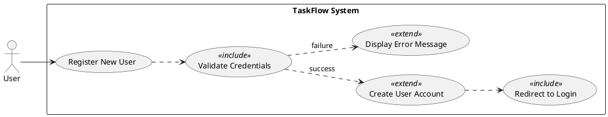
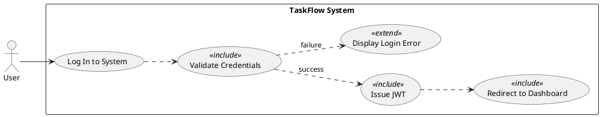
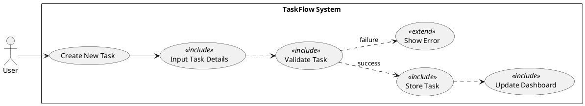
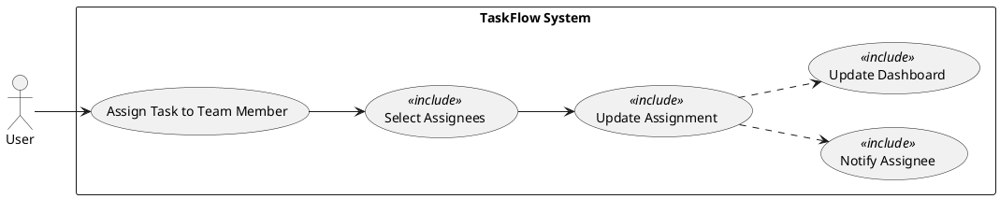
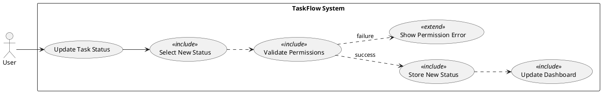
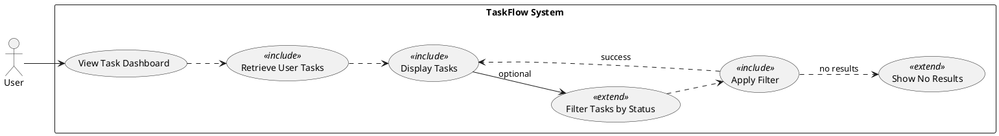
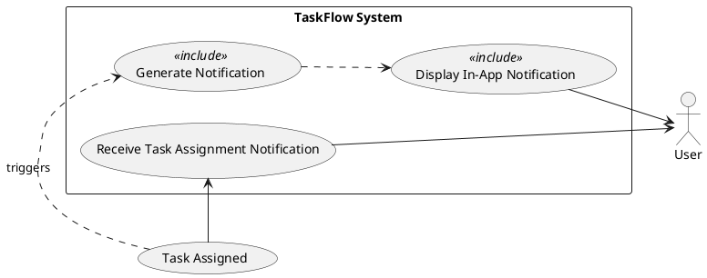

The following Product Specification details the requirements for TaskFlow, a simple team task management system, derived from the provided Business Requirements Document.

---
post_title: TaskFlow - Simple Team Task Management System Product Specification
author1: Senior Product Manager
post_slug: taskflow-product-specification
microsoft_alias: null
featured_image: null
categories: [Product Management, Software Development, Requirements]
tags: [BRD, Product Specification, Functional Requirements, Use Cases, PlantUML, Task Management, SaaS]
ai_note: This document was generated by an AI assistant based on a provided Business Requirements Document and specific formatting/content guidelines.
summary: This Product Specification details the functional and non-functional requirements for TaskFlow, a lightweight web application designed to improve team collaboration and task visibility. It includes detailed functional requirements, measurable acceptance criteria, use case analyses with PlantUML diagrams, and outlines key constraints, assumptions, and risks.
post_date: 2023-10-27
---

# TaskFlow - Simple Team Task Management System Product Specification

## Executive Summary

This document outlines the product specification for "TaskFlow," a new lightweight web application designed to enhance team productivity and collaboration through efficient task management. TaskFlow will enable small teams to seamlessly create, assign, track, edit, and delete tasks within a single, user-friendly platform. The system aims to reduce reliance on disparate tools like email and spreadsheets for task tracking, providing clear accountability and improved visibility of work progress. This specification details the functional and non-functional requirements, use cases with PlantUML diagrams, and critical constraints, assumptions, and risks to guide the development process.

## 1. Goal Statement

**Current State:** Small teams often struggle with fragmented task management, relying on informal methods like emails, chat messages, or complex spreadsheets. This leads to reduced task visibility, unclear accountability, and hinders overall team productivity.

**Desired State:** TaskFlow will provide a centralized, lightweight web application that allows small teams to efficiently create, assign, and track tasks. It will foster improved collaboration, enhance task visibility, and simplify task management through an intuitive interface, ultimately boosting team productivity.

## 2. Why - Business Objectives and Value

The development of TaskFlow is driven by the following strategic business objectives, which will deliver significant value to small teams:

*   **Improve Team Productivity:** By centralizing task management, TaskFlow SHALL streamline workflows, ensuring tasks are easily accessible and actionable, thereby increasing overall team output and efficiency.
*   **Enhance Managerial Tracking:** The system SHALL provide managers with clear visibility into task progress, enabling easier tracking of team performance and identification of potential bottlenecks.
*   **Foster Accountability:** Clear task assignment capabilities and notifications SHALL ensure that every team member understands their responsibilities, promoting a culture of accountability.
*   **Reduce Tool Sprawl:** TaskFlow SHALL serve as a single source of truth for task management, significantly reducing the need for cumbersome email threads or error-prone spreadsheets, leading to a more organized and efficient work environment.

## 3. What - User-Visible Behavior and Success Criteria

TaskFlow SHALL provide users with a simple, intuitive web interface to manage their tasks. The core user-visible behaviors include:
*   Secure user registration and login.
*   Creation, assignment, editing, and deletion of tasks.
*   Tracking of task status and priority.
*   A dashboard to view all relevant tasks.
*   Filtering capabilities for tasks.
*   Notifications for task assignments.

The project will be considered successful if:
*   Users **MUST** be able to create and manage tasks with minimal training and effort.
*   Task completion rates **MUST** measurably improve within target teams (e.g., a 15% increase in on-time completion recorded via the system's metrics after 3 months of adoption).
*   System adoption **MUST** reach at least 80% of the target users within the first 6 months post-launch, as measured by active user logins and task creation/completion rates.

## 4. Target Users

The primary target users for TaskFlow are:

*   **End Users (Team Members):** Individuals within small teams who are responsible for completing tasks. They need to easily view their assigned tasks, update progress, and mark tasks as complete.
*   **Managers (Team Leaders/Project Managers):** Individuals responsible for overseeing team activities, assigning tasks, and tracking overall project progress. They require clear dashboards and filtering capabilities to monitor team performance and task statuses.

The system is designed for teams with fewer than 50 members, assuming users have basic familiarity with web applications.

## 5. Functional Requirements (FR-XXX)

This section details the specific functional requirements for TaskFlow, each including measurable acceptance criteria and an AI suitability tag.

### FR-001: User Registration
*   **Description:** The system MUST allow new users to register and create an account using a unique email address and a strong password.
*   **Acceptance Criteria:**
    *   The system SHALL require a unique email address for registration.
    *   The system SHALL require a password of at least 8 characters, including a mix of uppercase letters, lowercase letters, numbers, and special characters.
    *   Upon successful registration, the system SHALL create a new user account and direct the user to the login page.
    *   The system SHALL provide clear error messages for invalid inputs (e.g., "Email already registered," "Password does not meet complexity requirements").
*   **Tag:** [DETERMINISTIC]

### FR-002: User Login
*   **Description:** Users MUST be able to log in securely to TaskFlow using their registered email address and password.
*   **Acceptance Criteria:**
    *   The system SHALL validate user credentials (email and password) against stored records.
    *   Upon successful login, the system SHALL issue a JSON Web Token (JWT) for authentication and redirect the user to the Task Dashboard.
    *   The system SHALL provide a generic error message for incorrect login attempts (e.g., "Invalid email or password") without indicating which specific credential was incorrect.
    *   The system SHALL manage user sessions using the issued JWT for subsequent authenticated requests.
*   **Tag:** [DETERMINISTIC]

### FR-003: Task Creation
*   **Description:** Authenticated users MUST be able to create new tasks within the system.
*   **Acceptance Criteria:**
    *   The system SHALL require a task title (minimum 3 characters, maximum 255 characters).
    *   The system SHALL allow an optional task description (up to 2000 characters).
    *   The system SHALL automatically set the initial task status to "To Do".
    *   The system SHALL allow users to select a task priority (e.g., Low, Medium, High).
    *   The system SHALL automatically record the user who created the task (`created_by`) and the timestamp (`created_at`).
    *   Upon successful creation, the new task SHALL be visible on the Task Dashboard for the creator.
*   **Tag:** [DETERMINISTIC]

### FR-004: Task Assignment
*   **Description:** Users MUST be able to assign tasks to one or more registered team members.
*   **Acceptance Criteria:**
    *   The system SHALL provide a mechanism (e.g., a dropdown or search field) to select one or more registered users as assignees for a task.
    *   A user who created a task or a user with a "Manager" role (if implemented, otherwise creator/assignee) SHALL be able to assign or reassign tasks.
    *   The system SHALL clearly display the assigned user(s) for each task on the Task Dashboard.
    *   Upon successful assignment, the task SHALL appear on the assignee's Task Dashboard.
*   **Tag:** [DETERMINISTIC]

### FR-005: Task Editing
*   **Description:** Users MUST be able to modify the details of existing tasks.
*   **Acceptance Criteria:**
    *   A task's creator or any assigned team member SHALL be able to edit its title, description, status, and priority.
    *   The system SHALL allow updating the task title (minimum 3 characters, maximum 255 characters).
    *   The system SHALL allow updating the task description (up to 2000 characters).
    *   The system SHALL allow changing the task status (e.g., "To Do," "In Progress," "Completed").
    *   The system SHALL allow changing the task priority (e.g., "Low," "Medium," "High").
    *   Changes to task details SHALL be immediately reflected on the Task Dashboard for all relevant users.
*   **Tag:** [DETERMINISTIC]

### FR-006: Task Completion
*   **Description:** Users MUST be able to mark tasks as completed.
*   **Acceptance Criteria:**
    *   A task's creator or any assigned team member SHALL be able to change a task's status to "Completed".
    *   The system SHALL visually indicate completed tasks on the Task Dashboard (e.g., strikethrough, different color).
    *   Completed tasks SHALL remain visible on the dashboard and accessible via filters unless explicitly deleted.
*   **Tag:** [DETERMINISTIC]

### FR-007: Task Deletion
*   **Description:** Users MUST be able to delete tasks from the system.
*   **Acceptance Criteria:**
    *   The system SHALL provide a confirmation prompt before permanently deleting a task.
    *   Only the task's creator or a user with a "Manager" role (if implemented, otherwise creator only) SHALL be authorized to delete a task.
    *   Upon confirmation, the task and all associated assignments SHALL be permanently removed from the system.
    *   The system SHALL provide a success message upon successful deletion.
*   **Tag:** [DETERMINISTIC]

### FR-008: Task Dashboard
*   **Description:** The system MUST display a comprehensive dashboard showing all tasks relevant to the logged-in user.
*   **Acceptance Criteria:**
    *   The dashboard SHALL display tasks created by the user and tasks assigned to the user.
    *   Each task entry on the dashboard SHALL display at least the task title, current status, priority, and assigned team member(s).
    *   The dashboard SHALL default to displaying tasks sorted by `created_at` (newest first).
    *   The dashboard SHALL support pagination for efficient loading if the number of tasks exceeds a predefined limit (e.g., 20 tasks per page).
*   **Tag:** [DETERMINISTIC]

### FR-009: Task Filtering
*   **Description:** Users MUST be able to filter the displayed tasks on the dashboard by their status.
*   **Acceptance Criteria:**
    *   The system SHALL provide filter options for task statuses (e.g., "All," "To Do," "In Progress," "Completed").
    *   Upon selecting a filter, the dashboard SHALL dynamically update to show only tasks matching the selected status.
    *   The applied filter SHALL be clearly indicated on the UI.
*   **Tag:** [DETERMINISTIC]

### FR-010: Task Assignment Notifications
*   **Description:** Users MUST receive a notification when a task is assigned to them.
*   **Acceptance Criteria:**
    *   The system SHALL generate an in-app notification to the assignee upon a new task assignment or re-assignment.
    *   The notification SHALL include the task title and the name of the user who assigned it.
    *   Notifications SHALL be displayed prominently within the application UI (e.g., a notification badge or a temporary pop-up).
    *   Assignees SHALL be able to view a history of their notifications within the application.
*   **Tag:** [DETERMINISTIC]

## 6. Non-Functional Requirements (NFR-XXX)

This section outlines the non-functional requirements that define the quality attributes of TaskFlow.

### NFR-001: Performance (Concurrent Users)
*   **Description:** The system SHALL support a minimum of 500 concurrent active users without significant degradation in performance.
*   **Acceptance Criteria:**
    *   Under a load of 500 concurrent users performing typical operations (e.g., viewing dashboard, creating a task), the average API response time SHALL remain below 2 seconds.
    *   CPU utilization SHALL not exceed 70% and memory utilization SHALL not exceed 80% on primary application servers under this load.

### NFR-002: Performance (API Response Time)
*   **Description:** Key API endpoints for common user actions (e.g., fetching tasks, creating tasks, logging in) SHALL respond within 2 seconds.
*   **Acceptance Criteria:**
    *   95% of all API requests for CRUD operations and dashboard loading SHALL complete within 2 seconds under normal operating conditions.
    *   Monitoring tools SHALL report P95 latency for these endpoints as less than 2 seconds over a 24-hour period.

### NFR-003: Availability
*   **Description:** The TaskFlow system SHALL maintain an uptime of at least 99.5% per month.
*   **Acceptance Criteria:**
    *   Scheduled downtime for maintenance SHALL be communicated to users at least 24 hours in advance and not count against this metric.
    *   Automated monitoring systems SHALL detect and alert on any service interruptions, and recorded uptime SHALL meet or exceed 99.5% when measured over a 30-day period.

### NFR-004: Security (Password Hashing)
*   **Description:** User passwords MUST be securely hashed using an industry-standard, computationally intensive algorithm before storage.
*   **Acceptance Criteria:**
    *   The system SHALL use Argon2 or bcrypt for hashing user passwords.
    *   No plaintext passwords SHALL be stored or transmitted within the system after initial input.
    *   Password hashes SHALL be generated with a unique salt for each user.

### NFR-005: Security (HTTPS)
*   **Description:** All communication between the client (web browser) and the TaskFlow server MUST be encrypted using HTTPS.
*   **Acceptance Criteria:**
    *   All HTTP requests to the TaskFlow domain SHALL be automatically redirected to HTTPS.
    *   Browser security indicators (e.g., padlock icon) SHALL confirm a secure connection for all pages.
    *   No sensitive data (e.g., login credentials, task details) SHALL be transmitted over unencrypted HTTP.

### NFR-006: Usability (Responsive UI)
*   **Description:** The TaskFlow user interface MUST be responsive and fully usable on common desktop and tablet screen sizes.
*   **Acceptance Criteria:**
    *   The UI SHALL adapt gracefully to screen widths from 768px (tablet portrait) up to 1920px (standard desktop).
    *   All interactive elements (buttons, forms, navigation) SHALL be accessible and functional across specified screen sizes without horizontal scrolling.
    *   User acceptance testing (UAT) SHALL confirm a consistent and intuitive experience on tested desktop and tablet devices.

## 7. Use Case Analysis (UC-XXX)

This section provides detailed use case specifications, including actors, system boundaries, preconditions, postconditions, and main/alternative flows, along with corresponding PlantUML diagrams.

### Actors & System Boundary

*   **Actors:**
    *   **User:** Any individual interacting with the TaskFlow system. This can be a new user, an existing team member, or a manager.
*   **System Boundary:** TaskFlow System

### UC-001: Register New User

*   **Description:** Allows a new user to create an account within the TaskFlow system.
*   **Actors:** User
*   **Preconditions:**
    *   User is not logged in.
    *   User has access to a web browser and internet connectivity.
*   **Postconditions:**
    *   A new user account is created in the TaskFlow system.
    *   User is redirected to the login page.
    *   (Failure) User remains on the registration page with appropriate error messages.
*   **Main Flow:**
    1.  User navigates to the TaskFlow registration page.
    2.  System displays the registration form.
    3.  User enters a unique email address and a strong password.
    4.  User submits the registration form.
    5.  System validates the input (email format, password strength, unique email).
    6.  System securely hashes the password and stores user details.
    7.  System confirms successful registration.
    8.  System redirects User to the login page.
*   **Alternative Flows:**
    *   **AF 1.1: Invalid Email Format:** If email format is invalid in step 5, system displays "Invalid email format" error. User can correct and resubmit.
    *   **AF 1.2: Email Already Exists:** If email already exists in step 5, system displays "Email already registered" error. User can choose to log in or use a different email.
    *   **AF 1.3: Weak Password:** If password does not meet complexity in step 5, system displays "Password does not meet requirements" error. User can correct and resubmit.

### UC-002: Log In to System

*   **Description:** Allows an existing user to gain authenticated access to the TaskFlow system.
*   **Actors:** User
*   **Preconditions:**
    *   User has a registered account in the TaskFlow system.
    *   User is not currently logged in.
*   **Postconditions:**
    *   User is successfully authenticated and redirected to the Task Dashboard.
    *   A valid JWT is issued to the user.
    *   (Failure) User remains on the login page with an error message.
*   **Main Flow:**
    1.  User navigates to the TaskFlow login page.
    2.  System displays the login form.
    3.  User enters their registered email address and password.
    4.  User submits the login form.
    5.  System validates the provided credentials against stored records.
    6.  System, upon successful validation, generates and issues a JWT.
    7.  System redirects User to the Task Dashboard.
*   **Alternative Flows:**
    *   **AF 2.1: Invalid Credentials:** If the email/password combination is incorrect in step 5, system displays a generic "Invalid email or password" error message. User can re-enter credentials.
    *   **AF 2.2: Account Locked:** (Future scope) If an account is temporarily locked after multiple failed attempts, system displays an "Account locked, please try again later" message.

### UC-003: Create New Task

*   **Description:** Allows an authenticated user to define and add a new task to the system.
*   **Actors:** User
*   **Preconditions:**
    *   User is logged in to the TaskFlow system.
*   **Postconditions:**
    *   A new task is successfully created and stored in the system.
    *   The newly created task is visible on the Task Dashboard for the creator.
    *   (Failure) User remains on the task creation form with error messages.
*   **Main Flow:**
    1.  User navigates to the "Create Task" section or clicks a "New Task" button.
    2.  System displays the task creation form (title, description, priority).
    3.  User enters the task title (mandatory) and optionally a description and selects a priority.
    4.  User submits the task creation form.
    5.  System validates the task details (e.g., title not empty).
    6.  System stores the new task with default status "To Do," `created_by` (current user), and `created_at` timestamp.
    7.  System displays a success message and updates the Task Dashboard to include the new task.
*   **Alternative Flows:**
    *   **AF 3.1: Missing Task Title:** If the task title is empty in step 5, system displays "Task title is required" error. User can correct and resubmit.

### UC-004: Assign Task to Team Member

*   **Description:** Allows an authenticated user to assign an existing task to one or more other registered team members.
*   **Actors:** User
*   **Preconditions:**
    *   User is logged in.
    *   A task exists in the system.
    *   Other registered team members exist.
*   **Postconditions:**
    *   The task is successfully assigned to the selected team member(s).
    *   The assigned task is visible on the assignee's Task Dashboard.
    *   Assignee receives a notification (UC-007).
*   **Main Flow:**
    1.  User views a task on the Task Dashboard or task details page.
    2.  User initiates the "Assign Task" action.
    3.  System displays a list of registered team members.
    4.  User selects one or more team members to assign the task to.
    5.  User confirms the assignment.
    6.  System updates the task's assignment records.
    7.  System triggers a notification for the newly assigned team member(s) (UC-007).
    8.  System updates the Task Dashboard to show the new assignment.
*   **Alternative Flows:**
    *   **AF 4.1: No Team Members Selected:** If user confirms without selecting any team members in step 5, system displays "Please select at least one team member" error. User can select and resubmit.

### UC-005: Update Task Status (e.g., Mark as Completed)

*   **Description:** Allows an authenticated user to change the status of an existing task, including marking it as completed.
*   **Actors:** User
*   **Preconditions:**
    *   User is logged in.
    *   A task exists and is visible to the user.
    *   User is the task creator or an assignee.
*   **Postconditions:**
    *   The task's status is updated in the system.
    *   The updated status is reflected on the Task Dashboard for all relevant users.
*   **Main Flow:**
    1.  User views a task on the Task Dashboard or task details page.
    2.  User initiates the "Change Status" action (e.g., clicks a "Mark as Complete" button, selects from a status dropdown).
    3.  User selects the new status (e.g., "In Progress", "Completed").
    4.  User confirms the status change.
    5.  System validates the user's permissions for the task.
    6.  System updates the task's status in the database.
    7.  System updates the Task Dashboard to reflect the new status.
*   **Alternative Flows:**
    *   **AF 5.1: Insufficient Permissions:** If user does not have permission in step 5, system displays "You do not have permission to update this task" error. Status change is aborted.

### UC-006: View Task Dashboard & Filter Tasks

*   **Description:** Allows an authenticated user to view a personalized dashboard of tasks and apply filters to refine the displayed list.
*   **Actors:** User
*   **Preconditions:**
    *   User is logged in.
    *   Tasks exist in the system (created by or assigned to the user).
*   **Postconditions:**
    *   The Task Dashboard displays tasks relevant to the user, potentially filtered by status.
*   **Main Flow:**
    1.  User logs in or navigates to the Task Dashboard.
    2.  System retrieves all tasks created by or assigned to the user.
    3.  System displays these tasks on the dashboard, sorted by `created_at` (newest first).
    4.  User interacts with the filter options (e.g., selects "Completed" from a status filter dropdown).
    5.  System applies the selected filter.
    6.  System updates the dashboard to display only the tasks matching the filter criteria.
*   **Alternative Flows:**
    *   **AF 6.1: No Tasks Found:** If no tasks match the filter criteria in step 6, system displays "No tasks found matching your criteria" message.

### UC-007: Receive Task Assignment Notification

*   **Description:** The system notifies a user when a task is assigned to them.
*   **Actors:** User
*   **Preconditions:**
    *   User is logged in (or will receive notification upon next login).
    *   A task has been assigned to the user (UC-004).
*   **Postconditions:**
    *   The user is aware of the new task assignment.
    *   An in-app notification is displayed.
*   **Main Flow:**
    1.  A task is assigned to a user (e.g., by another User via UC-004).
    2.  System detects the new assignment for the target user.
    3.  System generates an in-app notification for the target user.
    4.  System displays the notification in the user's UI (e.g., badge, pop-up).
    5.  User views the notification, which includes the task title and assigner.
*   **Alternative Flows:**
    *   **AF 7.1: User Offline:** If the user is offline when the task is assigned, the notification is queued and displayed upon their next successful login.

## 8. Risks & Mitigations

This section identifies the top 5 risks to the TaskFlow project and outlines potential mitigation strategies.

1.  **Risk: Scope Creep**
    *   **Description:** The "simple and easy to use" goal, combined with "Out of Scope" features (e.g., advanced analytics, AI suggestions), could lead to demands for additional functionality beyond the initial 3-month timeline.
    *   **Mitigation:**
        *   Maintain a strict product backlog, clearly categorizing "Must Haves" for MVP.
        *   Refer regularly to the "Out of Scope" section during stakeholder discussions.
        *   Implement a formal change request process for any new feature requests, evaluating impact on timeline and resources.

2.  **Risk: Performance Degradation Under Load**
    *   **Description:** Failing to meet NFR-001 (500 concurrent users) and NFR-002 (<2s API response time) could lead to poor user experience and low adoption.
    *   **Mitigation:**
        *   Implement robust load testing and stress testing early in the development cycle.
        *   Continuously monitor key performance indicators (KPIs) in staging and production environments.
        *   Optimize database queries, API endpoints, and frontend rendering, leveraging FastAPI's async capabilities and PostgreSQL's indexing.

3.  **Risk: Security Vulnerabilities**
    *   **Description:** A new development stack (React, FastAPI, PostgreSQL, JWT) carries risks of common vulnerabilities (e.g., injection, broken authentication, XSS) if not implemented with best practices.
    *   **Mitigation:**
        *   Follow OWASP Top 10 guidelines for secure coding practices (NFR-004, NFR-005).
        *   Conduct regular security reviews and static/dynamic application security testing (SAST/DAST).
        *   Ensure secure configuration of Docker and cloud deployments.

4.  **Risk: Low User Adoption**
    *   **Description:** If the system is not truly "simple and easy to use" as per the goal, or if it doesn't adequately replace existing fragmented solutions, users may not adopt TaskFlow, leading to project failure (as per Success Criteria).
    *   **Mitigation:**
        *   Involve end-users in early design and testing phases (e.g., prototyping, usability testing).
        *   Prioritize intuitive UI/UX design, leveraging Tailwind CSS for clean, consistent styling.
        *   Provide clear onboarding documentation and in-app tips to guide new users.

5.  **Risk: Initial Release Timeline Overrun**
    *   **Description:** The strict 3-month initial release constraint (Constraint) is aggressive and could be missed due to unforeseen complexities or scope creep.
    *   **Mitigation:**
        *   Maintain a tightly scoped MVP, prioritizing only the "Must Have" functional requirements.
        *   Implement agile development methodologies with short sprints and frequent feedback loops.
        *   Proactively identify and address technical blockers.
        *   Closely monitor progress against the project schedule and re-evaluate scope if necessary.

## 9. Constraints & Assumptions

This section details the critical constraints and assumptions governing the TaskFlow project.

### Constraints (Top 5)
1.  **Initial Release Timeline:** The initial release of TaskFlow MUST be completed within 3 months from project commencement.
2.  **Operational Costs:** The system design and deployment MUST minimize ongoing operational costs.
3.  **Technology Stack:** The system SHALL primarily utilize open-source technologies where possible (e.g., React, FastAPI, PostgreSQL, Docker).
4.  **Team Size:** The system is designed for and constrained to support teams with fewer than 50 members.
5.  **User Interface:** UI changes MUST respect the design system mapping and visual design requirements from provided assets.

### Assumptions (Top 5)
1.  **User Familiarity:** Users are assumed to have basic familiarity with web applications and common interface patterns.
2.  **Internet Connectivity:** Users are assumed to have stable internet connectivity to access and interact with the web application.
3.  **Authentication Provider:** JWT-based authentication is assumed to be the sole authentication mechanism, simplifying integration.
4.  **Data Volume:** Initial data volumes for tasks and users are assumed to be manageable by a single PostgreSQL instance without immediate need for advanced scaling solutions.
5.  **Third-Party Dependencies:** Any third-party open-source libraries or frameworks used are assumed to be stable, well-maintained, and compatible with the chosen tech stack.