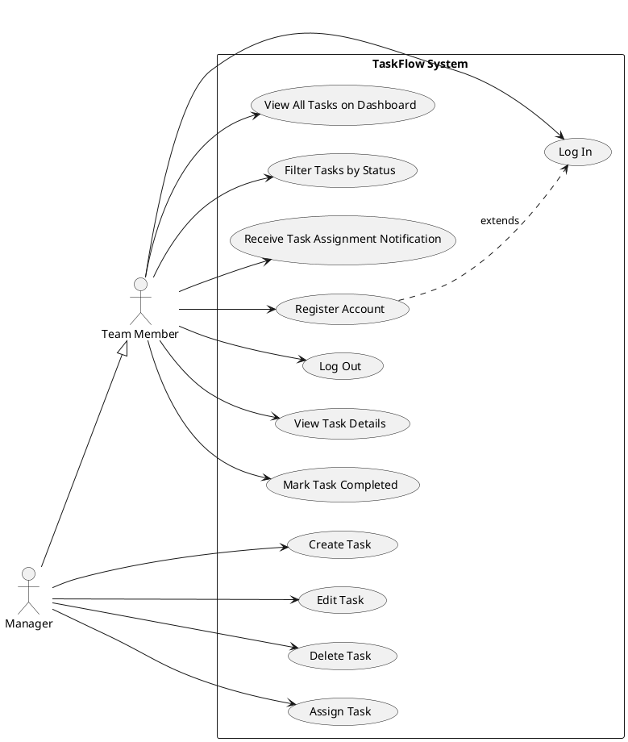
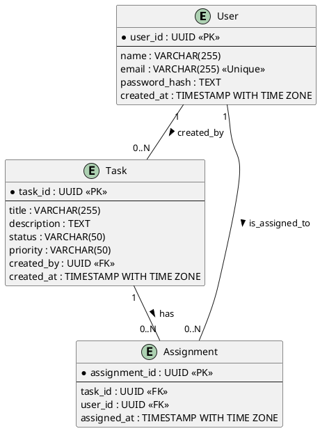

# Product Specification: TaskFlow – Simple Team Task Management System

---

## 1. Executive Summary

This document outlines the product specification for "TaskFlow," a lightweight web application designed to streamline task management for small teams. The current landscape often sees teams grappling with disparate tools like email and spreadsheets, leading to poor task visibility, unclear accountability, and reduced collaboration. TaskFlow aims to solve this by providing a centralized, easy-to-use platform for task creation, assignment, and tracking.

The system will focus on core functionalities such as secure user authentication, comprehensive task management (create, edit, delete, complete), task assignment to team members, a central dashboard for task visibility, and a simple notification system. By delivering these features within a 3-month timeframe, TaskFlow will significantly improve team productivity, provide clear accountability, and enable managers to track progress effortlessly, thereby reducing reliance on inefficient, manual tracking methods.

---

## 2. Goals and Objectives

### 2.1. Project Goal

The primary goal of TaskFlow is to provide a lightweight web application where small teams can create, assign, and track tasks efficiently. The system SHALL improve collaboration and task visibility within teams while keeping the interface simple and easy to use.

### 2.2. Business Objectives

The project MUST achieve the following business objectives:

*   **Improve team productivity:** By organizing tasks in one centralized platform, teams SHALL experience increased efficiency.
*   **Allow managers to track task progress easily:** Managers SHALL have clear insights into task statuses and team workloads.
*   **Provide clear accountability:** Through explicit task assignments, individual responsibilities SHALL be unambiguous.
*   **Reduce reliance on email or spreadsheets for task tracking:** The system SHALL serve as the primary source of truth for task management, minimizing the need for external, less efficient tools.

### 2.3. Success Criteria

The project will be considered successful if:

*   **Task Management Ease:** Users MUST be able to create, assign, and manage tasks easily, demonstrated by at least 90% of users successfully completing these core actions within 5 minutes of initial training.
*   **Task Completion Improvement:** Team task completion rates MUST improve by at least 15% within three months of system adoption.
*   **System Adoption:** System adoption MUST reach at least 80% of target users within one month of the initial release.

---

## 3. Target Users

TaskFlow is designed for small teams (fewer than 50 members) operating within collaborative environments. The primary target users fall into two main categories:

### 3.1. Team Member (Executor)

*   **Description:** An individual within a team responsible for executing assigned tasks.
*   **Goals:**
    *   Efficiently receive and understand assigned tasks.
    *   Easily update the status of tasks they are working on.
    *   View their personal list of tasks and their progress.
    *   Receive notifications for new assignments.
*   **Characteristics:** Seeks clarity, simplicity, and efficiency in managing their workload. May not be responsible for assigning tasks but needs a clear way to see and update their own.
*   **Typical Tasks:** Logging in, viewing tasks, marking tasks as completed, editing task descriptions (if permitted).

### 3.2. Team Lead / Manager (Assigner & Overseer)

*   **Description:** An individual responsible for overseeing a team's work, assigning tasks, and tracking overall progress.
*   **Goals:**
    *   Create new tasks and assign them to team members.
    *   Gain a clear overview of all tasks within the team.
    *   Monitor the progress and status of assigned tasks.
    *   Ensure accountability and identify bottlenecks.
*   **Characteristics:** Requires visibility, control over task allocation, and tools for progress tracking.
*   **Typical Tasks:** Logging in, creating new tasks, assigning tasks, editing tasks, deleting tasks, viewing the dashboard, filtering tasks.

---

## 4. Functional Requirements (FR)

### 4.1. User Management & Authentication

#### FR-UM.01: User Registration
*   **Description:** Users MUST be able to register and create a unique account within the TaskFlow system.
*   **Acceptance Criteria:**
    *   UM.01.1: The system SHALL present a user registration form requiring a unique email address, name, and password.
    *   UM.01.2: Upon successful submission of valid and unique credentials, the system SHALL create a new user account.
    *   UM.01.3: The system SHALL store the user's password securely using hashing algorithms as specified in NFR-SEC.01.
    *   UM.01.4: The system SHALL display a confirmation message upon successful registration and redirect the user to the login page.
    *   UM.01.5: The system SHALL prevent registration with an email address already registered, providing an appropriate error message.
*   **Tag:** [DETERMINISTIC]

#### FR-UM.02: User Login
*   **Description:** Users MUST be able to log in securely to their TaskFlow account.
*   **Acceptance Criteria:**
    *   UM.02.1: The system SHALL present a login form requiring a registered email address and password.
    *   UM.02.2: Upon successful authentication with valid credentials, the system SHALL grant access to the user's dashboard.
    *   UM.02.3: The system SHALL utilize JWT-based authentication for secure session management.
    *   UM.02.4: The system SHALL use HTTPS for all communication during the login process as per NFR-SEC.02.
    *   UM.02.5: The system SHALL display an error message for invalid login attempts (e.g., incorrect email or password).
*   **Tag:** [DETERMINISTIC]

### 4.2. Task Management

#### FR-TM.01: Create New Tasks
*   **Description:** Users MUST be able to create new tasks within the system.
*   **Acceptance Criteria:**
    *   TM.01.1: The system SHALL provide an interface for users to input a task title, description, priority (e.g., Low, Medium, High), and initial status (e.g., To Do).
    *   TM.01.2: Task titles MUST be a minimum of 3 characters and a maximum of 255 characters.
    *   TM.01.3: Upon successful creation, the system SHALL assign a unique `task_id` and record the `created_by` user and `created_at` timestamp.
    *   TM.01.4: The newly created task SHALL be visible on the dashboard (FR-VIZ.01) of the creating user and all team members.
*   **Tag:** [DETERMINISTIC]

#### FR-TM.02: Edit Existing Tasks
*   **Description:** Users MUST be able to edit existing tasks they have created or have permissions to modify.
*   **Acceptance Criteria:**
    *   TM.02.1: The system SHALL allow users to modify the task title, description, priority, and status of an existing task.
    *   TM.02.2: Any changes made to a task MUST be immediately reflected on the dashboard (FR-VIZ.01).
    *   TM.02.3: The system SHALL only permit the user who created the task or a designated "manager" role (future enhancement) to edit a task.
    *   TM.02.4: The system SHALL provide a clear "Save" or "Update" button to apply changes and display a confirmation message upon successful update.
*   **Tag:** [DETERMINISTIC]

#### FR-TM.03: Delete Tasks
*   **Description:** Users MUST be able to delete tasks they have created.
*   **Acceptance Criteria:**
    *   TM.03.1: The system SHALL provide an option to delete an existing task.
    *   TM.03.2: Upon confirmation, the system SHALL permanently remove the task and all associated assignments from the database.
    *   TM.03.3: The system SHALL only permit the user who created the task or a designated "manager" role (future enhancement) to delete a task.
    *   TM.03.4: The system SHALL display a confirmation prompt before permanent deletion to prevent accidental loss of data.
*   **Tag:** [DETERMINISTIC]

#### FR-TM.04: Mark Tasks as Completed
*   **Description:** Users MUST be able to mark tasks as completed.
*   **Acceptance Criteria:**
    *   TM.04.1: The system SHALL provide a clear mechanism (e.g., button, checkbox) to change a task's status to "Completed".
    *   TM.04.2: Upon marking a task as completed, its status field in the database MUST be updated to "Completed".
    *   TM.04.3: The dashboard (FR-VIZ.01) MUST immediately reflect the updated status of the task.
*   **Tag:** [DETERMINISTIC]

### 4.3. Team Collaboration & Assignment

#### FR-COL.01: Assign Tasks to Team Members
*   **Description:** Users MUST be able to assign tasks to one or more team members.
*   **Acceptance Criteria:**
    *   COL.01.1: When creating or editing a task, the system SHALL provide a dropdown or search interface to select existing registered users for assignment.
    *   COL.01.2: Upon assignment, an entry MUST be created in the `Assignment` table linking the `task_id` to the `user_id` of the assigned member, along with `assigned_at` timestamp.
    *   COL.01.3: A task can be assigned to multiple users.
    *   COL.01.4: The assigned user(s) MUST receive a notification (FR-NOT.01).
    *   COL.01.5: The assignment SHALL be visible on the task details view and the dashboard (FR-VIZ.01).
*   **Tag:** [DETERMINISTIC]

### 4.4. Task Visibility & Dashboard

#### FR-VIZ.01: Display Dashboard of All Tasks
*   **Description:** The system MUST display a dashboard showing all tasks accessible to the logged-in user.
*   **Acceptance Criteria:**
    *   VIZ.01.1: Upon login, the user SHALL be redirected to a dashboard displaying a list of tasks.
    *   VIZ.01.2: The dashboard MUST display task title, description (truncated if long), current status, priority, who it's assigned to, and creator.
    *   VIZ.01.3: The dashboard MUST update in real-time or near real-time (within 5 seconds) as tasks are created, edited, or assigned.
    *   VIZ.01.4: Each task entry on the dashboard MUST be clickable to view full task details.
*   **Tag:** [DETERMINISTIC]

#### FR-VIZ.02: Filter Tasks by Status
*   **Description:** Users MUST be able to filter tasks displayed on the dashboard by their status.
*   **Acceptance Criteria:**
    *   VIZ.02.1: The system SHALL provide filtering options (e.g., "To Do", "In Progress", "Completed", "All").
    *   VIZ.02.2: When a filter is applied, the dashboard MUST only display tasks matching the selected status.
    *   VIZ.02.3: The filter application and results display MUST occur within 2 seconds.
*   **Tag:** [DETERMINISTIC]

### 4.5. Notifications

#### FR-NOT.01: Task Assignment Notification
*   **Description:** Users MUST receive notifications when tasks are assigned to them.
*   **Acceptance Criteria:**
    *   NOT.01.1: When a task is assigned to a user, a visual notification (e.g., an in-app alert or badge) MUST appear for the assigned user within 5 seconds of the assignment action.
    *   NOT.01.2: The notification MUST include the task title and the name of the user who made the assignment.
    *   NOT.01.3: Clicking on the notification MUST direct the user to the details of the assigned task.
*   **Tag:** [DETERMINISTIC]

---

## 5. Non-Functional Requirements (NFR)

### 5.1. Performance

#### NFR-PERF.01: Concurrent Users
*   **Description:** The system SHOULD support at least 500 concurrent users without significant degradation in performance.
*   **Acceptance Criteria:**
    *   PERF.01.1: During load tests with 500 concurrent active users performing typical operations (viewing dashboard, creating tasks, updating status), 95% of API responses MUST be within the NFR-PERF.02 limits.
    *   PERF.01.2: The system's CPU utilization SHALL not exceed 80% and memory utilization SHALL not exceed 75% under 500 concurrent users.
*   **Tag:** [DETERMINISTIC]

#### NFR-PERF.02: API Response Time
*   **Description:** API response time SHOULD be under 2 seconds for 95% of all requests.
*   **Acceptance Criteria:**
    *   PERF.02.1: For standard CRUD operations (Create Task, View Task, Edit Task, Delete Task), 95% of API responses MUST complete within 1.5 seconds under normal load (up to 100 concurrent users).
    *   PERF.02.2: For dashboard loading (retrieving all tasks for a user), 95% of API responses MUST complete within 2 seconds under normal load.
*   **Tag:** [DETERMINISTIC]

### 5.2. Security

#### NFR-SEC.01: Password Hashing
*   **Description:** User passwords MUST be securely hashed before storage.
*   **Acceptance Criteria:**
    *   SEC.01.1: All user passwords stored in the database MUST be hashed using a strong, industry-standard, one-way cryptographic hashing algorithm (e.g., bcrypt, Argon2) with appropriate salting.
    *   SEC.01.2: Raw passwords SHALL NOT be stored or logged anywhere in the system.
*   **Tag:** [DETERMINISTIC]

#### NFR-SEC.02: HTTPS Communication
*   **Description:** The application MUST use HTTPS for all communication between the client (browser) and the server.
*   **Acceptance Criteria:**
    *   SEC.02.1: All network traffic to and from the TaskFlow application (frontend and backend APIs) MUST be encrypted using TLS 1.2 or higher.
    *   SEC.02.2: Attempts to access the application via HTTP SHALL be automatically redirected to HTTPS.
*   **Tag:** [DETERMINISTIC]

### 5.3. Reliability

#### NFR-REL.01: System Uptime
*   **Description:** System uptime SHOULD be at least 99.5%.
*   **Acceptance Criteria:**
    *   REL.01.1: The TaskFlow system MUST be available and functional for at least 99.5% of the time, measured monthly, excluding scheduled maintenance windows.
    *   REL.01.2: The system SHALL recover automatically from unexpected failures within 5 minutes.
*   **Tag:** [DETERMINISTIC]

### 5.4. Usability / User Experience

#### NFR-USAB.01: Responsive UI
*   **Description:** The UI MUST be responsive and usable on desktop and tablet devices.
*   **Acceptance Criteria:**
    *   USAB.01.1: The TaskFlow user interface MUST adapt fluidly to screen sizes ranging from 768px (tablet portrait) up to 1920px (desktop wide) without horizontal scrolling.
    *   USAB.01.2: All interactive elements (buttons, forms, links) MUST be easily clickable and legible on specified devices.
*   **Tag:** [DETERMINISTIC]

---

## 6. Use Case Analysis

### 6.1. Use Case Diagram

### 6.2. Detailed Use Cases

#### UC1.01: Register a New Account

*   **Actor:** Team Member
*   **Preconditions:**
    *   User is not logged in.
    *   User has internet connectivity.
*   **Trigger:** User navigates to the registration page and clicks "Sign Up".
*   **Main Flow:**
    1.  User enters a unique email, name, and password in the registration form.
    2.  User confirms password.
    3.  User clicks the "Register" button.
    4.  System validates inputs (e.g., email format, password strength).
    5.  System hashes the password (NFR-SEC.01).
    6.  System creates a new user record in the database (FR-UM.01.2).
    7.  System displays a "Registration Successful" message.
    8.  System redirects user to the login page.
*   **Alternative Flows:**
    *   **AF1.1: Invalid Input:** If input validation fails (e.g., invalid email, passwords don't match), the system displays specific error messages next to the offending fields. User corrects input and retries.
    *   **AF1.2: Email Already Registered:** If the email provided already exists, the system displays an error message "Email already registered. Please log in or use a different email."
*   **Postconditions:**
    *   A new user account is created in the system.
    *   User is redirected to the login page.

#### UC1.02: Log In to TaskFlow

*   **Actor:** Team Member
*   **Preconditions:**
    *   User has a registered account (UC1.01).
    *   User is not currently logged in.
*   **Trigger:** User navigates to the login page and clicks "Log In".
*   **Main Flow:**
    1.  User enters their registered email and password in the login form.
    2.  User clicks the "Log In" button.
    3.  System verifies the credentials against stored hashed passwords.
    4.  System generates a JWT for the session.
    5.  System redirects the user to their TaskFlow dashboard (FR-VIZ.01).
*   **Alternative Flows:**
    *   **AF2.1: Invalid Credentials:** If the email/password combination does not match a registered user, the system displays an error message "Invalid email or password." User can retry.
    *   **AF2.2: Network Error:** If there's a network issue, the system displays a connection error. User can retry.
*   **Postconditions:**
    *   User is authenticated and redirected to the TaskFlow dashboard.
    *   A secure session is established.

#### UC2.01: Create a New Task

*   **Actor:** Manager
*   **Preconditions:**
    *   User is logged in.
    *   User has permissions to create tasks.
*   **Trigger:** User clicks on a "Create New Task" button/link on the dashboard.
*   **Main Flow:**
    1.  System displays a "Create Task" form.
    2.  User enters a task title, description, selects a priority (Low/Medium/High), and initial status (e.g., To Do).
    3.  (Optional) User selects one or more team members to assign the task to (FR-COL.01).
    4.  User clicks the "Save Task" button.
    5.  System validates the input.
    6.  System creates a new `Task` record in the database with `created_by` and `created_at` (FR-TM.01.3).
    7.  If assigned, system creates `Assignment` records (FR-COL.01.2).
    8.  System displays a "Task Created" confirmation message.
    9.  System updates the dashboard (FR-VIZ.01) to show the new task.
    10. If assigned, system sends a notification to the assigned user(s) (FR-NOT.01).
*   **Alternative Flows:**
    *   **AF3.1: Invalid Input:** If validation fails (e.g., empty title), the system displays an error message and highlights the problematic fields. User corrects and retries.
*   **Postconditions:**
    *   A new task is created and stored in the database.
    *   The dashboard is updated to reflect the new task.
    *   Assigned users receive a notification (if applicable).

#### UC2.04: Mark a Task as Completed

*   **Actor:** Team Member
*   **Preconditions:**
    *   User is logged in.
    *   User has an assigned or relevant task on the dashboard.
*   **Trigger:** User clicks a "Mark Complete" button next to a task on the dashboard or within task details.
*   **Main Flow:**
    1.  User locates a task on the dashboard or task details page.
    2.  User clicks the "Mark Complete" action for that task.
    3.  System updates the task's `status` to "Completed" in the database (FR-TM.04.2).
    4.  System displays a "Task Marked Complete" confirmation message.
    5.  System immediately updates the dashboard (FR-VIZ.01) to reflect the new status.
*   **Alternative Flows:**
    *   **AF4.1: Task Already Completed:** If the task is already marked as completed, the system prevents re-marking and displays an informative message.
*   **Postconditions:**
    *   The task's status is updated to "Completed".
    *   The change is reflected on the dashboard.

#### UC4.01: View All Tasks on Dashboard

*   **Actor:** Team Member
*   **Preconditions:**
    *   User is logged in.
*   **Trigger:**
    *   User successfully logs in.
    *   User navigates to the dashboard via a menu link.
*   **Main Flow:**
    1.  System retrieves all tasks relevant to the logged-in user (created by them, or assigned to them, or all visible team tasks).
    2.  System renders the dashboard displaying the list of tasks (FR-VIZ.01.2).
    3.  Each task entry shows its title, description (truncated), status, priority, and assigned team members.
*   **Alternative Flows:**
    *   **AF5.1: No Tasks:** If no tasks are found, the system displays a message "No tasks found. Start by creating one!"
    *   **AF5.2: Performance Degradation:** If the system takes longer than 2 seconds to load (NFR-PERF.02), the user might experience a delay.
*   **Postconditions:**
    *   User is viewing the dashboard with a list of tasks.

---

## 7. Data Model

### 7.1. Entity-Relationship Diagram (ERD)

### 7.2. Detailed Schema

#### Table: `users`

| Column Name     | Data Type                  | Constraints                 | Description                                      |
| :-------------- | :------------------------- | :-------------------------- | :----------------------------------------------- |
| `user_id`       | `UUID`                     | `PRIMARY KEY`, `NOT NULL`   | Unique identifier for the user.                  |
| `name`          | `VARCHAR(255)`             | `NOT NULL`                  | Full name of the user.                           |
| `email`         | `VARCHAR(255)`             | `NOT NULL`, `UNIQUE`        | Unique email address of the user for login.      |
| `password_hash` | `TEXT`                     | `NOT NULL`                  | Securely hashed password (NFR-SEC.01).           |
| `created_at`    | `TIMESTAMP WITH TIME ZONE` | `NOT NULL`, `DEFAULT NOW()` | Timestamp when the user account was created.     |

#### Table: `tasks`

| Column Name     | Data Type                  | Constraints                             | Description                                            |
| :-------------- | :------------------------- | :-------------------------------------- | :----------------------------------------------------- |
| `task_id`       | `UUID`                     | `PRIMARY KEY`, `NOT NULL`               | Unique identifier for the task.                        |
| `title`         | `VARCHAR(255)`             | `NOT NULL`                              | Title of the task (FR-TM.01.2).                        |
| `description`   | `TEXT`                     | `NULLABLE`                              | Detailed description of the task.                      |
| `status`        | `VARCHAR(50)`              | `NOT NULL`, `DEFAULT 'To Do'`           | Current status of the task (e.g., 'To Do', 'In Progress', 'Completed'). |
| `priority`      | `VARCHAR(50)`              | `NOT NULL`, `DEFAULT 'Medium'`          | Priority level of the task (e.g., 'Low', 'Medium', 'High'). |
| `created_by`    | `UUID`                     | `NOT NULL`, `FOREIGN KEY REFERENCES users(user_id)` | User who created the task (FR-TM.01.3).                |
| `created_at`    | `TIMESTAMP WITH TIME ZONE` | `NOT NULL`, `DEFAULT NOW()`             | Timestamp when the task was created.                   |

#### Table: `assignments`

| Column Name       | Data Type                  | Constraints                                     | Description                                     |
| :---------------- | :------------------------- | :---------------------------------------------- | :---------------------------------------------- |
| `assignment_id`   | `UUID`                     | `PRIMARY KEY`, `NOT NULL`                       | Unique identifier for the assignment.           |
| `task_id`         | `UUID`                     | `NOT NULL`, `FOREIGN KEY REFERENCES tasks(task_id)` | Identifier of the assigned task.                |
| `user_id`         | `UUID`                     | `NOT NULL`, `FOREIGN KEY REFERENCES users(user_id)` | Identifier of the user to whom the task is assigned. |
| `assigned_at`     | `TIMESTAMP WITH TIME ZONE` | `NOT NULL`, `DEFAULT NOW()`                     | Timestamp when the task was assigned.           |
| `(task_id, user_id)` |                            | `UNIQUE`                                        | Ensures a task is assigned to a user only once. |

---

## 8. Technology Stack

*   **Frontend:** React, Tailwind CSS
*   **Backend:** FastAPI (Python)
*   **Database:** PostgreSQL
*   **Authentication:** JWT-based authentication
*   **Deployment:** Docker, AWS or Azure Cloud

---

## 9. Constraints, Assumptions, and Risks

### 9.1. Constraints

*   **Time:** Initial release MUST be completed within 3 months. This is a critical constraint impacting feature prioritization and complexity.
*   **Operational Costs:** The system SHOULD minimize operational costs, influencing architectural decisions and technology choices.
*   **Technology:** Only open-source technologies SHOULD be used where possible, guiding the selection of frameworks, libraries, and infrastructure components.

### 9.2. Assumptions

*   **User Familiarity:** Users are assumed to have basic familiarity with common web applications, implying standard UI/UX patterns can be followed without extensive onboarding.
*   **Team Size:** Teams using TaskFlow will consist of fewer than 50 members. This assumption helps scope scalability and collaboration features (NFR-PERF.01).
*   **Internet Connectivity:** Users are assumed to have reliable internet connectivity to access the web application.
*   **Manager Role:** While not explicitly defined, it's assumed some users will act as "managers" capable of creating and assigning tasks, overseeing the team.

### 9.3. Risks

*   **R1: Project Timeline Overrun:**
    *   **Description:** The 3-month initial release deadline is aggressive. Unexpected technical challenges or scope creep could lead to delays.
    *   **Mitigation:** Strict scope management for MVP. Prioritize critical features only. Agile development with frequent reviews. Buffer time in planning.
*   **R2: Security Vulnerabilities:**
    *   **Description:** Despite using JWT and password hashing, any misconfiguration or overlooked vulnerability could expose user data.
    *   **Mitigation:** Adhere strictly to NFR-SEC.01 and NFR-SEC.02. Implement secure coding practices. Conduct security reviews and penetration testing before launch.
*   **R3: Performance Degradation:**
    *   **Description:** If the user base or task volume grows rapidly beyond assumptions, performance (NFR-PERF.01, NFR-PERF.02) could suffer, leading to poor user experience.
    *   **Mitigation:** Regular performance testing and monitoring. Design for scalability from the outset (e.g., efficient database queries, proper indexing). Plan for horizontal scaling for backend services.
*   **R4: Low User Adoption:**
    *   **Description:** If the system is not perceived as "simple and easy to use" or doesn't meet critical user needs, adoption rates might fall below 80%.
    *   **Mitigation:** Focus on intuitive UI/UX as per NFR-USAB.01. Gather early user feedback. Provide clear onboarding and support.
*   **R5: Technical Debt:**
    *   **Description:** The rapid development cycle (3 months) might lead to rushed implementations or shortcuts, accumulating technical debt that hinders future development or maintenance.
    *   **Mitigation:** Enforce coding standards and review processes. Document architectural decisions. Prioritize modular and clean code where possible, even within tight deadlines.