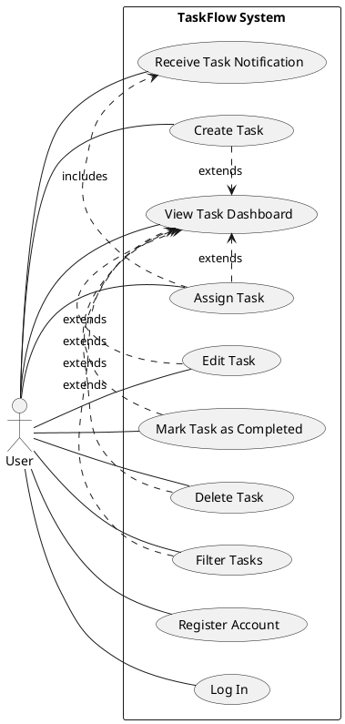

# Product Specification: TaskFlow – Simple Team Task Management System

---

## 1. Executive Summary

TaskFlow is envisioned as a lightweight web application designed to empower small teams in managing their daily tasks with improved efficiency and clarity. The primary objective is to centralize task creation, assignment, and tracking, thereby eliminating the inefficiencies associated with fragmented communication methods like email and spreadsheets. By providing a simple, intuitive interface, TaskFlow aims to enhance team collaboration, ensure clear accountability for tasks, and provide immediate visibility into task progress, ultimately boosting overall team productivity. This document outlines the comprehensive product requirements, functional specifications, non-functional criteria, and architectural considerations necessary for the successful development and deployment of TaskFlow.

---

## 2. Goals and Objectives

**Goal:**
The overarching goal of TaskFlow is to provide a lightweight web application where small teams can create, assign, and track tasks efficiently. The system SHALL improve collaboration and task visibility within teams while maintaining a simple and easy-to-use interface.

**Business Objectives:**
1.  **Improve team productivity:** The system SHALL organize tasks in one centralized platform to streamline workflows.
2.  **Enable easy task progress tracking:** Managers SHALL be able to easily monitor and track the progress of assigned tasks.
3.  **Ensure clear accountability:** The system SHALL provide clear accountability for tasks through explicit assignment to team members.
4.  **Reduce reliance on informal tracking methods:** The system SHALL reduce the dependency on email or spreadsheets for task management and tracking.

---

## 3. Target Users

The primary target users for TaskFlow are small teams, typically consisting of fewer than 50 members, who are looking for a straightforward, efficient solution to manage their tasks.

*   **Team Members:** Individuals responsible for executing tasks. They need to easily view their assigned tasks, update task status, and create new tasks.
*   **Team Leads/Managers:** Individuals responsible for overseeing team activities, assigning tasks, tracking progress, and ensuring project completion. They require a clear overview of all team tasks and the ability to manage task assignments and statuses.
*   **Product Owners/Stakeholders:** Individuals who define requirements and measure the overall success of the product.

**User Needs Addressed:**
*   A centralized location to view all current, pending, and completed tasks.
*   Clarity on who is responsible for which task.
*   An easy way to update task status without complex workflows.
*   Notifications for important task updates, such as assignments.
*   A responsive interface usable across desktop and tablet devices.

---

## 4. Functional Requirements (FR)

This section details the specific functionalities TaskFlow MUST provide. All requirements are stated using "MUST" or "SHALL" and include measurable acceptance criteria.

**FR-001: User Registration**
*   **Requirement:** Users SHALL be able to register and create a new account within the TaskFlow system. [DETERMINISTIC]
*   **Acceptance Criteria:**
    *   A user MUST be able to navigate to a dedicated registration page.
    *   The system MUST prompt the user for a unique email address and a password meeting defined complexity rules (e.g., minimum 8 characters, mix of uppercase, lowercase, numbers, symbols).
    *   Upon successful submission of valid credentials, the system MUST create a new `User` record in the database.
    *   The system MUST confirm successful registration (e.g., via a success message or immediate login).
    *   Attempts to register with an already existing email address MUST be rejected with an appropriate error message.

**FR-002: User Login**
*   **Requirement:** Users SHALL be able to securely log in to their registered TaskFlow account. [DETERMINISTIC]
*   **Acceptance Criteria:**
    *   A user MUST be able to navigate to a dedicated login page.
    *   The system MUST prompt the user for their registered email address and password.
    *   Upon successful validation of credentials, the system MUST establish an authenticated session for the user (e.g., via JWT token).
    *   The user MUST be redirected to their task dashboard upon successful login.
    *   Attempts to log in with incorrect credentials MUST be rejected with a generic error message (e.g., "Invalid credentials").

**FR-003: Task Creation**
*   **Requirement:** Users SHALL be able to create new tasks within the system. [DETERMINISTIC]
*   **Acceptance Criteria:**
    *   A logged-in user MUST have access to an interface for creating a new task.
    *   The task creation interface MUST allow the user to input a `title` (max 255 characters), an optional `description` (max 2000 characters), and select a `priority` (e.g., "Low", "Medium", "High").
    *   The system MUST automatically set the initial `status` of a new task to "To Do".
    *   The system MUST automatically record the `created_by` user and `created_at` timestamp upon task creation.
    *   Upon successful creation, the new task MUST be immediately visible on the user's dashboard.

**FR-004: Task Assignment**
*   **Requirement:** Users SHALL be able to assign tasks to other team members. [DETERMINISTIC]
*   **Acceptance Criteria:**
    *   A user (who created the task or has manager-level permissions) MUST be able to select an existing task from the dashboard.
    *   The system MUST provide an option to select an `user_id` from a list of registered team members to assign the task to.
    *   Upon selecting an assignee, the system MUST update the `Assignment` record linking the `task_id` to the `user_id`.
    *   The `assigned_at` timestamp MUST be recorded.
    *   The assigned task's details on the dashboard MUST reflect the new assignee.

**FR-005: Task Editing**
*   **Requirement:** Users SHALL be able to edit existing tasks. [DETERMINISTIC]
*   **Acceptance Criteria:**
    *   A user (who created the task, is assigned to it, or has manager-level permissions) MUST be able to select an existing task from the dashboard and access an edit interface.
    *   The edit interface MUST allow modification of the `title`, `description`, `status`, `priority`, and `assignee` fields.
    *   All edits MUST be validated for format and length similar to task creation.
    *   Upon saving changes, the system MUST update the corresponding `Task` record in the database.
    *   The dashboard MUST reflect the updated task details immediately.

**FR-006: Task Completion**
*   **Requirement:** Users SHALL be able to mark tasks as completed. [DETERMINISTIC]
*   **Acceptance Criteria:**
    *   A user (who created the task or is assigned to it) MUST be able to select an existing task from the dashboard.
    *   The system MUST provide a clear action (e.g., a button or dropdown) to change the task's `status` to "Completed".
    *   Upon confirmation, the task's `status` MUST be updated in the database.
    *   The dashboard MUST visually indicate the task's "Completed" status (e.g., strikethrough, specific icon, or separate section).

**FR-007: Task Deletion**
*   **Requirement:** Users SHALL be able to delete tasks from the system. [DETERMINISTIC]
*   **Acceptance Criteria:**
    *   A user (who created the task or has manager-level permissions) MUST be able to select an existing task from the dashboard.
    *   The system MUST provide a clear action (e.g., a "Delete" button) to initiate task removal.
    *   The system MUST prompt the user for confirmation before permanent deletion.
    *   Upon user confirmation, the `Task` record and any associated `Assignment` records MUST be permanently removed from the database.
    *   The dashboard MUST refresh, no longer displaying the deleted task.

**FR-008: Dashboard Display**
*   **Requirement:** The system SHALL display a comprehensive dashboard of all relevant tasks. [DETERMINISTIC]
*   **Acceptance Criteria:**
    *   Upon successful login, the system MUST automatically load and display the task dashboard.
    *   The dashboard MUST present tasks in a clear, tabular, or card-based format.
    *   For each task, the dashboard MUST display at minimum: `title`, current `status`, `priority`, and assigned `user_id` (displaying `name` instead of `user_id`).
    *   Tasks MUST be sortable by `priority` and `created_at` timestamp (latest first by default).

**FR-009: Task Filtering**
*   **Requirement:** Users SHALL be able to filter tasks displayed on the dashboard by status. [DETERMINISTIC]
*   **Acceptance Criteria:**
    *   The dashboard interface MUST include controls (e.g., dropdown, toggle buttons) to filter tasks by their `status` (e.g., "To Do", "In Progress", "Completed").
    *   Upon selecting a filter option, the dashboard MUST dynamically update to display only tasks matching the selected status within 1 second.
    *   Users MUST be able to clear or reset filters to view all tasks again.

**FR-010: Simple Notification System**
*   **Requirement:** Users SHALL receive notifications when tasks are assigned to them. [DETERMINISTIC]
*   **Acceptance Criteria:**
    *   When a `Task` is assigned to a specific `User` (via FR-004), an in-application notification MUST be generated.
    *   The notification MUST alert the assigned user (e.g., via a toast message or an icon badge) that a new task has been assigned to them, including the task `title`.
    *   The notification MUST be visible upon the user's next login or in real-time if they are actively using the application.
    *   (Out of scope for initial release: email notifications).

---

## 5. Non-Functional Requirements (NFR)

This section details the non-functional attributes the TaskFlow system MUST adhere to.

**NFR-001: Scalability - Concurrent Users**
*   **Requirement:** The TaskFlow system SHALL support at least 500 concurrent active users. [DETERMINISTIC]
*   **Acceptance Criteria:** The system MUST maintain stable performance (API response times under 2 seconds) under a simulated load of 500 concurrent users performing typical operations (login, view dashboard, create task, update status) for a continuous period of at least 30 minutes, with no more than 0.1% error rate.

**NFR-002: Performance - API Response Time**
*   **Requirement:** All critical API response times SHALL be under 2 seconds. [DETERMINISTIC]
*   **Acceptance Criteria:** 95% of all API requests for core functionalities (e.g., login, dashboard load, task creation, task update, task deletion) MUST complete within 2 seconds under peak load conditions (as defined in NFR-001).

**NFR-003: Availability - System Uptime**
*   **Requirement:** The system uptime SHALL be at least 99.5%. [DETERMINISTIC]
*   **Acceptance Criteria:** The TaskFlow application MUST be accessible and fully operational for at least 99.5% of the time, measured on a monthly basis, excluding pre-scheduled maintenance windows of which users are notified 24 hours in advance.

**NFR-004: Security - Password Hashing**
*   **Requirement:** User passwords MUST be securely hashed before storage. [DETERMINISTIC]
*   **Acceptance Criteria:** All user passwords stored in the PostgreSQL database SHALL be hashed using a strong, industry-standard cryptographic hashing algorithm (e.g., bcrypt or Argon2) with an appropriate salt, making them irreversible and resistant to brute-force attacks.

**NFR-005: Security - Encrypted Communication**
*   **Requirement:** All communication between the client and server MUST use HTTPS. [DETERMINISTIC]
*   **Acceptance Criteria:** All network traffic to and from the TaskFlow web application and its backend API SHALL be encrypted using TLS 1.2 or higher, enforced through HTTPS, ensuring data integrity and confidentiality in transit.

**NFR-006: Usability - Responsive UI**
*   **Requirement:** The user interface (UI) MUST be responsive and usable on desktop and tablet devices. [DETERMINISTIC]
*   **Acceptance Criteria:** The TaskFlow web application UI SHALL adapt gracefully to screen resolutions ranging from 768 pixels (tablet portrait) up to 1920 pixels (standard desktop), ensuring all elements are legible, functional, and properly laid out without requiring horizontal scrolling. Key elements like navigation, task lists, and forms MUST remain easily accessible and interactive.

---

## 6. Use Case Analysis

This section outlines the primary use cases for the TaskFlow system, detailing the interactions between actors and the system.

**Actors:**
*   **User:** Represents any individual interacting with the TaskFlow system. This role encompasses both general team members and those with manager-like responsibilities (e.g., task assignment).

### Use Case Diagram

### Use Case Descriptions

**UC-001: Register Account**
*   **Goal:** The User creates a new account to access TaskFlow functionalities.
*   **Preconditions:** User is not logged into the system.
*   **Main Flow:**
    1.  User accesses the TaskFlow registration page.
    2.  User provides a unique email address and a strong password.
    3.  System validates the input data (e.g., email format, password strength, email uniqueness).
    4.  System creates a new `User` record in the database.
    5.  System confirms registration success and logs in the user, redirecting to the Dashboard.
*   **Postconditions:** A new `User` account exists, and the user is authenticated.

**UC-002: Log In**
*   **Goal:** The User gains authenticated access to their TaskFlow account.
*   **Preconditions:** User has an existing TaskFlow account and is not currently logged in.
*   **Main Flow:**
    1.  User accesses the TaskFlow login page.
    2.  User inputs their registered email address and password.
    3.  System validates the provided credentials against stored user data.
    4.  System establishes a secure, authenticated session for the user.
    5.  System redirects the user to their Task Dashboard.
*   **Postconditions:** User is authenticated and can access their tasks and team tasks.

**UC-003: Create Task**
*   **Goal:** The User adds a new task to the system for team management.
*   **Preconditions:** User is logged in to TaskFlow.
*   **Main Flow:**
    1.  User navigates to the "Create Task" section or initiates task creation from the Dashboard.
    2.  User provides a title, description, and selects a priority level for the new task.
    3.  User optionally assigns the task to a team member (if they have the necessary permissions).
    4.  System validates the input fields.
    5.  System saves the new `Task` record in the database with an initial status of "To Do".
    6.  The new task appears on the Task Dashboard.
*   **Postconditions:** A new task record exists in the system, attributed to the creating user.

**UC-004: Assign Task**
*   **Goal:** The User assigns an existing task to a specific team member.
*   **Preconditions:** User is logged in, an unassigned or reassignable task exists, and there are other registered team members.
*   **Main Flow:**
    1.  User selects an existing task from the Task Dashboard.
    2.  User initiates the assignment process for the selected task.
    3.  User chooses a team member from a list of registered users.
    4.  System updates the `Assignment` record for the task.
    5.  System triggers a notification to the newly assigned team member (See UC-010).
    6.  The Task Dashboard updates to show the task with its new assignee.
*   **Postconditions:** The selected task is linked to the chosen team member, and a notification is sent.

**UC-005: Edit Task**
*   **Goal:** The User modifies the details of an existing task.
*   **Preconditions:** User is logged in, and a task exists that the user has permissions to edit.
*   **Main Flow:**
    1.  User selects an existing task from the Task Dashboard.
    2.  User accesses the "Edit Task" interface.
    3.  User modifies any of the task's title, description, status, priority, or assignee.
    4.  System validates the modified input.
    5.  System updates the `Task` record in the database with the changes.
    6.  The Task Dashboard refreshes to display the updated task information.
*   **Postconditions:** The task's details are updated in the system.

**UC-006: Mark Task as Completed**
*   **Goal:** The User indicates that a task has been finished.
*   **Preconditions:** User is logged in, and a task is in a non-completed status.
*   **Main Flow:**
    1.  User selects a task from the Task Dashboard.
    2.  User initiates the "Mark as Completed" action for the task.
    3.  System updates the `status` of the `Task` record to "Completed".
    4.  The Task Dashboard visually updates to reflect the task's new completed status.
*   **Postconditions:** The selected task's status is set to "Completed".

**UC-007: Delete Task**
*   **Goal:** The User permanently removes a task from the system.
*   **Preconditions:** User is logged in, and a task exists that the user has permissions to delete.
*   **Main Flow:**
    1.  User selects an existing task from the Task Dashboard.
    2.  User initiates the "Delete Task" action.
    3.  System prompts the user for confirmation of the deletion.
    4.  User confirms the deletion.
    5.  System permanently removes the `Task` record and associated `Assignment` records from the database.
    6.  The Task Dashboard refreshes, and the deleted task is no longer displayed.
*   **Postconditions:** The selected task is permanently removed from TaskFlow.

**UC-008: View Task Dashboard**
*   **Goal:** The User obtains an overview of all relevant tasks.
*   **Preconditions:** User is logged in.
*   **Main Flow:**
    1.  Upon successful login, or navigating to the home page, the system automatically loads the Task Dashboard.
    2.  System retrieves and displays a list of tasks relevant to the user (e.g., all team tasks, tasks created by user, tasks assigned to user).
    3.  Each task entry on the dashboard shows its title, current status, priority, and assigned team member.
*   **Postconditions:** The user has a current and personalized view of tasks.

**UC-009: Filter Tasks**
*   **Goal:** The User narrows down the list of tasks displayed on the Dashboard based on specific criteria.
*   **Preconditions:** User is logged in and viewing the Task Dashboard.
*   **Main Flow:**
    1.  User interacts with filtering controls (e.g., dropdown, buttons) on the Task Dashboard.
    2.  User selects a filter criterion, such as "Status: In Progress".
    3.  System re-queries or re-renders the task list to display only tasks matching the selected filter.
    4.  The Task Dashboard updates to show the filtered subset of tasks.
*   **Postconditions:** The Task Dashboard displays tasks matching the applied filter.

**UC-010: Receive Task Notification**
*   **Goal:** The User is informed about important updates related to their tasks.
*   **Preconditions:** User is logged in, and an event occurs that triggers a notification (e.g., a task is assigned to them).
*   **Main Flow:**
    1.  Another user performs an action (e.g., assigns a task via UC-004) that impacts the current user.
    2.  The system generates an in-application notification for the current user.
    3.  The notification is displayed to the user (e.g., as a toast message, an alert, or an updated notification badge).
*   **Postconditions:** The user is informed about the relevant task update.

---

## 7. Constraints, Assumptions, and Risks

### 7.1. Constraints

The following constraints govern the development and deployment of TaskFlow:

*   **Time-to-Market:** The initial release (MVP) of TaskFlow MUST be completed and deployed within 3 months from the project start date.
*   **Operational Costs:** The system architecture and chosen technologies MUST prioritize minimizing ongoing operational costs post-deployment.
*   **Technology Choice:** Where technically feasible and suitable, the system MUST utilize open-source technologies to align with cost efficiency objectives.
*   **Scope Limitation:** Features such as advanced project analytics, AI-based task suggestions, dedicated mobile applications, and integration with external project management tools are explicitly out of scope for the initial release.

### 7.2. Assumptions

The following assumptions underpin the planning and development of TaskFlow:

*   **User Familiarity:** It is assumed that target users have basic familiarity and proficiency with common web applications and their interaction patterns.
*   **Team Size:** The system is designed and optimized for small teams, assumed to consist of fewer than 50 members. Performance and scalability testing will focus on this user base.
*   **Internet Connectivity:** Users are assumed to have a stable internet connection to access and interact with the web application. Offline functionality is not within scope.

### 7.3. Risks

The following risks have been identified as potential challenges to the TaskFlow project:

*   **Timeline Overruns:**
    *   **Risk:** Aggressive 3-month timeline for initial release may lead to rushed development or incomplete features.
    *   **Mitigation:** Strict scope management, agile development methodologies, and continuous stakeholder communication to manage expectations. Prioritize core functionalities and defer non-essential features to subsequent iterations.
*   **Performance Bottlenecks:**
    *   **Risk:** Failure to meet NFR-001 (500 concurrent users) and NFR-002 (API response time < 2s) under production load.
    *   **Mitigation:** Implement robust performance testing early in the development cycle, conduct load testing prior to launch, optimize database queries and API endpoints, and utilize cloud auto-scaling capabilities.
*   **Security Vulnerabilities:**
    *   **Risk:** Data breaches due to inadequate security measures, particularly related to user authentication and data transmission.
    *   **Mitigation:** Adhere strictly to NFR-004 (password hashing) and NFR-005 (HTTPS). Conduct regular security audits, static code analysis, and penetration testing. Follow best practices for FastAPI, PostgreSQL, and JWT security.
*   **Low User Adoption:**
    *   **Risk:** Users may not adopt the new system if it is perceived as not meeting their needs or being too complex despite the goal of simplicity.
    *   **Mitigation:** Involve end-users in early feedback sessions (e.g., UI/UX prototypes). Ensure a highly intuitive and user-friendly interface. Provide clear onboarding documentation. Continuously monitor success criteria (Task completion rates, system adoption).
*   **Scope Creep:**
    *   **Risk:** Pressure to add features beyond the defined "In Scope" list before the initial release.
    *   **Mitigation:** Maintain rigorous change management processes. Clearly communicate the "Out of Scope" items and the iterative product roadmap to all stakeholders. Refer back to the BRD and this Product Specification as the single source of truth for the MVP.