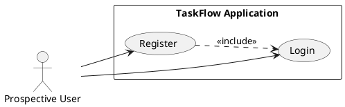
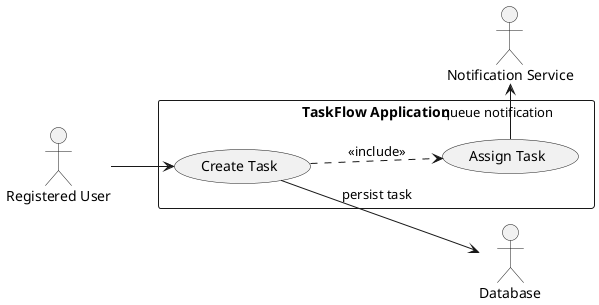
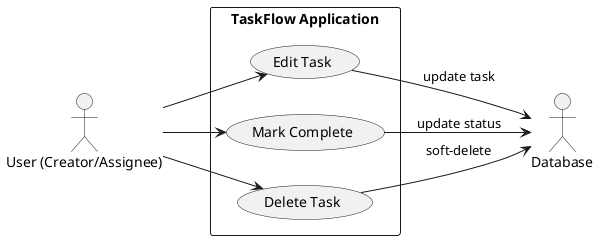
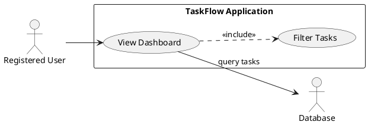
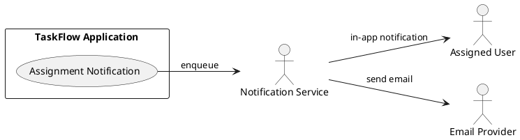

## Requirements Specification

## Feature Goal
Current state: Small teams use email and spreadsheets to track tasks, causing fragmentation, missed assignments, and low visibility.

Desired state: A lightweight web application (TaskFlow) enabling small teams to register, create, assign, edit, track, and notify about tasks through a simple, responsive dashboard—reducing email/spreadsheet dependency and improving accountability.

## Business Justification
- Improve team productivity by centralizing task management and visibility.
- Enable managers to track progress and accountability with minimal overhead.
- Reduce time lost to coordination by replacing email/spreadsheets.
- Low-cost, rapid delivery using open-source stack (React, FastAPI, PostgreSQL, Docker) to meet a 3-month timebox.

## Feature Scope
User-visible behavior:
- Users can register, authenticate, and manage tasks (create, assign, edit, complete, delete).
- Dashboard shows tasks across team with filtering and simple notification delivery when assignments occur.
Technical requirements:
- JWT-based auth, HTTPS-only, password hashing, responsive UI for desktop/tablet, backend APIs with <2s response time target.
- Support ~500 concurrent users; deployable via Docker on AWS/Azure.

### Success Criteria
- [ ] Registered users can perform full CRUD on tasks within the UI.
- [ ] Assigned users receive notifications within 1 minute of assignment (simple queue/email/webhook).
- [ ] Dashboard lists and filters tasks; API responses for list endpoints return within 2 seconds under normal load.
- [ ] Deployment completed and running with >=99.5% uptime during monitoring window.
- [ ] Adopted by at least 80% of target users in pilot group.

## Functional Requirements

Before expansion, list of FRs to generate:

| FR-ID | Summary |
|-------|---------|
| FR-001 | User registration / account creation |
| FR-002 | Secure login / authentication |
| FR-003 | Create new tasks |
| FR-004 | Assign tasks to team members |
| FR-005 | Edit existing tasks |
| FR-006 | Mark tasks as completed |
| FR-007 | Delete tasks |
| FR-008 | Dashboard: display all tasks |
| FR-009 | Filter tasks by status |
| FR-010 | Notifications when tasks are assigned |

Expanded Functional Requirements (each includes actor, trigger, success, failure, acceptance criteria). All requirements below marked with GenAI triage tags per initial scan.

- FR-001: [DETERMINISTIC] System MUST allow users to register and create an account.
  - Who: Prospective End User
  - Trigger: User submits registration form (name, email, password).
  - Success Outcome: New user record created, email uniqueness enforced, password stored as secure hash, user redirected to onboarding/dashboard with a JWT session.
  - Failure Scenarios: Duplicate email → error; weak password → validation error; DB failure → graceful error message and retry guidance.
  - Acceptance Criteria:
    - API returns 201 with user_id on success.
    - Passwords stored hashed (see NFR4).
    - Registration validates email format and uniqueness.
    - Validation errors return clear messages and HTTP 4xx codes.

- FR-002: [DETERMINISTIC] System MUST allow users to log in securely.
  - Who: Registered User
  - Trigger: User submits credentials.
  - Success Outcome: Valid credentials produce a short-lived JWT; client stores token (secure cookie/localStorage per policy) and gains access to protected endpoints.
  - Failure Scenarios: Invalid credentials → 401; locked account → 403 with explanation; brute-force attempts mitigated by rate-limiting.
  - Acceptance Criteria:
    - Successful login returns JWT and user profile.
    - Failed login returns 401 without leaking existence details.
    - Rate limiting applied to auth endpoints.

- FR-003: [DETERMINISTIC] System MUST allow users to create new tasks.
  - Who: Authenticated User
  - Trigger: User submits task creation form (title, description, optional priority, optional assignee).
  - Success Outcome: Task persisted with metadata (created_by, created_at, status=Open).
  - Failure Scenarios: Validation errors (missing title) → 4xx; DB failure → 5xx.
  - Acceptance Criteria:
    - POST /tasks returns 201 with task_id.
    - Task fields validated; default status set.
    - Created_by recorded as the requesting user.

- FR-004: [DETERMINISTIC] System MUST allow users to assign tasks to team members.
  - Who: Authenticated User (assigner)
  - Trigger: Assigner selects user from team and assigns a task.
  - Success Outcome: Assignment record created, task.assignee updated, assigned_at timestamp set, notification triggered.
  - Failure Scenarios: Assignee not found or not in same team → 4xx; race condition on concurrent assignments resolved deterministically (last-writer-wins or guarded by versioning).
  - Acceptance Criteria:
    - POST /tasks/{id}/assign creates Assignment record with assignment_id.
    - Notification (email/in-app) is queued and tracked for delivery.

- FR-005: [DETERMINISTIC] System MUST allow users to edit existing tasks.
  - Who: Authenticated User (task creator or assignee if permitted)
  - Trigger: User submits task edit with allowed fields.
  - Success Outcome: Task updated with audit fields (updated_by, updated_at).
  - Failure Scenarios: Unauthorized edit → 403; conflicting concurrent edits → returning 409 with guidance.
  - Acceptance Criteria:
    - PATCH /tasks/{id} returns 200 and updated resource.
    - Authorization check enforces edit rules (creator and/or assigned members).

- FR-006: [DETERMINISTIC] System MUST allow users to mark tasks as completed.
  - Who: Authenticated User (assignee or creator per business rule)
  - Trigger: User toggles status to "Completed".
  - Success Outcome: Task.status updated, completed_at recorded, optional notification to creator/manager.
  - Failure Scenarios: Unauthorized user → 403; DB error → 5xx.
  - Acceptance Criteria:
    - Status change persisted; completed_at present; UI updates to reflect completion.

- FR-007: [DETERMINISTIC] System MUST allow users to delete tasks.
  - Who: Authenticated User (creator or admin)
  - Trigger: User requests deletion.
  - Success Outcome: Task soft-deleted (recommended) and excluded from default dashboard; deletion audit recorded.
  - Failure Scenarios: Unauthorized → 403; attempt to delete tasks with constraints (e.g., archived) → 4xx.
  - Acceptance Criteria:
    - DELETE /tasks/{id} returns 204 on success.
    - Soft-delete flag (deleted_at) set; data retained for recovery within retention window.

- FR-008: [DETERMINISTIC] System MUST display a dashboard of all tasks.
  - Who: Authenticated User
  - Trigger: User opens dashboard route.
  - Success Outcome: Dashboard returns paginated list of tasks visible to user (team-scoped), with status, priority, assignee, and basic filters.
  - Failure Scenarios: Query parameter misuse → sanitized; large result sets paginated; DB timeout → 5xx with retry guidance.
  - Acceptance Criteria:
    - GET /tasks supports pagination (limit/offset or cursor), sorts by priority/created_at, and returns within NFR response targets.

- FR-009: [DETERMINISTIC] System MUST allow users to filter tasks by status.
  - Who: Authenticated User
  - Trigger: User selects status filter in UI.
  - Success Outcome: Dashboard list reflects filter (e.g., Open, In Progress, Completed).
  - Failure Scenarios: Unsupported filter → 400; empty result set handled gracefully.
  - Acceptance Criteria:
    - Filtering implemented server-side e.g., GET /tasks?status=completed.
    - UI shows "no tasks" state when results empty.

- FR-010: [DETERMINISTIC] System MUST notify users when tasks are assigned to them.
  - Who: Assigned User (recipient)
  - Trigger: Assignment created (FR-004).
  - Success Outcome: Notification queued & delivered (email or in-app). Delivery status tracked; retry logic for transient failures.
  - Failure Scenarios: Email delivery failure → log and retry; recipient without email → fallback to in-app notification.
  - Acceptance Criteria:
    - Notification event generated on assignment creation.
    - Delivery logged; UI displays unread notifications count.

**Note**: All FRs above are deterministic—no AI candidate features were identified in the provided BRD.

## Use Case Analysis

### Actors & System Boundary
- Primary Actor: Registered User — creates, assigns, edits tasks, views dashboard.
- Secondary Actor: Manager (subset of Registered User) — monitors team progress, may have additional permissions.
- System Actor: Auth Service (JWT provider), Notification Service (email/in-app queue), Database (PostgreSQL), External Email Provider (SMTP/SES).
- System Boundary: TaskFlow Web Application (Frontend + Backend APIs + Notification subsystem).

### Use Case Specifications

#### UC-001: Register & Authenticate
- Actor(s): Prospective User
- Goal: Create an account and gain authenticated access.
- Preconditions: None.
- Success Scenario:
  1. User navigates to Register page and submits registration form.
  2. System validates input and creates user record.
  3. System hashes password and stores user.
  4. System issues JWT and redirects user to dashboard.
- Extensions/Alternatives:
  - 2a. Email already exists → Show error and suggest password recovery.
  - 3a. Weak password → Show password policy guidance.
- Postconditions: User account created; user authenticated session established.

Use Case Diagram

#### UC-002: Create & Assign Task
- Actor(s): Registered User (creator)
- Goal: Create a task and optionally assign it to a team member.
- Preconditions: User authenticated; team membership established.
- Success Scenario:
  1. User opens Create Task form and fills title, description, priority.
  2. Optionally selects assignee from team list.
  3. System validates input and creates Task record.
  4. If assignee selected, system creates Assignment record and triggers notification.
  5. System returns created task and updates dashboard view.
- Extensions/Alternatives:
  - 2a. Assignee not in team → validation error.
  - 4a. Notification service temporarily unavailable → queue notification for retry.
- Postconditions: Task and optional assignment persisted; notification queued.

Use Case Diagram

#### UC-003: Edit / Complete / Delete Task
- Actor(s): Registered User (creator/assignee), Manager (if permissions)
- Goal: Modify task details, mark complete, or remove task.
- Preconditions: User authenticated and authorized to act on task.
- Success Scenario:
  1. User selects task and chooses Edit/Complete/Delete.
  2. For Edit: User submits changes; system validates and updates task with audit info.
  3. For Complete: User sets status to Completed; system records completed_at and notifies creator.
  4. For Delete: User confirms; system performs soft-delete and records action.
- Extensions/Alternatives:
  - 2a. Concurrent edit detected → system returns 409 with latest resource and merge guidance.
  - 3a. Unauthorized attempt → 403.
- Postconditions: Task updated/completed/deleted and audit trails present.

Use Case Diagram

#### UC-004: View Dashboard & Filter Tasks
- Actor(s): Registered User
- Goal: See team tasks and quickly filter by status or priority.
- Preconditions: User authenticated.
- Success Scenario:
  1. User opens Dashboard.
  2. System fetches paginated tasks scoped to user's team with default sort.
  3. User applies filter (status/priority); system returns filtered results.
- Extensions/Alternatives:
  - 2a. Large dataset → use cursor pagination; UI displays loading state.
  - 3a. Unsupported filter → 400.
- Postconditions: Dashboard displays relevant tasks.

Use Case Diagram

#### UC-005: Receive Assignment Notification
- Actor(s): Assigned User
- Goal: Be informed when a task is assigned to the user.
- Preconditions: Assignment record exists; user contact info available.
- Success Scenario:
  1. Assignment created triggers notification event.
  2. Notification Service enqueues delivery (email or in-app).
  3. Recipient receives notification; UI shows unread notification badge.
- Extensions/Alternatives:
  - 2a. Email provider transient failure → retry with exponential backoff.
  - 2b. User has no email on file → rely on in-app notifications only.
- Postconditions: Notification logged; recipient aware of assignment.

Use Case Diagram

## Risks & Mitigations (Top 5)
- Risk: Tight 3-month timeline may cause scope creep.
  - Mitigation: Strict MoSCoW prioritization; deliver MVP with core flows; defer analytics/integrations.
- Risk: Notification delivery failures impact UX.
  - Mitigation: Implement queued retries, fallback in-app notifications, and monitoring/alerts.
- Risk: Auth/security misconfigurations (data breach).
  - Mitigation: Enforce HTTPS, secure JWT handling, password hashing (bcrypt/argon2), security review before launch.
- Risk: Performance under concurrent load (500 users).
  - Mitigation: Define performance budget, implement pagination, caching, and scale via container orchestration; load test pre-release.
- Risk: Data loss or accidental deletion.
  - Mitigation: Use soft-delete, retention/backup policies, and audit logs for critical actions.

## Constraints & Assumptions (Top 5)
- Constraint: Initial release must be delivered within 3 months.
- Constraint: Prefer open-source technologies to minimize costs.
- Constraint: Support at least 500 concurrent users (NFR1).
- Assumption: Teams have fewer than 50 members — scoping ownership and UI assumptions.
- Assumption: No mobile app; responsive design covers tablets and desktops only.

---

## Data Model (Concise)
- User(user_id PK, name, email UNIQUE, password_hash, created_at)
- Task(task_id PK, title, description, status, priority, created_by FK->User, created_at, updated_at, deleted_at)
- Assignment(assignment_id PK, task_id FK->Task, user_id FK->User, assigned_at)

Indexing & constraints:
- Index on Task(created_by), Task(status), Assignment(user_id).
- Foreign keys enforce referential integrity; soft-delete preserved.

## Technical Integration Points
- Auth: JWT issued by Auth component (FastAPI).
- Notifications: Internal Notification Service with message queue (e.g., Redis/RQ or AWS SQS) and connector to Email Provider (SMTP/SES).
- Persistence: PostgreSQL with migrations and backups.
- Deployment: Docker images, CI/CD pipeline to AWS/Azure, basic monitoring/alerts.

## Testing & Acceptance Strategy
- Unit tests for business logic (creation, assignment, authorization).
- API integration tests for endpoints and auth flows.
- End-to-end UI tests for core workflows (create/assign/dashboard).
- Load testing simulating 500 concurrent users for core list endpoints.
- Security tests: dependency scans, basic OWASP checklists.

## Implementation Notes & Prioritization
- MVP (must-have): FR-001, FR-002, FR-003, FR-004, FR-006, FR-008, FR-010.
- Next iteration (should/could): FR-005, FR-007, FR-009, richer notification preferences, role-based permissions.
- Defer: Advanced analytics, external integrations, mobile apps.

---

### RULES USED BY THIS WORKFLOW
- rules/ai-assistant-usage-policy.md
- rules/code-anti-patterns.md
- rules/dry-principle-guidelines.md
- rules/iterative-development-guide.md
- rules/language-agnostic-standards.md
- rules/markdown-styleguide.md
- rules/performance-best-practices.md
- rules/security-standards-owasp.md
- rules/uml-text-code-standards.md

### EVALUATION SCORES

| Criterion | Score (1-5) |
|----------|-------------:|
| Business Alignment | 5 |
| Clarity / Unambiguity | 4 |
| Testability | 4 |
| Completeness (MVP coverage) | 4 |
| Security Considerations | 4 |

Average Score: 4.2

Evaluation summary:
The spec aligns strongly with the BRD and business objectives, providing testable deterministic FRs, clear use cases, and PlantUML diagrams for core flows. Key risks and mitigations are identified and the MVP scope is prioritized to meet the 3-month constraint. Remaining clarifications: team membership model and role-based permissions for edit/delete should be finalized before implementation.